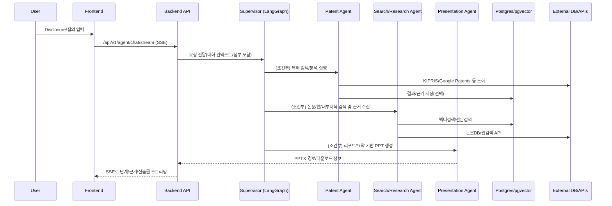

# 01. ABEKM(AI Based Enterprise Knowledge Management) 시스템 개요 설계서

> 본 문서는 ABEKM 시스템의 **목표 아키텍처(청사진)**와 **현재 구현 상태**를 함께 기술합니다.
> 
> - ✅ **구현 완료**: 현재 운영/사용 가능한 기능
> - 🚧 **개발 중**: 부분 구현 또는 진행 중인 기능
> - 📋 **계획**: 향후 개발 예정인 기능
> 
> *최종 업데이트: 2025년 12월*

---

## 목차 (TOC)

- [0. 개요(구성도 중심)](#0-개요구성도-중심)
    - [0.1 소프트웨어 구성도(논리 아키텍처)](#01-소프트웨어-구성도논리-아키텍처)
    - [0.2 하드웨어/인프라 구성도(물리/배포 아키텍처)](#02-하드웨어인프라-구성도물리배포-아키텍처)
    - [0.3 프로젝트 목적/범위/용어 정의](#03-프로젝트-목적범위용어-정의)
- [1. 어플리케이션 아키텍처(ABEKM Application)](#1-어플리케이션-아키텍처abekm-application)
    - [1.1 시스템(End-to-End 관점)](#11-시스템end-to-end-관점)
    - [1.2 서브시스템(도메인 단위)](#12-서브시스템도메인-단위)
    - [1.3 기능(서브시스템별 “구현 단위”)](#13-기능서브시스템별-구현-단위)
- [2. 시스템 소프트웨어 아키텍처(Platform/Runtime)](#2-시스템-소프트웨어-아키텍처platformruntime)
    - [2.1 서비스 레이어 아키텍처 상세](#21-서비스-레이어-아키텍처-상세)
    - [2.2 비동기 처리 구조](#22-비동기-처리-구조)
    - [2.3 멀티 프로바이더 AI 아키텍처](#23-멀티-프로바이더-ai-아키텍처)
    - [2.4 멀티 클라우드 스토리지 아키텍처](#24-멀티-클라우드-스토리지-아키텍처)
    - [2.5 기술 스택 요약](#25-기술-스택-요약)
- [3. 인프라 아키텍처(Deployment/Operations)](#3-인프라-아키텍처deploymentoperations)
    - [3.1 배포 및 운영 아키텍처](#31-배포-및-운영-아키텍처)
    - [3.2 스토리지/네트워크/보안 경계](#32-스토리지네트워크보안-경계)
    - [3.3 핵심 품질 지표(KPI) 및 운영 루프](#33-핵심-품질-지표kpi-및-운영-루프)
    - [3.4 프로젝트 문서 구조](#34-프로젝트-문서-구조)
- [4. 특허 기능 관리 및 문서화 전략](#4-특허-기능-관리-및-문서화-전략)
    - [4.1 특허 기능 문서 체계](#41-특허-기능-문서-체계)
    - [4.2 특허 관련 코드 구조](#42-특허-관련-코드-구조)
    - [4.3 특허 기능 로드맵 및 버전 관리](#43-특허-기능-로드맵-및-버전-관리)
    - [4.4 품질 관리 및 테스트 전략](#44-품질-관리-및-테스트-전략)
- [8. 개정 이력](#8-개정-이력)

---

## 0. 개요(구성도 중심)

### 0.1 소프트웨어 구성도(논리 아키텍처)

ABEKM 시스템은 **마이크로서비스 지향의 모듈형 아키텍처**를 기반으로 하며, 프론트엔드, 백엔드 API, 비동기 워커, 그리고 다양한 외부 AI 서비스가 유기적으로 결합되어 있습니다.

또한 본 플랫폼은 향후 사업 활용을 위해 **Autonomous Agentic AI 기반의 IP(특허/논문) 솔루션**을 핵심 성장축으로 포함합니다. 특히 “특허/논문 자동 수집 → 선행기술조사(Prior‑Art) → 기술가치 스크리닝(Valuation) → 리포트/PPT 생성”의 엔드투엔드 워크플로를 **에이전트 워크플로**로 구현/확장합니다.

```mermaid
graph TD
    User[사용자 (Web/Mobile)] -->|HTTPS| FE[Frontend (React)]
    FE -->|REST/SSE| API[Backend API (FastAPI)]
    
    subgraph "Application Layer"
        API --> Auth[인증/권한 (Auth/RBAC)]
        API --> DocSvc[문서 서비스 (Ingestion)]
        API --> RAGSvc[RAG/검색 서비스]
        API --> AgentSvc[AI 에이전트 서비스 (LangGraph/LangChain)]
        API --> AdminSvc[관리자 서비스]
    end

    subgraph "Async Processing"
        API -->|Task| RedisQ[Redis Queue]
        RedisQ --> Worker[Celery Worker]
        Worker -->|Extract/Chunk| DocSvc
        Worker -->|Generate| AgentSvc
    end

    subgraph "Data Layer"
        DocSvc -->|Meta/Vector| DB[(PostgreSQL + pgvector)]
        DocSvc -->|File| Storage[Object Storage (Azure/S3/Local)]
        RAGSvc -->|Cache| Redis[(Redis Cache)]
    end

    subgraph "External AI Providers"
        Worker -->|OCR/Parse| Upstage[Upstage / Azure DI]
        Worker -->|Embedding| EmbedModel[Bedrock / Azure OpenAI]
        RAGSvc -->|LLM| LLMModel[Bedrock / Azure / OpenAI]
    end

    subgraph "External Data Sources (for IP Copilot)"
        AgentSvc -->|Patent DB/API| PatentDB[Patent Sources (KIPRIS/Google Patents/...) ]
        AgentSvc -->|Paper DB/API| PaperDB[Paper Sources (IEEE/PubMed/...) ]
        AgentSvc -->|Web Search| Web[Search APIs (Tavily/Bing/DDG)]
    end
```

### 0.2 하드웨어/인프라 구성도(물리/배포 아키텍처)

시스템은 컨테이너 기반으로 배포되며, 클라우드 인프라(AWS/Azure) 위에서 운영됩니다. 외부 AI 서비스와는 보안 채널을 통해 통신합니다.

```mermaid
graph TB
    subgraph "Client Zone"
        Client[User Device]
    end

    subgraph "DMZ / Public Zone"
        LB[Load Balancer / Ingress]
    end

    subgraph "Private Zone (Container Cluster)"
        subgraph "App Tier"
            FE_C[Frontend Container]
            BE_C[Backend Container]
            Worker_C[Celery Worker Container]
        end
        
        subgraph "Data Tier"
            DB_C[(PostgreSQL Container)]
            Redis_C[(Redis Container)]
        end
    end

    subgraph "External Cloud Services"
        S3[Object Storage (S3/Blob)]
        AI_API[AI APIs (Bedrock/Azure/Upstage)]
    end

    Client -->|HTTPS:443| LB
    LB -->|HTTP:3000| FE_C
    LB -->|HTTP:8000| BE_C
    
    FE_C -->|Internal API| BE_C
    BE_C -->|Task| Redis_C
    Worker_C -->|Pop Task| Redis_C
    
    BE_C -->|SQL| DB_C
    Worker_C -->|SQL| DB_C
    
    BE_C -->|API| AI_API
    Worker_C -->|API| AI_API
    Worker_C -->|File I/O| S3
```

### 0.3 프로젝트 목적/범위/용어 정의

#### 프로젝트 목적

ABEKM (AI Based Enterprise Knowledge Management)은 기업 내 산재된 비정형 문서(PDF, Office, HWP 등)를 중앙화하고, 최신 AI 기술(RAG, LLM, Agent)을 적용하여 지식의 **검색, 요약, 재생산**을 자동화하는 것을 목적으로 합니다.

추가적으로 본 플랫폼은 2026년 MVP 방향으로 **AI Agent 기반 선행기술조사 + 기술가치 스크리닝(Prior‑Art & Valuation Copilot)** 솔루션을 목표로 합니다.

- **타깃**: 중소·중견기업 IP 담당자, 변리사, 기술경영 컨설턴트
- **핵심 가치**: 조사/검토 프로세스의 “전략 수립–검색–해석–보고”를 에이전트가 자동화하고, 사용자는 인터랙티브 UI로 후속 질의/보정을 수행

#### 범위

- **문서 수집**: 다양한 포맷의 문서 업로드 및 파싱
- **지식화**: 텍스트/이미지/표 추출 및 벡터 임베딩
- **활용**: 자연어 검색, 질의응답, 자동 보고서 생성
- **관리**: 조직도 기반 권한 관리 및 시스템 모니터링

#### 범위(확장/사업화 관점: IP Copilot)

- **Disclosure 입력/정제(향후)**: 발명 설명/자료를 구조화(문제–해결수단–효과–구성요소–키워드–IPC/CPC 후보)
- **선행기술조사(현재+확장)**: 특허/논문/웹을 대상으로 다단계 검색·확장·축소 워크플로 수행
- **기술가치 스크리닝(향후)**: 인용/트렌드/경쟁사 포지션 기반의 정성·정량 스코어링
- **산출물 생성(현재+확장)**: 근거 기반 리포트 초안(PDF/HTML) + PPT 자동 생성

#### 주요 용어

- **RAG (Retrieval-Augmented Generation)**: 검색 증강 생성. LLM이 학습하지 않은 기업 내부 데이터를 검색하여 답변 생성에 활용하는 기술.
- **Chunking**: 문서를 의미 단위(문단, 섹션 등)로 쪼개는 과정.
- **Embedding**: 텍스트나 이미지를 벡터(숫자 배열)로 변환하는 과정.
- **Agent**: 복잡한 작업을 수행하기 위해 도구(Tool)를 사용하고 추론(Reasoning)하는 AI 모듈.

#### IP Copilot 관련 용어

- **Disclosure**: 발명자 인터뷰/발명설명서 등 출원 전 단계의 발명 기술 설명 문서
- **Prior‑Art(선행기술)**: 신규성/진보성 판단에 영향을 줄 수 있는 기존 특허/논문/기술 문서
- **Novelty/Inventive Step Risk**: 신규성/진보성 리스크 수준(정성·정량)
- **IPC/CPC**: 특허 분류코드(검색 범위 축소/확장에 사용)
- **Evidence Context**: 답변/리포트가 참조하는 근거(특허번호/문장/URL 등) 묶음

---

## 1. 어플리케이션 아키텍처(ABEKM Application)

### 1.1 시스템(End-to-End 관점)

#### 1.1.1 프로젝트 목적

기업의 지식 자산을 통합 관리하고, AI 기반 검색 및 질의응답 시스템을 통해 임직원의 업무 효율성을 극대화하는 차세대 지식관리 플랫폼 구축.

#### 1.1.2 주요 기능(사용자 가치/유스케이스 중심)

- **통합 지식 검색**: 키워드 및 의미 기반(Semantic) 하이브리드 검색 지원.
- **문서 기반 Q&A**: 업로드된 문서를 근거로 정확한 답변 제공 및 출처 표기.
- **심층 리포트 생성**: "Deep Research" 기능을 통해 여러 문서를 종합 분석하여 구조화된 보고서 작성.
- **자동 PPT 생성**: 분석된 내용을 바탕으로 프레젠테이션 초안 자동 생성.
- **개인화된 지식 관리**: '내 지식' 공간을 통한 개인 문서 관리 및 공유.

##### 사업화/MVP: Prior‑Art & Valuation Copilot

- **선행기술조사 워크플로 자동화**: 국내·해외 특허 DB + 논문 DB를 대상으로 다단계 조사 수행
- **신규성/진보성 리스크 스코어링**: 유사도·인용·분류코드 기반의 정성/정량 지표 제공
- **간이 기술가치 스크리닝(향후)**: 시장/출원 동향 기반 가치지표 산출 및 해석
- **검토용 리포트/PPT 생성**: 결과를 리포트 초안과 PPT로 제공, 사용자 대화형 보정 지원

#### 1.1.3 핵심 아키텍처 원칙(정합성/확장성/보안/감사/비용)

- ✅ **Provider Agnostic**: 특정 AI 벤더(OpenAI, AWS 등)에 종속되지 않는 유연한 구조.
- ✅ **Scalability**: 대량의 문서 처리 및 트래픽 증가에 대응 가능한 비동기 큐 기반 설계.
- ✅ **Security First**: 모든 문서 접근은 RBAC(Role-Based Access Control)를 통해 통제.
  - 🚧 ABAC(Attribute-Based Access Control)는 부분 구현 (권한 요청/승인 워크플로만 적용)
- 🚧 **Auditability**: 문서의 업로드, 조회, 다운로드 등 모든 활동에 대한 감사 로그 기록 목표.
  - ✅ 현재 구현: 권한 변경 감사 로그(`TbPermissionAuditLog`)
  - 📋 향후 구현: 문서 업로드/다운로드/조회 등 일반 활동 감사 로그
- ✅ **Cost Optimization**: 고성능 모델(Claude 3.5/GPT-4)과 가성비 모델(Titan/Haiku)의 적재적소 활용.

#### 1.1.4 데이터 흐름 개요(업로드 → 추출 → 청킹/임베딩 → 검색/RAG → 지식생성/리포트)

1. **Ingestion**: 사용자가 문서를 업로드하면 원본이 스토리지에 저장되고 처리 작업이 큐에 등록됩니다.
2. **Extraction**: 워커가 문서를 가져와 텍스트, 표, 이미지를 추출합니다 (Upstage/Azure DI 활용).
3. **Chunking & Embedding**: 추출된 데이터를 의미/구조 단위로 쪼개고(Chunking), 벡터화(Embedding)하여 DB에 저장합니다.
4. **Retrieval**: 사용자 질문 시 관련 청크를 벡터 유사도와 키워드로 검색합니다.
5. **Generation**: 검색된 청크를 LLM에 제공하여 답변이나 리포트를 생성합니다.

#### 1.1.5 IP Copilot 데이터 흐름(Disclosure → Prior‑Art → Valuation → Report/PPT)

아래 흐름은 `01.docs/10.agentic_architecture.md` 및 `backend/app/agents` 구현을 기반으로, **현재 구현된 능력(특허 검색/분석, 논문/문서 검색, Deep Research, PPT 생성)**을 조합해 MVP 목표 워크플로로 확장하는 기준 흐름입니다.



### 1.2 서브시스템(도메인 단위)

#### 1.2.1 문서 수집·추출·벡터화 서브시스템 ✅
문서의 생명주기 시작점인 수집부터 검색 가능한 형태(벡터)로 변환하는 핵심 서브시스템입니다.
- **(연관 시스템 SW)**: `MultimodalDocumentService` (총괄), `UpstageDocumentService`/`AzureDocumentIntelligenceService` (추출), `StructureAwareChunker` (청킹), Celery Worker.
- **(연관 인프라)**: Object Storage (원본/산출물 저장), PostgreSQL (메타데이터/벡터 저장), Redis (작업 큐).

#### 1.2.2 검색 및 질의응답(RAG) 서브시스템 ✅
사용자의 질문 의도를 파악하고 최적의 지식을 찾아 답변을 생성합니다.
- **(연관 시스템 SW)**: `SearchService` (하이브리드 검색), `RerankTool` (재순위화), `AIService` (답변 생성), LangChain.
- **(연관 인프라)**: PostgreSQL (`pgvector` 인덱스), LLM Provider (Bedrock/Azure), Embedding Provider.

#### 1.2.3 AI 지식 생성(멀티 에이전트) 서브시스템

단순 답변을 넘어, 복잡한 분석과 산출물을 만들어내는 에이전트 시스템입니다.
- **(연관 시스템 SW)**:
    - ✅ 오케스트레이션: `backend/app/agents/supervisor_agent.py` (Supervisor, LangGraph)
    - ✅ 검색/리서치: `backend/app/agents/paper_search_agent.py` (PaperSearchAgent)
      - 📋 자율형 ReAct V2: 설정 플래그(`use_paper_search_agent_v2`)만 존재, 구현 예정
    - ✅ 심층리서치: `backend/app/agents/deep_research_agent.py`
    - ✅ 특허분석: `backend/app/agents/patent/patent_analysis_agent.py` (PatentAnalysisAgentV2 클래스 포함)
    - ✅ PPT 생성: `backend/app/agents/presentation/unified_presentation_agent.py`
    - ✅ 레지스트리: `backend/app/agents/registry.py`, `backend/app/agents/autonomous_registry.py`
- **(연관 인프라)**: LLM Provider (Reasoning 모델), Redis/Postgres (세션/체크포인트/상태 저장), Object Storage (PPTX 등 산출물 저장)

#### 1.2.7 IP Copilot(선행기술조사·가치 스크리닝) 서브시스템

ABEKM의 Agentic Architecture를 "특허/논문 기반 IP 의사결정" 도메인으로 확장한 서브시스템입니다.

| 기능 | 상태 | 설명 |
|------|------|------|
| 특허 검색/분석 에이전트 | ✅ 구현 | KIPRIS/Google Patents 연동 |
| 논문/웹/내부지식 검색 | ✅ 구현 | PaperSearchAgent |
| Deep Research | ✅ 구현 | 다단계 심층 분석 |
| PPT 생성 (Quick/Template) | ✅ 구현 | LangGraph 체크포인트 기반 |
| Disclosure 정제·구조화 | 📋 계획 | 발명 설명 자동 구조화 |
| 가치 스크리닝(Valuation) | 📋 계획 | 기술가치 정량/정성 분석 |
| 리포트 생성 (PDF/HTML) | 📋 계획 | 근거 기반 리포트 자동 생성 |
| 실험/평가 모듈 | 📋 계획 | 품질 측정 및 개선 루프 |

#### 1.2.8 특허 데이터 수집 및 처리 서브시스템 ✅

KIPRIS 등 외부 특허 DB에서 특허를 자동 수집하고, 지식 컨테이너와 통합하여 검색/분석이 가능하도록 하는 서브시스템입니다.

> **상세 문서(단일 정본)**: `01.docs/12.patent_processing_unified.md` (특허 수집→MyKnowledge, 업로드 파이프라인, KPI/실측, 에이전트 설계)

##### 특허 자동 수집 시스템 ✅

| 구성요소 | 상태 | 설명 |
|----------|------|------|
| KIPRIS Client | ✅ 구현 | `backend/app/clients/kipris.py` - Advanced Search API 연동 |
| 수집 설정 관리 | ✅ 구현 | 키워드/IPC/출원인 기반 검색 조건, 스케줄 설정 |
| Celery 비동기 작업 | ✅ 구현 | `collect_patents_from_kipris` 태스크 |
| 진행률 실시간 모니터링 | ✅ 구현 | 작업 상태/수집 결과 실시간 피드백 |
| 마지막 수집 결과 추적 | ✅ 구현 | `last_collection_result` JSON 저장 (2025-12-24) |

##### 특허 데이터 모델 ✅

| 테이블 | 용도 |
|--------|------|
| `TbPatentBibliographicInfo` | 특허 서지정보 저장 (출원번호, 제목, 초록, IPC 등) |
| `TbPatentCollectionSettings` | 수집 설정 (검색 조건, 스케줄, 옵션) |
| `TbPatentCollectionTasks` | 수집 작업 상태 추적 |
| `TbFileBssInfo` | 지식 컨테이너 문서 목록 (`document_type='patent'`) |

##### 지식 컨테이너 통합 ✅

- 수집된 특허는 `TbFileBssInfo`에 `document_type='patent'`로 저장
- `path` 필드에 외부 URL 저장 (원본 PDF 미저장 정책)
- MyKnowledge UI에서 일반 문서처럼 표시
- FileViewer에서 외부 URL 리다이렉트

##### 특허 문서 처리 파이프라인 (PatentPipeline) ✅

> **구현 완료**: 2025-12-24

일반 문서 파이프라인과 달리, 특허 문서의 정형화된 구조를 보존하여 검색 품질을 향상시킵니다.

```
PatentPipeline (GeneralPipeline 상속)
├── Step 1-5: 기본 파이프라인 (추출/청킹/임베딩/인덱싱)
└── Step 6: 특허 섹션 감지 (후처리)
    └── PatentSectionDetector (11개 섹션 자동 감지)
        ├── 청구항 (claims) - 우선순위 0
        ├── 기술분야 (technical_field)
        ├── 발명의 배경 (background)
        ├── 선행기술문헌 (prior_art)
        ├── 해결하고자 하는 과제 (problem)
        ├── 과제의 해결 수단 (solution)
        ├── 발명의 효과 (effects)
        ├── 도면의 간단한 설명 (brief_description_drawings)
        ├── 발명을 실시하기 위한 구체적인 내용 (detailed_description)
        └── 도면 (drawings)
```

**청구항 개별 파싱**:
- 독립항/종속항 자동 분리
- 각 청구항을 개별 청크로 저장
- `section_heading='청구항'` 메타데이터 저장

**섹션 정보 저장**:
- Blob Storage: `intermediate/multimodal/{document_id}/patent_sections.json`
- PostgreSQL: `doc_chunk.section_heading`에 섹션 타입 저장

##### 3계층 도구 아키텍처 (Layered Tool Architecture) ✅

| 계층 | 설명 | 구현 |
|------|------|------|
| **Layer 1**: Provider Adapter | KIPRIS/Google Patents API 클라이언트 | `backend/app/clients/kipris.py` |
| **Layer 2**: Functional Tools | 의도 단위 도구 추상화 | `backend/app/tools/retrieval/patent_functional_tools.py` |
| **Layer 3**: Agent Strategy | 하이브리드 검색 로직 | `backend/app/agents/patent/patent_analysis_agent.py` |

**Layer 2 도구 목록**:
| 도구 | 용도 | 상태 |
|------|------|------|
| `PatentDiscoveryTool` | 광범위 탐색, 리스트 확보 | ✅ 구현 |
| `PatentDetailTool` | 청구항/상세설명 심층 분석 | ✅ 구현 |
| `PatentLegalTool` | 권리/행정 상태 확인 | ✅ 구현 |
| `PatentCitationTool` | 인용 분석 | 📋 계획 |

#### 1.2.4 파일 뷰어·변환(LibreOffice 등) 서브시스템 ✅
웹 브라우저에서 다양한 포맷의 문서를 즉시 열람할 수 있도록 지원합니다.
- **(연관 시스템 SW)**: `OfficeConverterService`, LibreOffice (Headless), PDF.js.
- **(연관 인프라)**: 변환 전용 컨테이너 런타임, Intermediate Storage (변환된 PDF/이미지 저장).

#### 1.2.5 컨테이너·권한관리 서브시스템 ✅
지식의 보안과 접근 제어를 담당합니다.
- **(연관 시스템 SW)**: `PermissionService`, `AuthService`, RBAC 미들웨어.
- **(연관 인프라)**: PostgreSQL (사용자/권한 테이블), JWT 인증 서버.

#### 1.2.6 관리자 기능 서브시스템 🚧
시스템 운영 및 지식 관리를 위한 도구 모음입니다.
- **관리자 유형**: 시스템 관리자(IT 운영), 지식 관리자(콘텐츠 관리).
- **주요 기능** (구현 상태):
  - ✅ 사용자 관리: `/api/v1/users` (CRUD, 권한 부여)
  - ✅ 권한 관리: `/api/v1/permissions`, `/api/v1/permission-requests` (요청/승인 워크플로)
  - ✅ 컨테이너 관리: `/api/v1/containers` (생성/삭제/권한 설정)
  - ✅ 대시보드 통계: `/api/v1/dashboard` (사용자별 요약 정보)
  - 📋 시스템 설정 UI: 환경변수 기반 설정 (관리자 UI 미구현)
  - 📋 감사 로그 조회 UI: 백엔드 테이블 존재, 조회 API/UI 미구현
  - 📋 문서 강제 삭제/복구: 백엔드 Soft Delete 지원, 관리자 UI 미구현

> ⚠️ **현재 상태**: 관리자 기능은 개별 API로 분산 구현되어 있으며, 통합 관리자 콘솔(`/api/v1/admin`)은 미구현 상태입니다.

### 1.3 기능(서브시스템별 “구현 단위”)

#### 1.3.1 업로드/처리 기능
- **일반 문서**: 표준적인 텍스트 추출 및 토큰 기반 청킹.
- **학술 문서**: 논문 구조(서론, 본론, 결론, 참고문헌) 인식 및 섹션 기반 청킹.
- **특허 문서**: 특허 특화 필드(청구항, 요약 등) 인식 처리.
- **비구조화 텍스트(기사/블로그/게시글/마케팅 카피 등)**: 목차/섹션/표지 구조가 없거나 문단 경계가 불명확한 경우가 많아, 구조 인식 기반 청킹을 생략하고 **문자/토큰 단위 스트리밍 청킹**(줄바꿈·문장부호 힌트 기반 포함)을 적용.
- **처리 옵션**: OCR 적용 여부, 고해상도 이미지 처리 여부 등 선택 가능.

#### 1.3.2 청킹 전략
- **Structure-Aware**: 문서의 논리적 구조(제목, 문단, 표)를 유지하며 청킹 (기본값).
- **Section-Aware**: 명시적인 섹션 헤더를 기준으로 분할 (학술 문서 등).
- **Patent-Section-Aware** ✅: 특허 문서 전용 청킹 전략 (2025-12-24 추가).
  - `PatentSectionDetector`가 11개 특허 섹션을 자동 감지
  - 청구항은 개별 항목(독립항/종속항)으로 분리하여 별도 청크 생성
  - `section_heading` 메타데이터로 청크의 출처 섹션 추적
  - 관련 코드: `backend/app/services/multimodal/pipelines/patent_pipeline.py`
- **Token-Based**: 고정된 토큰 길이로 기계적 분할 (Fallback).
- **Character/Stream-Based**: 섹션 구조가 없는 비구조화 텍스트(기사/광고/게시글 등)에 대해, 줄바꿈/문장부호를 우선 경계로 사용하고 제한 길이를 초과하면 **문자/토큰 기준으로 강제 분할**.

#### 1.3.3 멀티모달 산출물 저장 및 재처리
- 텍스트뿐만 아니라 **표(Table)**와 **이미지(Figure)**를 별도 객체로 추출하여 저장.
- 원본 문서가 변경되거나 파싱 로직이 개선될 경우, `reprocess` 기능을 통해 기존 문서를 재처리 가능.

#### 1.3.4 API 엔드포인트 구조

##### 문서/검색 API (✅ 구현 완료)
| 엔드포인트 | 설명 |
|------------|------|
| `/api/v1/documents` | 문서 업로드, 목록 조회, 삭제 |
| `/api/v1/search` | 통합 검색, 벡터 검색 |
| `/api/v1/multimodal-search` | 멀티모달(텍스트+이미지) 검색 |
| `/api/v1/files` | 파일 다운로드, 미리보기 |
| `/api/v1/containers` | 지식 컨테이너 관리 |

##### AI 에이전트 API (✅ 구현 완료)
| 엔드포인트 | 설명 |
|------------|------|
| `/api/v1/agent/chat/stream` | Agent 기반 RAG 대화 (SSE 스트리밍) - **주력** |
| `/api/v1/agent/chat` | Agent 기반 RAG 대화 (동기 응답) |
| `/api/v1/agent/chat/v2` | Agent 대화 V2 (자율형 에이전트) |
| `/api/v1/agent/sessions` | 에이전트 세션 조회/관리 |
| `/api/v1/agent/chat/assets` | 대화 첨부 파일 업로드/다운로드 |
| `/api/v1/presentation` | PPT 템플릿 관리 및 생성 |

##### 인증/권한 API (✅ 구현 완료)
| 엔드포인트 | 설명 |
|------------|------|
| `/api/v1/auth` | 로그인, 로그아웃, 토큰 갱신, 사용자 정보 |
| `/api/v1/users` | 사용자 CRUD (관리자 기능 포함) |
| `/api/v1/permissions` | 권한 조회/설정 |
| `/api/v1/permission-requests` | 권한 요청/승인 워크플로 |

##### 대시보드/통계 API (✅ 구현 완료)
| 엔드포인트 | 설명 |
|------------|------|
| `/api/v1/dashboard` | 사용자 대시보드 요약, 최근 활동, 통계 |

##### 특허 관련 API (✅ 구현 완료)
| 엔드포인트 | 설명 |
|------------|------|
| `/api/v1/patent` | 특허 검색/분석 |
| `/api/v1/patent-collection` | 특허 수집 작업 관리 |

##### 기타 API (✅ 구현 완료)
| 엔드포인트 | 설명 |
|------------|------|
| `/api/v1/transcribe` | 실시간 음성→텍스트 변환 (AWS Transcribe) |
| `/api/v1/sap` | SAP HR 정보 관리 |

##### Deprecated API
| 엔드포인트 | 상태 | 비고 |
|------------|------|------|
| `/api/v1/chat` | ⛔ Deprecated (2025-12-09) | `/api/v1/agent/*`로 통합됨 |

##### 📋 계획된 API (미구현)
| 엔드포인트 | 설명 |
|------------|------|
| `/api/v1/admin` | 통합 관리자 콘솔 (현재 기능은 개별 API에 분산됨) |
| `/api/v1/audit` | 범용 감사 로그 조회 |

#### 1.3.5 관리자 API 기능 현황

관리자 기능은 현재 개별 API에 분산 구현되어 있습니다.

| 기능 | 상태 | 구현 위치 |
|------|------|----------|
| 사용자 CRUD | ✅ 구현 | `/api/v1/users` |
| 권한 부여/해제 | ✅ 구현 | `/api/v1/permissions` |
| 권한 요청 승인/거부 | ✅ 구현 | `/api/v1/permission-requests` |
| 컨테이너 생성/삭제 | ✅ 구현 | `/api/v1/containers` |
| 대시보드 통계 조회 | ✅ 구현 | `/api/v1/dashboard` |
| 시스템 설정 변경 | 📋 계획 | 환경변수 기반 (UI 미구현) |
| 감사 로그 조회 | 🚧 부분 | 권한 변경 로그만 저장, 조회 API 미구현 |
| 문서 강제 삭제/복구 | 📋 계획 | Soft Delete 지원, 관리자 UI 미구현 |
| 통합 관리자 콘솔 | 📋 계획 | `/api/v1/admin` 미구현 |

#### 1.3.6 에이전트형 IP Copilot 기능

##### (A) Disclosure 정제·구조화 📋
- **상태**: 계획 (미구현)
- 입력: 발명 설명/자료(Disclosure)
- 출력(스키마): 문제–해결수단–효과–구성요소–키워드–IPC/CPC 후보–검색 질의 초안

##### (B) 선행기술조사 ✅
- **상태**: 구현 완료 + 확장 예정
- ✅ 특허 검색/분석: `PatentSearchTool`, `PatentDiscoveryTool`, `PatentDetailTool`, `PatentLegalTool`, `PatentAnalysisTool`
- ✅ 자율형 실행: LangGraph ReAct 기반 (`patent_analysis_agent.py` 내 `PatentAnalysisAgentV2` 클래스)
- ✅ 논문/문서/웹 검색: `paper_search_agent.py` (PaperSearchAgent)
  - 📋 V2 ReAct 에이전트: 설정 플래그만 존재, 구현 예정
- ✅ 후처리: deduplicate/rerank/context_builder(근거 컨텍스트 구성)

##### (C) 기술가치 스크리닝 📋
- **상태**: 계획 (미구현)
- 입력: 선행기술 세트 + 시장/동향 데이터
- 출력: 가치지표(정량) + 해석(정성) + 리스크/기회 요약

##### (D) 산출물 생성
- **상태**: 부분 구현
- ✅ PPT 생성: `unified_presentation_agent.py` (Quick/Template, LangGraph 체크포인트 기반)
- 📋 근거 기반 리포트 초안 (PDF/HTML): 계획

---

## 2. 시스템 소프트웨어 아키텍처(Platform/Runtime)

### 2.1 서비스 레이어 아키텍처 상세
Backend는 **FastAPI** 프레임워크 위에 계층화된 아키텍처(Layered Architecture)로 구현되었습니다.
- **Presentation Layer**: API Router, Pydantic Models (DTO).
- **Service Layer**: 비즈니스 로직, 트랜잭션 관리.
- **Data Access Layer**: SQLAlchemy ORM, Redis Client.
- **External Interface Layer**: AI Provider Clients, Storage Clients.

### 2.2 비동기 처리 구조
대용량 문서 처리와 AI 추론의 지연 시간을 관리하기 위해 **Celery**와 **Redis**를 사용합니다.
- **Task Queue**: `document_processing`, `ai_generation` 등 큐 분리.
- **Worker**: CPU 집약적 작업(파싱)과 I/O 집약적 작업(API 호출)을 처리.
- **상태 관리**: 작업 진행률(Progress)과 결과(Status)를 DB/Redis에 실시간 업데이트.

에이전트 실행은 사용자 경험을 위해 **SSE 기반 스트리밍 응답**과 결합됩니다.
- **동기+스트리밍(현재)**: `backend/app/api/v1/agent.py`의 `/agent/chat/stream`에서 단계별 결과를 스트리밍
- **장기 실행/재개(부분 적용)**: PPT 생성은 LangGraph 체크포인터를 통해 재개 가능한 실행을 지원(구현 위치: `backend/app/agents/presentation/ppt_checkpointer.py`)
- **향후 방향**: (1) 특허/논문 대량 수집은 Celery 배치 작업, (2) 분석/보고서 생성은 사용자 요청 기반 스트리밍 + 재개 가능한 그래프 실행으로 분리

### 2.3 멀티 프로바이더 AI 아키텍처

#### 2.3.0 Agentic Runtime(오케스트레이션) 개요
ABEKM의 Agentic Runtime은 **LangGraph 기반 Supervisor + 전문 에이전트(검색/특허/리포트/PPT)** 구조를 따릅니다.
- 라우팅/조율: Supervisor가 요청 의도를 분석해 다음 에이전트를 선택(검색 → PPT 등 멀티스텝)
- 실행 패턴: ReAct(Thought→Action→Observation) 기반 도구 호출 및 단계 로그 축적
- 통합 지점: `/api/v1/agent/chat`, `/api/v1/agent/chat/v2`, `/api/v1/agent/chat/stream`
- 관련 문서: `01.docs/10.agentic_architecture.md`

#### 2.3.1 Provider 기반 설계 원칙
- **추상화(Abstraction)**: `AIService` 인터페이스를 통해 구현체를 은닉.
- **설정 기반 전환**: 코드 수정 없이 환경 변수(`DEFAULT_LLM_PROVIDER`)만으로 전환.

#### 2.3.1.1 에이전트/도구 레지스트리(구성 관리)
- Tool 기반 레지스트리: `backend/app/agents/registry.py` (presentation/patent/summarizer 등)
- 자율형 에이전트 레지스트리: `backend/app/agents/autonomous_registry.py` (capability/priority 기반 선택)

#### 2.3.2 지원 AI 프로바이더(LLM/Embedding)
- **AWS Bedrock**: Claude 3.5 Sonnet, Titan Embeddings (주력 운영).
- **Azure OpenAI**: GPT-4o, Text-Embedding-3 (대안/Fallback).
- **OpenAI**: GPT-4 Turbo (개발/테스트).

#### 2.3.3 임베딩 프로바이더 아키텍처
- **Bedrock**: Titan Text v2 (1024차원), Marengo (멀티모달 512차원).
- **Azure**: text-embedding-3-small (1536차원).
- **DB 스키마**: `vector(1024)`, `vector(1536)` 컬럼을 모두 보유하여 하이브리드 운영 지원.

#### 2.3.4 LLM 프로바이더 아키텍처
- **Routing**: 작업 난이도에 따라 모델 자동 선택 (예: 단순 요약은 Haiku, 복잡한 추론은 Sonnet/GPT-4).
- **Fallback**: 주 프로바이더 장애 시 예비 프로바이더로 자동 절체.

#### 2.3.5 문서 처리 프로바이더 아키텍처
- **Upstage Document Parse**: 한국어 문서 구조 인식 및 OCR 성능 우수 (현재 주력).
- **Azure Document Intelligence**: 레이아웃 분석 및 다국어 지원 (대안).

#### 2.3.6 프로바이더 전환 가이드
1. `.env` 파일에서 `DOCUMENT_PROCESSING_PROVIDER` 또는 `DEFAULT_LLM_PROVIDER` 변경.
2. 컨테이너 재시작 (`docker-compose restart backend worker`).

#### 2.3.7 비용 최적화 전략
- 대량의 과거 데이터 마이그레이션 시 저렴한 모델(Titan/Haiku) 사용.
- 사용자 대화 및 고품질 리포트 생성 시 고성능 모델(Sonnet/GPT-4) 사용.

#### 2.3.8 IP Copilot 품질을 위한 모델/도구 선택 가이드(권장)
- **선행기술조사(검색 커버리지)**: 검색/재순위화에 강한 모델 + 도구 호출 안정성이 높은 모델 조합
- **리스크/가치 해석(설명력)**: 근거 컨텍스트(특허번호/문장/링크) 기반으로 설명을 생성하도록 프롬프트/툴 체인을 고정
- **산출물(PPT/리포트)**: 템플릿 기반 생성 흐름을 우선 사용(품질/재현성/브랜딩)

### 2.4 멀티 클라우드 스토리지 아키텍처
- **지원 백엔드**: Azure Blob Storage (Prod), AWS S3 (Alternative), Local Filesystem (Dev).
- **추상화 계층**: `FileStorageService`가 공통 인터페이스 제공.
- **하이브리드**: 보안이 중요한 문서는 로컬/Private 클라우드, 일반 문서는 Public 클라우드 저장 가능 (설정 가능).

**에이전트 산출물/실험 데이터(권장 저장 분류)**
- 원본 입력: Disclosure/첨부 문서(버전 관리 및 접근 제어)
- 근거 스냅샷: 특허/논문 결과(검색 질의, 결과 목록, 주요 근거)
- 산출물: 리포트(PDF/HTML), PPTX, 중간 결과(JSON)
- 실행 로그/체크포인트: 장기 실행 워크플로의 재개를 위한 상태 저장(특히 PPT 생성)

### 2.5 기술 스택 요약
- **Backend**: Python 3.11, FastAPI, SQLAlchemy, Celery, LangChain, LangGraph, SSE.
- **Frontend**: React 18, TypeScript, TailwindCSS, Zustand.
- **AI/Search**: AWS Bedrock, Azure OpenAI, Upstage, pgvector.
- **Ops**: Docker, Docker Compose, Nginx, GitHub Actions.
- **Performance**: Redis Caching, Connection Pooling, Async I/O.

---

## 3. 인프라 아키텍처(Deployment/Operations)

### 3.1 배포 및 운영 아키텍처

#### 컨테이너 구성
- `abkms-backend`: API 서버.
- `abkms-celery-worker`: 비동기 작업 처리.
- `abkms-frontend`: 정적 파일 서빙 및 프록시.
- `abkms-postgres`: 데이터베이스.
- `abkms-redis`: 메시지 브로커 및 캐시.

#### 환경별 배포 지원
- **Development**: Local Docker Compose, Hot-reloading.
- **Staging/Production**: 최적화된 Docker Image, 볼륨 마운트 최소화, 환경변수 주입.

#### 자동화된 데이터베이스 초기화
- 컨테이너 시작 시 `init_database_complete.py`가 실행되어 테이블 생성 및 초기 데이터(사용자, 권한 등) 시딩.

#### 모니터링/로그/헬스체크
- **Healthcheck**: `/health` 엔드포인트를 통해 컨테이너 상태 주기적 확인.
- **Logs**: Docker Logs 및 파일 로그 수집.

### 3.2 스토리지/네트워크/보안 경계
- **Network**: Backend와 DB/Redis는 내부 네트워크로만 통신, 외부 노출 차단.
- **Storage**: 업로드 파일은 볼륨 마운트 또는 클라우드 스토리지로 영구 보존.
- **Security**: SSL/TLS 적용 (Nginx), API Rate Limiting.

### 3.3 핵심 품질 지표(KPI) 및 운영 루프
- **KPI 목록**: 검색 정확도(MRR), 응답 시간(Latency), 문서 처리 성공률, 시스템 가동률.
- **수집 구조**: API 로그 및 사용자 피드백(좋아요/싫어요) 수집.
- **품질 개선 루프**: 피드백 데이터를 기반으로 RAG 파이프라인(Chunking, Retrieval) 지속 튜닝.
- **데이터 보존 정책**: 로그 1년 보관, 삭제된 문서 30일 후 영구 삭제(Soft Delete).

**(IP Copilot 전용 KPI/실험 지표 - 연구/논문화 연계)**
- **조사 시간 절감**: 기존 키워드/불리언 검색 대비 소요 시간(분) 및 반복 횟수
- **커버리지/누락률**: 평가셋 기준 “핵심 선행기술 포함 여부”(Recall proxy) 및 누락 케이스 분석
- **리스크 판정 품질**: 신규성/진보성 리스크 등급의 전문가 합의 대비 일치율
- **산출물 품질**: 리포트/PPT의 구조화 점수(템플릿 준수), 근거 링크 적합률
- **비용**: 요청당 토큰/외부 API 호출 수(도구 호출) 및 평균 비용

### 3.4 프로젝트 문서 구조
- **문서 분산 전략**: 아키텍처, API, 가이드 문서를 `01.docs/` 하위에 체계적으로 분류.
- **통합 대시보드**: 시스템 현황을 한눈에 볼 수 있는 관리자 대시보드 제공.

**관련 핵심 문서(Agentic/IP/PPT)**
- `01.docs/10.agentic_architecture.md`: 멀티 에이전트 아키텍처(오케스트레이션/도구/유즈케이스)
- `01.docs/11.enterprise_intelligence_architecture.md`: 기업 경쟁 인텔리전스 아키텍처
- `01.docs/12.patent_processing_unified.md`: 특허 처리/품질/KPI/에이전트(선행기술조사 포함) 단일 정본
- `01.docs/13.agent_design_for_presentation.md` 및 `01.docs/13.1.Template_PPT_generation_design.md`: PPT 에이전트 및 템플릿 기반 생성
- (통합) 특허 수집/처리/평가/KPI는 `01.docs/12.patent_processing_unified.md`에 단일 정본으로 유지

---

## 4. 특허 기능 관리 및 문서화 전략

> 특허 정보 관련 기능은 ABEKM 시스템의 핵심 사업 가치를 담당하는 영역으로, 체계적인 관리와 문서화가 필수적입니다.

### 4.1 특허 기능 문서 체계

#### 문서 계층 구조 (권장)

```
01.docs/
├── 01.system_overview_design.md      # L0: 전체 아키텍처 + 특허 서브시스템 개요
├── 10.agentic_architecture.md        # L1: 멀티 에이전트 오케스트레이션
├── 11.enterprise_intelligence_architecture.md  # L1: 기업 인텔리전스 (Patent/Research/Market)
├── 12.patent_processing_unified.md      # L2: 특허 처리/품질/KPI/에이전트 단일 정본
├── 15.patent_api_reference.md        # L3: 특허 API 엔드포인트 참조 (권장 생성)
├── 16.patent_data_model.md           # L3: 특허 데이터 모델/스키마 (권장 생성)
└── 17.patent_evaluation_metrics.md   # L3: 특허 기능 품질 평가 기준 (권장 생성)
```

#### 문서별 역할 정의

| 수준 | 문서 | 내용 | 대상 독자 |
|------|------|------|----------|
| L0 | `01.system_overview_design.md` | 시스템 전체 아키텍처, 특허 서브시스템 위치 | 경영진, 아키텍트 |
| L1 | `10.agentic_architecture.md` | 에이전트 오케스트레이션, 도구 체계 | 아키텍트, 시니어 개발자 |
| L1 | `11.enterprise_intelligence_architecture.md` | 3대 인텔리전스(특허/연구/시장) 구조 | 사업 기획, 아키텍트 |
| L2 | `12.patent_processing_unified.md` | 특허 처리/품질/KPI/에이전트 단일 정본 | 개발자, QA |
| L3 | API/데이터/평가 문서 | 구현 세부사항 | 개발자, QA |

### 4.2 특허 관련 코드 구조

#### 백엔드 디렉토리 구성

```
backend/app/
├── agents/patent/                    # 특허 분석 에이전트
│   ├── patent_analysis_agent.py      # PatentAnalysisAgentV2 (메인 에이전트)
│   └── ...
├── clients/
│   └── kipris.py                     # KIPRIS API 클라이언트 (Layer 1)
├── services/
│   ├── patent/
│   │   └── patent_collection_service.py  # 특허 수집 서비스
│   └── multimodal/pipelines/
│       └── patent_pipeline.py        # 특허 문서 처리 파이프라인
├── tools/retrieval/
│   └── patent_functional_tools.py    # Layer 2 도구 (Discovery/Detail/Legal)
├── models/patent/
│   └── patent_models.py              # 특허 DB 모델
├── api/v1/
│   ├── patent.py                     # 특허 검색/분석 API
│   └── patent_collection.py          # 특허 수집 관리 API
└── tasks/
    └── patent_collection_tasks.py    # Celery 비동기 수집 작업
```

#### 프론트엔드 디렉토리 구성

```
frontend/src/
├── pages/user/
│   ├── PatentCollectionSettings.tsx  # 특허 수집 설정 UI
│   └── ...
├── services/
│   └── patentService.ts              # 특허 API 클라이언트
└── components/patent/                # 특허 전용 UI 컴포넌트 (권장 생성)
```

### 4.3 특허 기능 로드맵 및 버전 관리

#### 버전 명명 규칙

| 구분 | 명명 | 예시 | 설명 |
|------|------|------|------|
| 에이전트 버전 | `V1`, `V2`, ... | `PatentAnalysisAgentV2` | 주요 구조 변경 시 버전 증가 |
| API 버전 | `/api/v1/`, `/api/v2/` | `/api/v1/patent` | 호환성 깨는 변경 시 버전 증가 |
| 파이프라인 버전 | 코드 내 상수 | `PIPELINE_VERSION = "1.2"` | 청킹/임베딩 전략 변경 시 |

#### 현재 구현 상태 (2025-12-25)

| 기능 영역 | 버전 | 상태 | 비고 |
|----------|------|------|------|
| 특허 검색 에이전트 | V2 | ✅ 구현 | LangGraph ReAct 기반 |
| KIPRIS 클라이언트 | V1 | ✅ 구현 | Advanced Search API |
| 특허 수집 관리 | V1 | ✅ 구현 | 설정/작업/로그 3테이블 구조 |
| 특허 파이프라인 | V1 | ✅ 구현 | 11개 섹션 감지 |
| Layer 2 도구 | V1 | ✅ 구현 | Discovery/Detail/Legal |
| Layer 2 Citation | - | 📋 계획 | 인용 분석 도구 |
| 가치 스크리닝 | - | 📋 계획 | Valuation Agent |

#### 로드맵 (향후 방향)

```mermaid
gantt
    title 특허 기능 로드맵
    dateFormat  YYYY-MM
    section 기반 구축 (완료)
    KIPRIS 연동           :done,    2025-11, 2025-12
    특허 수집 시스템       :done,    2025-12, 2025-12
    특허 파이프라인        :done,    2025-12, 2025-12
    section 분석 고도화 (진행중)
    인용 분석 도구         :active,  2025-12, 2026-01
    청구항 유사도 분석     :         2026-01, 2026-02
    section 가치 평가 (계획)
    기술가치 스코어링      :         2026-02, 2026-03
    리스크 평가 리포트     :         2026-03, 2026-04
    section 사업화 (계획)
    SaaS MVP 배포         :         2026-Q2, 2026-Q3
```

### 4.4 품질 관리 및 테스트 전략

#### 특허 기능 테스트 범위

| 테스트 유형 | 대상 | 도구/방법 |
|------------|------|----------|
| 단위 테스트 | KIPRIS 클라이언트, 파이프라인 | pytest, mock |
| 통합 테스트 | 수집→저장→검색 플로우 | pytest + DB fixture |
| E2E 테스트 | 프론트엔드 수집 설정 UI | Cypress/Playwright |
| 품질 평가 | 검색 정확도, 섹션 감지율 | 수동 평가셋 + 자동 메트릭 |

#### 특허 검색 품질 메트릭 (권장)

| 메트릭 | 정의 | 목표 |
|--------|------|------|
| **섹션 감지 정확도** | 올바른 섹션 레이블 비율 | ≥ 95% |
| **청구항 파싱 정확도** | 독립항/종속항 분리 정확도 | ≥ 98% |
| **검색 Recall@10** | 관련 특허가 상위 10건에 포함될 확률 | ≥ 80% |
| **선행기술 누락률** | 전문가 평가 대비 누락된 핵심 특허 비율 | ≤ 5% |

#### 문서 동기화 체크리스트

기능 변경 시 아래 문서 업데이트 여부 확인:

- [ ] `01.system_overview_design.md` - 서브시스템 상태 마커 (✅/🚧/📋)
- [ ] `12.patent_processing_unified.md` - 도구/파이프라인 상세
- [ ] API 주석/Swagger - 엔드포인트 변경
- [ ] 개정 이력 - 버전 및 변경 내용 기록

---

## 8. 개정 이력

| 날짜 | 버전 | 내용 | 작성자 |
| :--- | :--- | :--- | :--- |
| 2025-10-01 | v1.0 | 최초 작성 | 시스템 아키텍트 |
| 2025-11-15 | v1.1 | 멀티 프로바이더 아키텍처 추가 | AI 팀 |
| 2025-12-19 | v1.2 | 최신 운영 현황 반영 및 목차 재구조화 | GitHub Copilot |
| 2025-12-19 | v1.3 | Agentic AI/IP Copilot(MVP) 방향 및 구현 반영 | GitHub Copilot |
| 2025-12-25 | v1.4 | 청사진/구현상태 구분 명확화 (✅/🚧/📋 마커 도입), API 엔드포인트 현행화, 관리자 기능 현황 정리 | Cursor AI |
| 2025-12-25 | v1.5 | 특허 기능 대폭 강화: (1) Section 1.2.8 특허 데이터 수집 및 처리 서브시스템 추가, (2) PatentPipeline/PatentSectionDetector 상세화, (3) 3계층 도구 아키텍처 명세, (4) Patent-Section-Aware 청킹 전략 추가, (5) Section 4 특허 기능 관리 및 문서화 전략 신설 (문서 체계, 코드 구조, 로드맵, 품질 관리) | Cursor AI |
