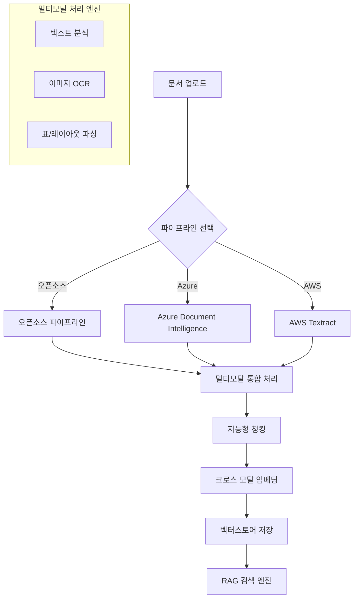
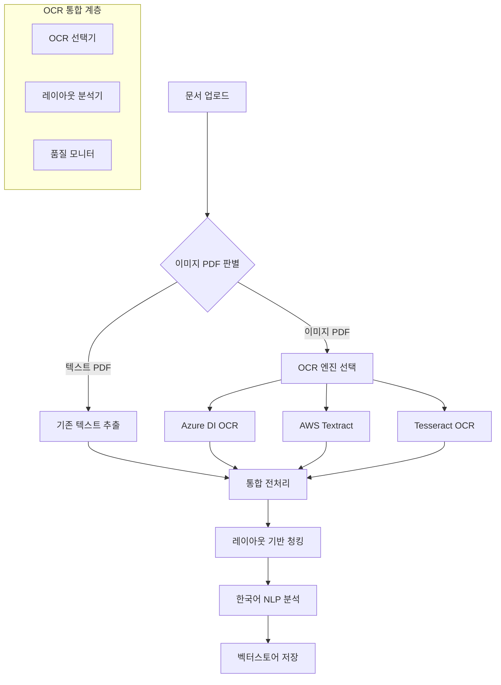
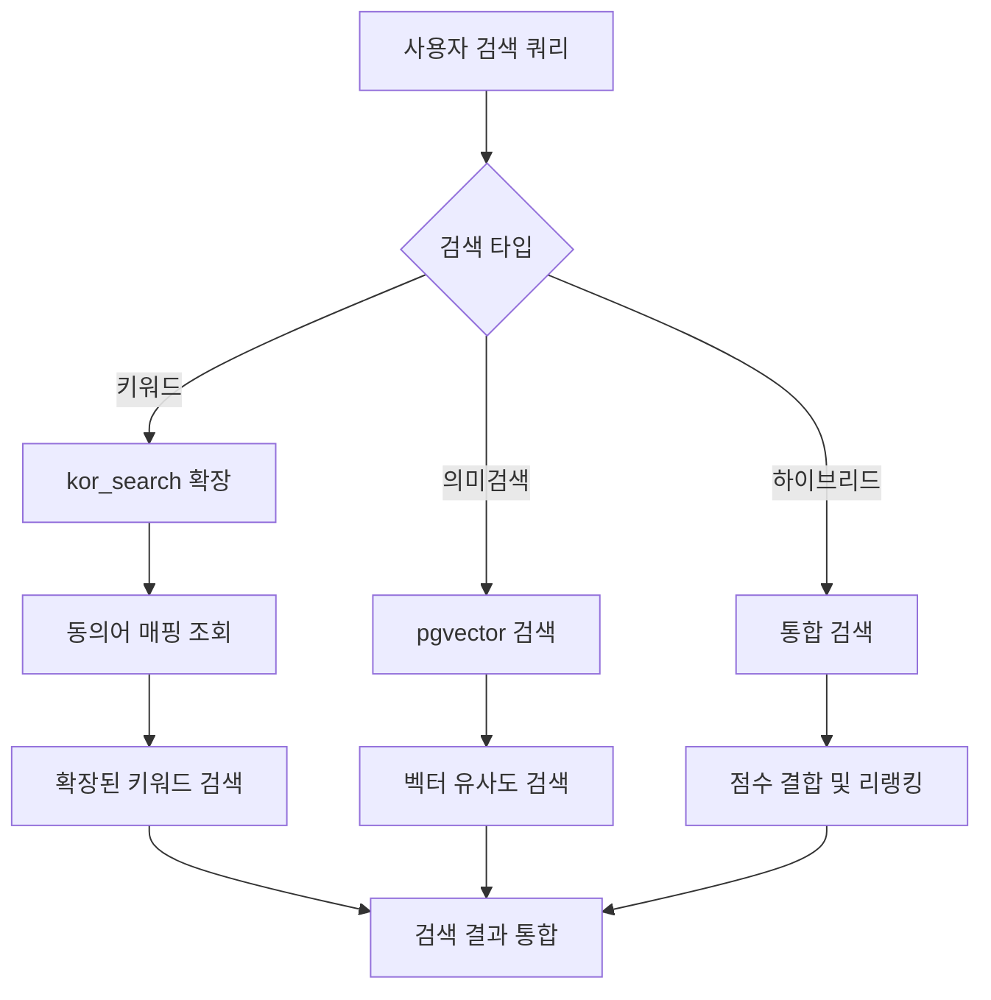

# 02. 멀티모달 RAG 문서 처리 및 벡터스토어 구축 시스템

## 1. 시스템 개요

> **최종 업데이트**: 2025-11-19  
> **주요 변경**: Upstage Document Parser 멀티 프러바이더 지원 강화 (FIGURE 타입 처리)

### 1.1 목적

ABEKM(AI Based Enterprise Knowledge Management)의 멀티모달 RAG 문서 처리 시스템은 텍스트, 이미지, 표, 차트 등 다양한 콘텐츠 유형을 통합적으로 처리하여 고품질 벡터스토어를 구축하는 차세대 지식 관리 시스템입니다.

### 1.2 멀티모달 RAG 특징

- **텍스트 처리**: 한국어 특화 NLP 파이프라인 (형태소 분석, 개체명 인식)
- **이미지 분석**: OCR, 차트/그래프 데이터 추출, 다이어그램 해석
- **표 구조 인식**: 복잡한 표 구조 파싱 및 관계형 데이터 추출
- **레이아웃 이해**: 문서 구조 분석 (제목, 본문, 각주, 헤더/푸터)
- **크로스 모달 임베딩**: 텍스트-이미지 통합 벡터 표현

### 1.3 시스템 범위

- **다중 파이프라인 지원**: 오픈소스, Upstage Document Parser 🆕, Azure Document Intelligence, AWS Textract
- **멀티모달 처리**: 텍스트, 이미지(IMAGE/FIGURE), 표, 레이아웃 통합 분석
- **지능형 청킹**: 문서 구조 기반 의미적 청킹
- **권한 기반 처리**: 사용자 권한 및 지식 컨테이너 자동 할당
- **실시간 품질 검증**: AI 기반 문서 품질 평가
- **확장성**: 대용량 파일 및 배치 처리 지원
- **비동기 처리**: Celery 기반 백그라운드 작업 큐 (2025-10-15 적용) 🆕
- **클라우드 스토리지**: Azure Blob Storage + S3 하이브리드 구성 🆕

### 1.4 최근 주요 업데이트 (2025-11-18)

#### 1.4.1 임베딩 모델 통합 및 Provider 기반 아키텍처 🆕

##### 1.4.1.1 일반 텍스트 임베딩 (RAG 시스템 핵심)

**용도**: 문서 청킹, 검색 쿼리, 벡터 유사도 계산

**Provider 선택** (`.env` 파일의 `DEFAULT_EMBEDDING_PROVIDER` 설정):

| Provider | 모델 | 차원 | 저장 컬럼 | 특징 |
|----------|------|------|-----------|------|
| **AWS Bedrock** ✅ | amazon.titan-embed-text-v2:0 | **1024d** | `aws_embedding_1024` | 25개 언어, 8192 토큰, RAG 최적화, $0.0001/1K tokens |
| **Azure OpenAI** | text-embedding-3-small | **1536d** | `azure_embedding_1536` | 다국어 지원, 높은 정확도 |
| **OpenAI** | text-embedding-ada-002 | 1536d | `azure_embedding_1536` | Fallback 옵션 |

**벡터 저장 스키마**:
- **테이블**: `vs_doc_contents_chunks`
- **컬럼 구조**:
  - `aws_embedding_1024` (vector(1024)) - Bedrock Titan v2 전용
  - `azure_embedding_1536` (vector(1536)) - Azure/OpenAI 공용
  - `chunk_embedding` (vector) - 레거시 폴백 (동적 차원)
- **인덱스**: HNSW (m=16, ef_construction=64)
- **Provider 자동 선택**: 코드에서 `DEFAULT_EMBEDDING_PROVIDER` 설정값에 따라 자동으로 올바른 컬럼 사용

##### 1.4.1.2 멀티모달 임베딩 (이미지-텍스트 크로스모달 검색) 🆕

**용도**: 이미지 임베딩, 텍스트-이미지 크로스모달 검색

**Provider 선택** (`.env` 파일의 `DEFAULT_EMBEDDING_PROVIDER` 설정):

| Provider | 모델 | 차원 | 저장 컬럼 | 특징 |
|----------|------|------|-----------|------|
| **AWS Bedrock** ✅ | twelvelabs.marengo-embed-3-0-v1:0 | **512d** | `aws_marengo_vector_512` | 비디오/이미지/텍스트 멀티모달, 시맨틱 검색 특화, 한국어 지원 |
| **Azure OpenAI CLIP** | openai-clip-image-text-embed-11 | **512d** | `azure_clip_vector` | 이미지-텍스트 통합 벡터 공간, Azure ML 배포 |
| **로컬 CLIP** | openai/clip-vit-base-patch32 | **512d** | `clip_vector` | Hugging Face 모델, Fallback 옵션 |

**벡터 저장 스키마**:
- **테이블**: `doc_embedding`
- **컬럼 구조**:
  - `aws_marengo_vector_512` (vector(512)) - Bedrock Marengo 전용
  - `azure_clip_vector` (vector(512)) - Azure CLIP 전용
  - `clip_vector` (vector(512)) - 레거시 로컬 CLIP 폴백
- **인덱스**: HNSW (m=16, ef_construction=64)
- **Provider 자동 선택**: 코드에서 `DEFAULT_EMBEDDING_PROVIDER` 설정값에 따라 자동으로 올바른 컬럼 사용
- **Modality 필터**: `modality='image'` 컬럼으로 이미지 임베딩만 검색 가능

##### 1.4.1.3 임베딩 서비스 구조

```
EmbeddingService (일반 텍스트 임베딩)
├── 용도: 문서 청킹, RAG 쿼리 임베딩, 벡터 검색
├── Provider 분기: settings.default_embedding_provider
│   ├── bedrock → amazon.titan-embed-text-v2:0 (1024d)
│   ├── azure_openai → text-embedding-3-small (1536d)
│   └── openai → text-embedding-ada-002 (1536d)
├── 저장 컬럼: aws_embedding_1024 | azure_embedding_1536 | chunk_embedding
└── 파일: backend/app/services/core/embedding_service.py

ImageEmbeddingService (멀티모달 임베딩)
├── 용도: 이미지 임베딩, 크로스모달 텍스트 쿼리 (이미지 검색용)
├── Provider 분기: settings.default_embedding_provider
│   ├── bedrock → twelvelabs.marengo-embed-3-0-v1:0 (512d)
│   ├── azure_openai → Azure CLIP (512d)
│   └── local → Hugging Face CLIP (512d, fallback)
├── 저장 컬럼: aws_marengo_vector_512 | azure_clip_vector | clip_vector
└── 파일: backend/app/services/document/vision/image_embedding_service.py
```

**⚠️ 중요 구분사항**:
1. **용도 분리**: 
   - `EmbeddingService` → 일반 텍스트 RAG 검색 (문서 내용 검색)
   - `ImageEmbeddingService` → 이미지 검색 및 크로스모달 검색
2. **차원 차이**: 
   - 텍스트: 1024d (Bedrock) / 1536d (Azure/OpenAI)
   - 이미지: 512d (모든 Provider 공통)
3. **벡터 저장 분리**:
   - 텍스트: `vs_doc_contents_chunks` 테이블
   - 이미지: `doc_embedding` 테이블 (modality='image')

##### 1.4.1.4 프로바이더 전환 방법

`.env` 파일에서 `DEFAULT_EMBEDDING_PROVIDER` 변경만으로 전환 가능:

```bash
# Bedrock 사용 (현재 운영 중)
DEFAULT_EMBEDDING_PROVIDER=bedrock
BEDROCK_EMBEDDING_MODEL_ID=amazon.titan-embed-text-v2:0
BEDROCK_MULTIMODAL_EMBEDDING_MODEL_ID=twelvelabs.marengo-embed-3-0-v1:0

# Azure OpenAI로 전환 시
DEFAULT_EMBEDDING_PROVIDER=azure_openai
AZURE_OPENAI_EMBEDDING_DEPLOYMENT=text-embedding-3-small
AZURE_OPENAI_MULTIMODAL_EMBEDDING_DEPLOYMENT=openai-clip-image-text-embed-11
```

**자동 처리 사항**:
- ✅ 임베딩 생성 시 Provider별 API 자동 호출
- ✅ 벡터 저장 시 Provider별 컬럼 자동 선택
- ✅ 검색 시 Provider별 컬럼 자동 참조
- ✅ 차원 불일치 시 자동 에러 로깅

#### 1.4.2 멀티 프러바이더 이미지 객체 처리 통합 (2025-11-19 업데이트) 🆕

**배경**: Upstage Document Parser는 `FIGURE` 타입, Azure DI는 `IMAGE` 타입으로 이미지 객체를 생성하는 차이로 인해 Upstage로 처리된 문서의 이미지 검색이 작동하지 않는 문제 발생

**해결 방안**:

1. **바이너리 저장 시 Provider별 카운트 분기**:
   ```python
   # 기존: IMAGE만 카운트
   saved_counts['IMAGE'] += 1
   
   # 개선: Provider별 타입 구분
   if obj_type == 'FIGURE':
       saved_counts['FIGURE'] += 1  # Upstage
   else:
       saved_counts['IMAGE'] += 1   # Azure DI, AWS
   ```

2. **청킹 단계 통합 처리**:
   ```python
   # IMAGE와 FIGURE 모두 포함
   raw_image_objs = [o for o in extracted_objects 
                     if o.object_type in ["IMAGE", "FIGURE"]]
   ```

3. **로그 개선**:
   - Provider 정보 명시 (`Provider=upstage/azure_di`)
   - 이미지 타입별 카운트 표시 (`visual=2 (IMAGE=0, FIGURE=2)`)
   - 바이너리 누락 원인 상세화 (Upstage base64 여부 확인)

**효과**:
- ✅ Upstage FIGURE 객체 → 이미지 청크 정상 생성
- ✅ Azure DI IMAGE 객체 → 기존 로직 유지
- ✅ 멀티 프러바이더 환경에서 이미지 검색 통합 지원

**파일**: `backend/app/services/document/multimodal_document_service.py` (lines 1270, 1283, 1329, 1358)

#### 1.4.3 한국어 전문검색 (FTS) 트리거 구현

- **확장**: PostgreSQL `textsearch_ko 1.0` + `kor_search 1.0.0` 설치 완료
- **Configuration**: 'korean' (mecab 파서 기반 형태소 분석)
- **자동 생성 트리거**: `tb_document_search_index` INSERT/UPDATE 시 tsvector 자동 생성
  - `keyword_tsvector`: 키워드 배열 기반 (korean 파서)
  - `content_tsvector`: 문서 제목 + 요약 + 전문 (korean 파서)
- **Alembic 리비전**: `72342a21e7bc_add_tsvector_triggers_for_korean_search.py`
- **성능**: 조사/어미 자동 제거로 한국어 검색 정확도 향상

#### 1.4.3 비동기 문서 처리 파이프라인

- **Celery 워커**: 가상환경 `/home/wjadmin/Dev/InsightBridge/.venv` 적용
- **작업 큐**: Redis 기반 메시지 브로커
- **처리 흐름**:
  1. API 업로드 → 즉시 응답 (task_id 반환)
  2. Celery 워커 → 백그라운드 문서 처리
  3. WebSocket → 실시간 진행 상황 알림
  4. 완료 시 → 검색 인덱스 자동 업데이트

#### 1.4.4 멀티 클라우드 스토리지 통합 (2025-11-14 업데이트) 🆕

##### 1.4.4.1 스토리지 백엔드 개요

ABEKM은 **유연한 스토리지 백엔드 전환**을 지원하여 클라우드 환경에 최적화된 파일 저장소를 선택할 수 있습니다.

**지원 백엔드:**
- **Azure Blob Storage**: 프로덕션 환경 (현재 운영 중)
- **AWS S3**: AWS 네이티브 환경
- **Local File System**: 개발/테스트 환경

**핵심 특징:**
- ✅ **코드 수정 없음**: `.env` 설정만으로 전환
- ✅ **통일된 API**: 모든 백엔드에서 동일한 인터페이스
- ✅ **자동 폴백**: 백엔드 장애 시 대체 스토리지 자동 선택
- ✅ **메타데이터 동기화**: DB와 스토리지 간 경로 일관성 유지

##### 1.4.4.2 Azure Blob Storage 구성 (프로덕션)

**컨테이너 구조:**
```
Azure Storage Account: blobstoragephs1
├── wkms-raw/                           # 원본 파일 저장
│   └── {knowledge_container_id}/raw/{file_physical_name}
│       예: sales-dept/raw/report_2024_Q4.pdf
│
├── wkms-intermediate/                  # 중간 산출물 (추출 데이터)
│   ├── {knowledge_container_id}/pages/{file_id}/
│   │   ├── page_0.json                # 페이지별 텍스트/표/이미지
│   │   ├── page_1.json
│   │   └── ...
│   └── {knowledge_container_id}/images/{file_id}/
│       ├── figure_1.png               # 추출된 이미지
│       └── chart_2.png
│
└── wkms-derived/                       # 최종 산출물 (청킹/임베딩)
    └── {knowledge_container_id}/chunks/{file_id}/
        ├── chunk_metadata.json        # 청킹 세션 정보
        └── embeddings/
            ├── text_embedding.npy     # 텍스트 임베딩 배열
            └── clip_embedding.npy     # CLIP 이미지 임베딩
```

**Blob 메타데이터 태깅:**
```python
{
    "file_type": "application/pdf",
    "processing_status": "completed",
    "knowledge_container_id": "sales-dept",
    "file_id": "12345",
    "uploaded_by": "user@company.com",
    "uploaded_at": "2024-11-14T10:30:00Z"
}
```

**SAS 토큰 생성:**
- **유효 기간**: 1시간 (3600초)
- **권한**: 읽기 전용 (`r`)
- **용도**: 프론트엔드 직접 다운로드 링크

**다운로드 모드:**
- `redirect`: 302 리다이렉트 (클라이언트 → Azure Blob 직접, CORS 필요)
- `proxy`: 서버 프록시 (서버 → Azure Blob → 클라이언트, CORS 불필요)

**환경 설정 (.env):**
```bash
STORAGE_BACKEND=azure_blob
AZURE_BLOB_ACCOUNT_NAME=blobstoragephs1
AZURE_BLOB_ACCOUNT_KEY=***
AZURE_BLOB_CONTAINER_RAW=wkms-raw
AZURE_BLOB_CONTAINER_INTERMEDIATE=wkms-intermediate
AZURE_BLOB_CONTAINER_DERIVED=wkms-derived
AZURE_BLOB_SAS_EXPIRY_SECONDS=3600
AZURE_BLOB_ENABLE_AUTO_CONTAINER=true
AZURE_BLOB_DOWNLOAD_MODE=proxy
```

##### 1.4.4.3 AWS S3 구성 (대안)

**버킷 + Prefix 구조:**
```
S3 Bucket: ABEKM-file-bucket-20250910
├── {knowledge_container_id}/raw/{file_physical_name}
│   예: s3://bucket/sales-dept/raw/report_2024_Q4.pdf
│
├── {knowledge_container_id}/intermediate/pages/{file_id}/
│   ├── page_0.json
│   └── page_1.json
│
└── {knowledge_container_id}/derived/chunks/{file_id}/
    └── chunk_metadata.json
```

**Presigned URL 생성:**
```python
url = s3_client.generate_presigned_url(
    ClientMethod='get_object',
    Params={
        'Bucket': 'ABEKM-file-bucket-20250910',
        'Key': 'sales-dept/raw/report.pdf',
        'ResponseContentDisposition': 'attachment; filename="report.pdf"'
    },
    ExpiresIn=3600
)
```

**S3 객체 메타데이터:**
```python
{
    "Metadata": {
        "file-type": "application/pdf",
        "processing-status": "completed",
        "container-id": "sales-dept"
    }
}
```

**라이프사이클 정책 (선택사항):**
```json
{
  "Rules": [{
    "Id": "ArchiveOldFiles",
    "Status": "Enabled",
    "Transitions": [{
      "Days": 90,
      "StorageClass": "GLACIER"
    }]
  }]
}
```

**환경 설정 (.env):**
```bash
STORAGE_BACKEND=s3
AWS_S3_BUCKET=ABEKM-file-bucket-20250910
AWS_REGION=ap-northeast-2
AWS_ACCESS_KEY_ID=AKIA***
AWS_SECRET_ACCESS_KEY=***
S3_PRESIGN_EXPIRY_SECONDS=3600
```

##### 1.4.4.4 Local File System 구성 (개발)

**디렉토리 구조:**
```
uploads/
└── {knowledge_container_id}/
    ├── {file_physical_name}              # 원본
    ├── pages/{file_id}/page_0.json       # 중간
    └── chunks/{file_id}/chunk_*.json     # 최종
```

**환경 설정 (.env):**
```bash
STORAGE_BACKEND=local
UPLOAD_DIR=uploads
```

##### 1.4.4.5 스토리지 백엔드 전환 절차

**운영 시나리오: Azure → AWS S3 전환**

```bash
# 1단계: 백업
cp /home/admin/wkms-aws/backend/.env .env.backup_$(date +%Y%m%d_%H%M%S)

# 2단계: 설정 변경
sed -i 's/^STORAGE_BACKEND=azure_blob/STORAGE_BACKEND=s3/' /home/admin/wkms-aws/backend/.env

# 3단계: S3 버킷 생성 (AWS CLI)
aws s3 mb s3://ABEKM-file-bucket-20250910 --region ap-northeast-2

# 4단계: 서비스 재시작
cd /home/admin/wkms-aws
docker-compose restart backend

# 5단계: 검증
curl http://localhost:8000/health | jq '.storage_backend'
# 예상 출력: "s3"

# 6단계: 파일 업로드 테스트
curl -X POST http://localhost:8000/api/v1/documents/upload \
  -H "Authorization: Bearer $TOKEN" \
  -F "file=@test.pdf" \
  -F "container_id=sales-dept"

# 7단계: S3 업로드 확인
aws s3 ls s3://ABEKM-file-bucket-20250910/sales-dept/raw/
```

**롤백 절차:**
```bash
# 백업 복구
cp .env.backup_20251114_103000 /home/admin/wkms-aws/backend/.env
docker-compose restart backend
```

##### 1.4.4.6 FileStorageService 구현 상세

**추상화 계층:**
```python
class FileStorageService:
    """멀티 클라우드 스토리지 추상화 서비스"""
    
    def __init__(self):
        self.backend = settings.storage_backend
        self.s3 = None
        self.azure_blob = None
        
        if self.backend == 's3':
            self.s3 = S3Service()
        elif self.backend == 'azure_blob':
            self.azure_blob = AzureBlobService()
    
    async def save_file_basic_info(
        self,
        file_path: str,
        knowledge_container_id: str,
        file_physical_name: str,
        **kwargs
    ) -> str:
        """파일 저장 (백엔드 자동 선택)"""
        
        if self.backend == 's3':
            # S3 업로드
            object_key = f"{knowledge_container_id}/raw/{file_physical_name}"
            await self.s3.upload_file(file_path, object_key)
            permanent_path = object_key
            
        elif self.backend == 'azure_blob':
            # Azure Blob 업로드
            blob_path = f"{knowledge_container_id}/raw/{file_physical_name}"
            self.azure_blob.upload_file(file_path, blob_path, purpose='raw')
            permanent_path = blob_path
            
        else:
            # Local 파일 시스템
            permanent_dir = os.path.join(settings.upload_dir, knowledge_container_id)
            os.makedirs(permanent_dir, exist_ok=True)
            permanent_path = os.path.join(permanent_dir, file_physical_name)
            shutil.move(file_path, permanent_path)
        
        # 로컬 임시 파일 삭제
        if os.path.exists(file_path):
            os.remove(file_path)
        
        return permanent_path
```

**데이터베이스 경로 저장:**
```sql
-- TB_FILE_BSS_INFO 테이블
INSERT INTO tb_file_bss_info (
    file_lgc_nm,
    file_psl_nm,
    path,  -- 백엔드별 경로 저장
    knowledge_container_id
) VALUES (
    'report.pdf',
    'report_20241114.pdf',
    'sales-dept/raw/report_20241114.pdf',  -- Azure Blob path
    'sales-dept'
);
```

##### 1.4.4.7 성능 및 비용 비교

| 항목 | Azure Blob | AWS S3 | Local |
|------|-----------|--------|-------|
| **업로드 속도** | ~50MB/s | ~60MB/s | ~200MB/s |
| **다운로드 속도** | ~80MB/s | ~90MB/s | ~500MB/s |
| **저장 비용** | $0.018/GB/월 | $0.023/GB/월 | 무료 (디스크) |
| **전송 비용** | $0.087/GB | $0.09/GB | 무료 |
| **가용성** | 99.9% | 99.99% | 서버 의존 |
| **보안** | SAS Token | Presigned URL | 파일 권한 |
| **자동 백업** | Geo-Redundant | Cross-Region | 수동 rsync |
| **권장 용도** | Azure 환경 | AWS 환경 | 개발/테스트 |

##### 1.4.4.8 운영자 매뉴얼

**스토리지 상태 모니터링:**
```bash
# 헬스체크
curl http://localhost:8000/health | jq '{
  storage_backend: .storage_backend,
  upload_dir: .upload_dir,
  azure_containers: .azure_blob_containers,
  s3_bucket: .aws_s3_bucket
}'

# 저장 공간 확인
df -h /home/admin/wkms-aws/backend/uploads

# Azure Blob 사용량
az storage account show-usage --account-name blobstoragephs1

# S3 사용량
aws s3 ls s3://ABEKM-file-bucket-20250910 --summarize --recursive
```

**트러블슈팅:**
```bash
# 1. 업로드 실패 시
tail -f logs/app.log | grep -i "upload\|storage\|error"

# 2. Azure Blob 연결 오류
az storage blob list --account-name blobstoragephs1 --container-name wkms-raw

# 3. S3 권한 오류
aws s3 cp test.txt s3://ABEKM-file-bucket-20250910/ --debug

# 4. 스토리지 전환 실패 시 롤백
cp .env.backup_YYYYMMDD_HHMMSS /home/admin/wkms-aws/backend/.env
docker-compose restart backend
```

#### 1.4.5 멀티모달 파이프라인 운영 반영

- **서비스**: `MultimodalDocumentService` 프로덕션 배포
- **Azure Document Intelligence**: 표/양식/레이아웃 고정밀 추출
- **폴백 메커니즘**: pdfplumber 기반 그림(figure) 보완 추출
- **DB 스키마**:
  - `doc_extraction_session`: 추출 세션 메타
  - `doc_extracted_object`: 텍스트/표/이미지 객체 저장
  - `doc_chunk_session`: 청킹 세션 메타
  - `doc_chunk`: 멀티모달 청크 저장
  - `doc_embedding`: 모델별 임베딩 버전 관리 (텍스트 + CLIP)

#### 1.4.6 멀티모달 검색 시스템 완전 구현 (2025-10-17) 🆕

##### 백엔드 완성

- **CLIP 임베딩 서비스**: `ImageEmbeddingService` 프로덕션 배포
  - Azure CLIP API 우선 시도 → 로컬 CLIP 자동 fallback
  - 텍스트 및 이미지 임베딩 생성 (512차원)
  - 이미지 특징 추출 (pHash, 메타데이터)
- **멀티모달 검색 API**: 2개 엔드포인트 추가
  - `POST /api/v1/search/multimodal`: 텍스트 검색 + 이미지 메타 필터링
  - `POST /api/v1/search/clip`: 이미지 업로드 + CLIP 기반 유사도 검색
- **문서 업로드 응답 확장**: `multimodal_metadata` 필드 추가
  - 이미지/표/차트 개수
  - CLIP 임베딩 생성 상태
  - 멀티모달 처리 단계별 정보
  - 이미지 검색 가능 여부 플래그

##### 프론트엔드 완성

- **검색 타입 확장**: `multimodal`, `clip` 옵션 추가
  - 하이브리드 (기본)
  - 벡터 유사도
  - 키워드
  - **🎨 멀티모달 (이미지 우선)** 🆕
  - **🖼️ CLIP (이미지 검색)** 🆕
- **이미지 업로드 UI**: SearchBar 및 FloatingSearchBar에 구현
  - 이미지 업로드 버튼 (📷 아이콘)
  - 이미지 미리보기 (썸네일 + 파일명 + 크기)
  - 파일 검증 (타입, 10MB 제한)
  - 이미지 제거 기능
  - 멀티모달/CLIP 모드 조건부 활성화
- **검색 결과 메타 표시**: ResultList 컴포넌트 강화
  - 🖼️ 이미지 개수 뱃지 (파란색)
  - 🎨 이미지 모달리티 뱃지 (보라색)
  - 🔍 CLIP 점수 뱃지 (초록색, 0-100%)
  - 색상 코딩 및 아이콘으로 시각적 구분

##### 테스트 및 문서화

- **파이프라인 테스트**: `test_multimodal_pipeline.py` (6개 테스트 통과)
  - 로컬 CLIP 모델 초기화
  - 텍스트/이미지 임베딩 생성
  - 이미지 특징 추출
  - Azure → 로컬 fallback 동작
  - 에러 핸들링
- **완료 보고서**: `MULTIMODAL_INTEGRATION_COMPLETE_FINAL.md`
- **테스트 가이드**: `MULTIMODAL_SEARCH_TESTING_GUIDE.md`
- **API 문서**: Swagger UI 업데이트 완료

## 2. 멀티모달 RAG 아키텍처

### 2.1 전체 시스템 아키텍처



## 3. 문서 처리 파이프라인

본 시스템은 세 가지 파이프라인을 선택적으로 제공하며, 동일한 계약(입력/출력/오류 처리)을 따릅니다. 파이프라인은 구성만 다르고, 교체 가능하도록 인터페이스가 통일되어 있습니다.

### 3.1 오픈소스 파이프라인

#### 3.1.1 구성과 인터페이스

- 텍스트 파서 + OCR(EasyOCR/Tesseract/Paddle) + 레이아웃 분석 조합
- 입력: 파일 바이너리/URI, 처리 옵션(언어, OCR 필요 여부 등)
- 출력: 추출 텍스트, 표/폼 구조, 품질 지표, 원본-추출 매핑

#### 3.1.2 교체 전략

- 엔진 독립 모듈화: OCR, PDF 파서, 레이아웃 분석기를 플러그인으로 교체 가능
- 성능/품질 기준치 미달 시 다른 엔진으로 폴백 또는 재시도

#### 3.1.3 장점 및 적용 시나리오

- 비용 제로, 온프레미스/보안 환경 적합, 한국어 튜닝 용이
- 대량 배치, 비용 민감, 내부 데이터 반출 금지 환경

### 3.2 Azure Document Intelligence

#### 3.2.1 목적

- 복잡한 표/양식/레이아웃이 많은 문서에서 높은 구조 인식 정확도 확보

#### 3.2.2 흐름

- 업로드 → 분석 요청 → 폴링/웹훅 → 추출 결과 수집 → 표/키-값 매핑 정규화

#### 3.2.3 특징

- 구조화 데이터 정밀도 높음, 과금 단가 안정, 관리형 SLA 제공

#### 3.2.4 장점 및 적용 시나리오

- 품질 우선, 복잡 양식/표 중심, 처리량 일일 1천 건 이하의 사내 문서

### 3.3 Upstage Document Parser 🆕

#### 3.3.1 목적

- 한국어 학술 논문 및 전문 문서에 특화된 고정밀 문서 파싱
- 그림(Figure), 표(Table), 차트(Chart) 등 시각적 요소의 구조적 추출

#### 3.3.2 흐름

- 업로드 → Document Parse API 요청 → JSON 결과 수신 → 객체 타입별 후처리 → 저장

#### 3.3.3 특징

- **FIGURE 타입 객체 생성**: 그림/차트/다이어그램을 `FIGURE` 타입으로 추출 (Azure DI는 `IMAGE` 타입 사용)
- **Base64 임베딩**: 이미지 바이너리를 JSON 내 base64로 직접 제공 (`structure_json.base64_encoding`)
- **한국어 OCR 최적화**: 한글 인식 정확도 향상
- **학술 논문 구조 인식**: 제목, 초록, 본문, 참고문헌 자동 분류

#### 3.3.4 멀티 프러바이더 지원 🆕

**Provider별 이미지 객체 타입 차이점**:

| Provider | 이미지 객체 타입 | 바이너리 저장 방식 | 특징 |
|----------|------------------|-------------------|------|
| **Upstage** | `FIGURE` | JSON 내 base64_encoding | 학술 논문 그림 특화, 캡션 포함 |
| **Azure DI** | `IMAGE` | binary_data 속성 또는 bbox 크롭 | 범용 이미지, 정확한 bbox |
| **AWS Textract** | `IMAGE` (예정) | S3 참조 또는 bbox 크롭 | 대용량 처리 특화 |

**코드 레벨 처리**:
```python
# 바이너리 저장 시 Provider별 카운트 분기
if obj_type == 'FIGURE':
    saved_counts['FIGURE'] += 1  # Upstage
else:
    saved_counts['IMAGE'] += 1   # Azure DI, AWS

# 청킹 단계에서 통합 처리
raw_image_objs = [o for o in extracted_objects 
                  if o.object_type in ["IMAGE", "FIGURE"]]
```

#### 3.3.5 장점 및 적용 시나리오

- 한국어 학술 논문, 연구 보고서, 기술 문서
- 그림 캡션 및 차트 정보 정확한 추출 필요 시
- 비용 효율적 (Azure DI 대비 50% 절감)

### 3.4 AWS Textract

#### 3.4.1 목적

- 대용량/대규모 확장, 서명/체크박스 등 특수 요소 인식 포함

#### 3.3.2 흐름

- S3 업로드 → Textract(Sync/Async) → 결과 S3/콜백 → 테이블/폼 후처리 → 저장

#### 3.3.3 주요 선택지

- DetectDocumentText, AnalyzeDocument, AnalyzeExpense 등 업무 특화 API 선택

#### 3.3.4 오류 처리

- Async 재시도, 페이지 단위 부분 실패 격리, 임계값 기반 폴백(오픈소스/다른 클라우드)

#### 3.3.5 장점 및 적용 시나리오

- 확장성/내결함성, 서명/양식 처리 강점, AWS 네이티브 통합 환경

### 3.4 전체 파이프라인 정리

1) 업로드 및 저장
- 컨테이너 권한 검증 → 파일 유효성 검사 → 로컬 임시 저장 → S3 업로드(옵션, 표준 키 스킴)
- DB 기본 메타 저장: `tb_file_bss_info`, `tb_file_dtl_info`

2) 텍스트/레이아웃 추출 (멀티 프러바이더 지원 🆕)
- **오픈소스**: PDF 파서 + OCR(EasyOCR/Tesseract/Paddle)
- **Upstage Document Parser** 🆕: 
  - 학술 논문 특화 API (`layout-analyzer-0.1.0`)
  - FIGURE 타입 객체 생성 (base64_encoding 포함)
  - 한국어 OCR 최적화, 수식/차트 인식 강화
- **Azure Document Intelligence**: 
  - `prebuilt-document` + `prebuilt-layout` 병행 호출
  - IMAGE 타입 객체 생성 (binary_data 또는 bbox 크롭)
  - 2025-10-10 기준으로 **그림(figure)** 미검출 시 `pdfplumber` 기반 폴백 추출을 자동 적용하고 페이지 메타데이터에 병합
- **AWS Textract**: API 기반 분석(표/키-값/레이아웃)
- **Office/HWP**: 네이티브 파서 우선, 폴백으로 PDF 변환 후 레이아웃 분석 및 멀티모달 객체 매핑

**Provider별 이미지 객체 처리 차이** 🆕:
- Upstage: `FIGURE` 타입 → `saved_counts['FIGURE']` 증가 → `image_ids_with_binary` 세트 등록
- Azure DI: `IMAGE` 타입 → `saved_counts['IMAGE']` 증가 → `image_ids_with_binary` 세트 등록
- 청킹 단계: 두 타입 모두 `raw_image_objs` 통합 리스트로 처리 (`["IMAGE", "FIGURE"]` 필터)

3) 청킹 및 임베딩
- 구조/의미/레이아웃 기반 청킹 → 임베딩 생성(현재 운영 값 3072차원, Azure OpenAI `text-embedding-3-large`)
- 텍스트 임베딩: 현재 `vs_doc_contents_chunks`
- 멀티모달 임베딩: 제안 `vs_multimodal_embeddings` (image/table/layout/video 포함)

4) 인덱싱과 검색
- 키워드/전문: `tb_document_search_index` (TSVECTOR + GIN)
- 의미 검색: pgvector IVFFlat 인덱스 → 후보 TopK
- **크로스 언어 검색**: `kor_search` 확장 통한 한국어-영어 통합 검색 🆕
- 하이브리드: 키워드와 벡터 점수 결합 + 리랭킹

5) 품질/운영
- 품질 지표(quality_score), 실패 재처리/폴백, probes/lists 튜닝, Structured Logging

### 3.5 현재 백엔드 파이프라인 구현 현황 (2025.10.10)

#### 3.5.1 백엔드 문서 처리 아키텍처

현재 `/home/admin/wkms-aws/backend/app/api/v1/documents.py`에서 구현된 실제 파이프라인:

```mermaid
graph TB
    A[문서 업로드 API] --> B[권한 및 파일 검증]
    B --> C[로컬 임시 저장]
    C --> D[Azure/S3 업로드 + 경로 스킴 분류]
    D --> E[DB 메타데이터 저장]
    E --> F[MultimodalDocumentService]
    F --> G[TextExtractorService (Azure DI + 폴백)]
    G --> H[Blob Storage 중간 산출물 저장]
    H --> I[고급 청킹 & 임베딩]
    I --> J[VectorStore 저장]
    J --> K[RAG 준비 완료]

    subgraph "현재 구현된 서비스"
        F1[azure_document_intelligence_service<br/>테이블·그림 폴백 병합]
        F2[text_extractor_service<br/>PDF/PPTX/DOCX/XLSX 멀티모달 추출]
        G1[multimodal_document_service<br/>추출 객체/청킹/임베딩]
        H1[korean_nlp_service<br/>키워드/임베딩 생성]
        I1[Azure Blob (intermediate)<br/>추출 메타/텍스트 보존]
        J1[vs_doc_contents_chunks<br/>pgvector 저장]
    end
```

#### 3.5.2 현재 처리 흐름 분석 (2025-10-15 업데이트)

1. **파일 업로드** (documents.py `/upload`)
   - 컨테이너 권한 검증 → 파일 검증 → 로컬 임시 저장
   - **Azure Blob Storage 업로드**: `wkms-documents/<file_id>/<filename>`
   - `document_service.create_document_from_upload()` 호출
   - **Celery 작업 큐 등록**: 즉시 task_id 반환 (비동기 처리) 🆕
2. **Celery 백그라운드 처리** 🆕
   - **워커 환경**: `/home/wjadmin/Dev/InsightBridge/.venv/bin/python`
   - **작업 흐름**:

     ```
     Celery Worker → MultimodalDocumentService.process_document_multimodal()
                  → 문서 추출 (Azure DI / Upstage / AWS Textract)
                  → Blob Storage 중간 산출물 저장
                  → 청킹 & 임베딩 (1024d - amazon.titan-embed-text-v2:0)
                  → PostgreSQL 저장 (vs_doc_contents_chunks)
                  → 이미지 임베딩 (512d - twelvelabs.marengo-embed-3-0-v1:0)
                  → 검색 인덱스 업데이트 (tb_document_search_index)
                  → korean FTS 트리거 자동 실행
     ```
   - **WebSocket 알림**: 처리 진행률 실시간 전송
3. **멀티모달 파이프라인 실행**
   - `MultimodalDocumentService.process_document_multimodal()` 메인 오케스트레이션
   - **추출 단계**:
     - Azure Document Intelligence: 표/양식/레이아웃 분석
     - pdfplumber 폴백: 그림(figure) 미검출 시 보완
     - 파일 형식별 처리: 📄 PDF, 📊 PPTX, 📝 DOCX, 📈 XLSX, 🗎 HWP
   - **중간 산출물 저장** (Azure Blob): 🆕
     - `wkms-intermediate/multimodal/<file_id>/extraction_metadata.json`
     - `wkms-intermediate/multimodal/<file_id>/extraction_full_text.txt`
     - `wkms-intermediate/multimodal/<file_id>/images/*.png` (추출된 이미지)
4. **추출 결과 DB 저장** 🆕
   - **doc_extraction_session**: 추출 세션 메타 (파이프라인 종류, 시작/종료 시간, 상태)
   - **doc_extracted_object**: 텍스트 블록, 표, 이미지 객체 개별 저장
   - **doc_chunk_session**: 청킹 세션 메타 (청킹 전략, 파라미터)
   - **doc_chunk**: 멀티모달 청크 저장 (텍스트, 이미지 참조, 페이지 범위)
   - **doc_embedding**: 모델별 임베딩 버전 관리
     - 일반 텍스트: `amazon.titan-embed-text-v2:0` (1024d)
     - 멀티모달: `twelvelabs.marengo-embed-3-0-v1:0` (512d)
5. **검색 인덱스 자동 업데이트** 🆕
   - **vs_doc_contents_chunks**: pgvector HNSW 인덱스
     - 일반 텍스트 벡터: 1024d (`amazon.titan-embed-text-v2:0`)
     - 멀티모달 벡터: 512d (`twelvelabs.marengo-embed-3-0-v1:0`) - `doc_embedding.clip_vector`
   - **tb_document_search_index**: PostgreSQL FTS 인덱스
     - **korean tsvector 트리거**: INSERT/UPDATE 시 자동 생성
     - keyword_tsvector: 키워드 배열 → to_tsvector('korean', keywords)
     - content_tsvector: 제목 + 요약 + 전문 → to_tsvector('korean', content)
   - **한국어 형태소 분석**: mecab 파서로 조사/어미 자동 제거
6. **품질 모니터링 및 로깅**
   - 처리 시간, 성공/실패율, 추출 객체 수 메트릭 수집
   - 실패 시 자동 재시도 (지수 백오프)
   - 감사 로그: 모든 단계의 입력/출력/오류 기록

#### 3.5.3 OCR 노트북 구현 현황

현재 Jupyter 노트북으로 3가지 OCR 파이프라인 구현 완료:

| 노트북 파일                                             | OCR 엔진                      | 실행 상태  | 주요 기능           |
| -------------------------------------------------- | --------------------------- | ------ | --------------- |
| `01.image_pdf_Tesseract_ocr_layout_pipeline.ipynb` | Tesseract + pdfplumber      | ❌ 미실행  | 로컬 OCR, 무료      |
| `02.image_pdf_Textract_ocr_layout_pipeline.ipynb`  | AWS Textract                | ✅ 실행완료 | 클라우드 OCR, 컬럼 정렬 |
| `03.image_pdf_AzureDI_ocr_layout_pipeline.ipynb`   | Azure Document Intelligence | ✅ 실행완료 | 클라우드 OCR, 표 추출  |

**공통 구현 특징:**
- **컬럼 자동 감지**: k-means 1D 클러스터링으로 좌표 기반 2열/N열 인식
- **읽기 순서 복원**: 좌→우 컬럼 순서로 텍스트 병합 
- **표 구조 추출**: 별도 텍스트 파일로 표 내용 저장
- **메타데이터 JSON**: 페이지별 처리 통계 및 컬럼 감지 정보

#### 3.5.4 2025-10-10 업데이트: 멀티모달 파이프라인 검증 결과

- PDF, PPTX, DOCX, XLSX 샘플 파일을 업로드하여 **Document Intelligence + 폴백** 파이프라인을 실제 호출했고, 각 형식별 객체/청크/임베딩이 예상대로 생성됨을 확인함
- `multimodal/<file_id>/extraction_metadata.json`과 `extraction_full_text.txt`가 Azure Blob `wkms-intermediate` 컨테이너에 저장되며, PDF에서는 27개의 텍스트 블록과 6개의 이미지, PPTX/DOCX에서는 표·이미지 메타데이터가 포함됨
- 데이터베이스 요약: `doc_extracted_object` (PDF: TEXT_BLOCK 27 + IMAGE 6 등), `doc_chunk`, `doc_embedding` 카운터가 파이프라인 통계와 일치
- Azure OpenAI 임베딩(`text-embedding-3-large`) 기준 3072 차원으로 일관 저장, 추후 kor_search와의 하이브리드 검색 테스트 진행 예정

#### 3.5.5 OCR 통합 전략 및 향후 계획

**Phase 1: OCR 서비스 계층 추가**
```python
# 제안: backend/app/services/document/ocr/
ocr_service.py              # OCR 엔진 추상화 인터페이스
tesseract_ocr_service.py    # 노트북 01.* 로직 → 서비스 변환
textract_ocr_service.py     # 노트북 02.* 로직 → 서비스 변환  
azure_di_ocr_service.py     # 노트북 03.* 로직 → 서비스 변환
```

**Phase 2: text_extractor_service 확장**
```python
class TextExtractorService:
    async def extract_text_from_file(self, file_path: str) -> Dict[str, Any]:
        # 1. PDF 타입 판별 (이미지 vs 텍스트)
        if self._is_image_pdf(file_path):
            # 2. OCR 엔진 선택 및 처리
            return await self._extract_with_ocr(file_path)
        else:
            # 3. 기존 텍스트 추출 유지
            return await self._extract_text_pdf(file_path)
```

**Phase 3: 파이프라인 선택 로직**
```python
# OCR 엔진 선택 매트릭스
OCR_SELECTION_MATRIX = {
    '한국어_문서': 'azure_di',      # 한국어 지원 우수
    '영문_기술문서': 'textract',     # AWS 생태계 통합
    '2열_논문': 'azure_di',         # 컬럼 정렬 성능
    '표_중심_문서': 'azure_di',      # 표 구조 인식
    '예산_절약': 'tesseract'        # 비용 0원
}
```

#### 3.4.1 파이프라인별 의존 패키지 (Linux/Python)

- 공통 (Linux):

    - poppler-utils, ghostscript, fonts-noto-cjk|fonts-nanum, libxml2-dev, libxslt1-dev
    - LibreOffice(헤드리스 변환), wkhtmltopdf(선택)
- 공통 (Python):

    - pdfplumber|pymupdf, pdfminer.six, pillow, pytesseract, easyocr|paddleocr, tiktoken
    - kiwipiepy, sentence-transformers, pgvector, sqlalchemy, psycopg2-binary
- 오픈소스 파이프라인 전용:

    - Tesseract(리눅스: tesseract-ocr, tesseract-ocr-kor), easyocr 또는 paddleocr
- Azure Document Intelligence:

    - azure-ai-formrecognizer, azure-core, azure-identity (서비스 계정/키 필요)
- AWS Textract:

    - boto3, aioboto3 (Async 선택), awscli(운영), IAM 권한 (Textract, S3)

#### 3.5.5 노트북 → 서비스 변환 가이드

**현재 노트북 핵심 로직 활용:**
1. **컬럼 감지 알고리즘** → `LayoutAnalysisService`
   - k-means 1D 클러스터링: `_kmeans_1d()`, `_split_into_n_columns()`
   - 바운딩박스 좌표 정규화: `_line_left_top_norm()`

2. **OCR 설정 관리** → `OCRConfigService`  
   - 환경변수 로드: `.env` 파일 기반 자격증명
   - 모델 선택: `prebuilt-read`, `prebuilt-layout` 등
3. **메타데이터 생성** → `DocumentMetadataService`
   - 페이지별 통계: 텍스트 길이, 컬럼 개수, 처리 시간
   - 품질 지표: OCR 신뢰도, 표 감지 개수

**서비스 클래스 변환 예시:**
```python
class AzureDIOCRService:
    def __init__(self):
        # 03.* 노트북의 DIConfig → 서비스 설정
        self.client = self._init_azure_client()
        self.config = self._load_config_from_env()
    
    async def extract_with_layout(self, file_path: str) -> Dict[str, Any]:
        # 노트북의 analyze_pdf_with_azure_di() 로직 적용
        # + 컬럼 감지 + 표 추출 통합
        result = await self._analyze_document(file_path)
        
        # 레이아웃 기반 청킹 정보 포함
        return {
            'text': result['ordered_text'],
            'layout_info': {
                'columns_per_page': result['columns_detected'],
                'tables': result['tables'],
                'reading_order': 'left_to_right'
            },
            'quality_metrics': {
                'ocr_confidence': result['confidence'],
                'processing_time': result['processing_time']
            }
        }
```

#### 3.5.6 통합 후 기대 효과

**현재 한계점:**
- 이미지 PDF 처리 불가 (백엔드 파이프라인)
- OCR 엔진 선택 옵션 없음
- 컬럼/표 구조 인식 미지원

**통합 후 개선 사항:**
- ✅ **이미지 PDF 완벽 지원**: 3가지 OCR 엔진 선택
- ✅ **컬럼 읽기 순서 복원**: 2열 논문/보고서 올바른 순서
- ✅ **표 구조 인식**: 복잡한 표 내용 정확한 추출
- ✅ **비용 최적화**: 문서 유형별 최적 엔진 자동 선택
- ✅ **한국어 특화**: Azure DI 우선, Tesseract 폴백

**성능 목표:**
- OCR 정확도: 90%+ (한국어 문서 기준)
- 처리 속도: 평균 20-30초/페이지 (클라우드 OCR)
- 비용 절감: 최대 80% (Tesseract 활용 시)

#### 3.4.2 파일 유형별 특징 처리

- PDF: 텍스트 기반→텍스트 추출 우선, 스캔 기반→OCR/Textract; 페이지/블록 bbox 보존
- DOCX: Heading/목록/표 유지, 이미지/캡션/AltText 수집, 손상시 PDF 폴백
- PPTX: Slide/Shape/표/도형 좌표 추출, 노트/AltText 포함, 이미지/도형 bbox/URI 저장
- XLSX: 시트/표 영역 추출, 요약 텍스트 생성 후 임베딩, 대형 시트 샘플링 및 마스킹
- HWPX/HWP: HWPX=XML 직접 파싱, HWP=PrvText→실패시 PDF 폴백, 폰트 캐시 필수
- 이미지(JPEG/PNG/TIFF): OCR + 이미지 임베딩, EXIF 메타 고려, 고해상도 리사이즈/타일링
- 동영상(MP4): 샘플링 프레임/장면(Scene) 추출→OCR/ASR 적용, 장면 이미지 임베딩/자막 텍스트 임베딩 병행
- **이미지 PDF**: OCR 엔진 자동 선택 → 컬럼 정렬 → 표 추출 → 레이아웃 기반 청킹

## 4. 한국어 문서 전처리

### 4.1 한국어 토큰화 및 형태소 분석

```python
from kiwipiepy import Kiwi
from kiwipiepy.utils import Stopwords

class KoreanTextProcessor:
    def __init__(self):
        # 고성능 SkipBigram 모델 + 오타 교정
        self.kiwi = Kiwi(
            model_type='sbg',
            typos='basic_with_continual_and_lengthening'
        )
        self.stopwords = Stopwords()
        
        # 회사 특화 사용자 사전
        self.kiwi.add_user_word("기업명", "NNP")
        self.kiwi.add_user_word("지식관리시스템", "NNG")
        self.kiwi.add_user_word("SAP RFC", "NNG")
    
    def extract_keywords(self, text: str) -> List[str]:
        """한국어 키워드 추출"""
        tokens = self.kiwi.tokenize(text, stopwords=self.stopwords)
        return [token.form for token in tokens 
                if token.tag in ['NNG', 'NNP', 'SL']]
    
    def extract_proper_nouns(self, text: str) -> List[str]:
        """고유명사 추출"""
        tokens = self.kiwi.tokenize(text)
        return [token.form for token in tokens if token.tag == 'NNP']
```

### 4.2 청킹 (Chunking) 전략

```python
import tiktoken

class DocumentChunker:
    def __init__(self):
        self.tokenizer = tiktoken.get_encoding("cl100k_base")
    
    def chunked_texts(self, text: str, max_tokens: int = 1500, 
                     overlap_percentage: float = 0.1) -> List[str]:
        """
        토큰 기반 한국어 청킹
        - 문장 경계 보존
        - 의미 단위 분할
        - 겹침 처리로 문맥 보존
        """
        sentences = self.split_korean_sentences(text)
        chunks = []
        current_chunk = ""
        current_tokens = 0
        
        for sentence in sentences:
            sentence_tokens = len(self.tokenizer.encode(sentence))
            
            if current_tokens + sentence_tokens > max_tokens:
                if current_chunk:
                    chunks.append(current_chunk.strip())
                    
                # 겹침 처리
                overlap_tokens = int(max_tokens * overlap_percentage)
                current_chunk = self.create_overlap(current_chunk, overlap_tokens)
                current_tokens = len(self.tokenizer.encode(current_chunk))
            
            current_chunk += sentence + " "
            current_tokens += sentence_tokens
        
        if current_chunk.strip():
            chunks.append(current_chunk.strip())
            
        return chunks
```

#### 4.2.1 목표와 원칙

- 검색 질의와 고품질로 연결되는 단위로 나눈다: 질문-답 매핑을 고려한 의미 단위 유지
- 과도한 길이 방지: 임베딩 모델 토큰 한계를 고려(권장 800–1500 tokens)
- 문맥 보존: 5–15% 겹침으로 인접 청크 간 연속성 유지
- 구조 활용: 제목, 부제, 표/목록 경계 기준을 우선 사용

#### 4.2.2 모드별 청킹 방식

- 구조 기반 청킹: Heading/Section/Slide/표/도형 단위로 분할, 헤더 경로(header_path) 메타데이터 저장
- 의미 기반 청킹: 문장 유사도/토픽 변화 감지로 경계 설정, 기준 토큰 수 범위 내 조정
- 레이아웃 기반 청킹: PDF/Textract 좌표(bbox) 블록을 페이지/영역 단위로 묶어 저장(멀티모달 검색 대비)

#### 4.2.3 권장 파라미터 (한국어 문서 기준)

- max_tokens: 1000–1200
- overlap_percentage: 0.1 (100–150 토큰)
- sentence_max: 12–18문장/청크
- header_path 포함: true (ex: 1장 > 1.2절 > 소제목)

#### 4.2.4 실행 방안

- 파이프라인 단계에 청킹 모듈 삽입: 텍스트 정규화 → 구조 파싱 → 청킹 → 임베딩 → 저장
- 청크 메타 필드: chunk_index, header_path, page_number, section_title, chunk_type(structural|semantic|layout)
- 실패/경계 케이스: 한 페이지 과도 길이 시 자동 분할, 표/코드 블록은 독립 청크로 고정

#### 4.2.5 평가 지표와 방법

- Retrieval: Recall@K, Precision@K, MRR@K, nDCG@K (K=5/10/20)
- Pipeline: 청킹 전후 비교 A/B, Q/A 쿼리셋 기반 재현율 평가
- 인덱스 튜닝: ivfflat lists/probes 변화에 따른 지표 곡선 기록
- 오류 분석: Missed@K 상위 50개 사례 샘플링하여 경계/오타/표/레이아웃 원인 라벨링

#### 4.2.6 검색 성능 향상 방안

- 하이브리드 검색: BM25(키워드/TSVECTOR) + 벡터(임베딩) 결합, 점수 정규화 가중합
- 쿼리 확장: 동의어/형태 변형/키워드 확장 및 질의 재작성(Query Rewriting)
- 리랭킹: Cross-Encoder/Bi-Encoder 재랭킹으로 TopK 정밀도 향상
- 메타 가중: 헤더 일치/컨테이너/문서유형/신뢰도(quality_score)로 가중치 조정
- 다단계 검색: 1단계 넓게 Recall, 2단계 정밀 리랭킹, 3단계 컨텍스트 확장

### 4.3 메타데이터 추출

```python
class DocumentMetadataExtractor:
    def extract_metadata(self, file_path: str, content: str) -> dict:
        """문서 메타데이터 추출"""
        metadata = {
            "file_name": os.path.basename(file_path),
            "file_size": os.path.getsize(file_path),
            "file_extension": os.path.splitext(file_path)[1],
            "modified_time": os.path.getmtime(file_path),
            "content_length": len(content),
            "token_count": len(self.tokenizer.encode(content)),
            "language": "korean",
            "keywords": self.extract_keywords(content),
            "proper_nouns": self.extract_proper_nouns(content),
            "corp_names": self.extract_corp_names(content),
            "document_type": self.classify_document_type(content)
        }
        return metadata
```

### 4.4 HWP/HWPX 파일 처리 강화 (2025.08.05 업데이트)

#### 4.4.1 HWP/HWPX 텍스트 추출 개선

```python
async def _extract_hwp_file(self, file_path: str, result: Dict[str, Any]) -> Dict[str, Any]:
    """HWP 파일 및 HWPX 파일 텍스트 추출 - 개선된 버전"""
    ext = Path(file_path).suffix.lower()
    try:
        if ext == '.hwpx':
            # HWPX: ZIP + XML 구조 개선된 처리
            import zipfile, lxml.etree as ET
            with zipfile.ZipFile(file_path, 'r') as z:
                xml_names = [n for n in z.namelist() if n.endswith('.xml')]
                text_content = ''
                for name in xml_names:
                    try:
                        data = z.read(name)
                        tree = ET.fromstring(data)
                        # XPath를 사용한 모든 텍스트 노드 수집
                        texts = tree.xpath('//text()')
                        text_content += '\n'.join(texts) + '\n'
                    except Exception:
                        continue
            result['text'] = text_content.strip() or f'HWPX 파일입니다: {Path(file_path).name}\n[텍스트 추출 실패]'
            result['metadata'].update({
                'extraction_method': 'hwp5-xml-enhanced',
                'char_count': len(result['text']),
                'extraction_note': 'HWPX 텍스트 추출 완료'
            })
        else:
            # HWP: OLE 파일 PrvText 스트림 추출 개선
            import olefile
            ole = olefile.OleFileIO(file_path)
            if ole.exists('PrvText'):
                raw = ole.openstream('PrvText').read()
                try:
                    text = raw.decode('utf-16le')
                except Exception:
                    text = raw.decode('cp949', errors='ignore')
                result['text'] = text.strip() or f'HWP 파일입니다: {Path(file_path).name}\n[PrvText 빈 스트림]'
                result['metadata'].update({
                    'extraction_method': 'olefile-PrvText-enhanced',
                    'char_count': len(result['text']),
                    'extraction_note': 'HWP 텍스트 추출 완료'
                })
            else:
                result['text'] = f'HWP 파일입니다: {Path(file_path).name}\n[PrvText 스트림 없음]'
                result['metadata']['extraction_note'] = 'HWP PrvText 스트림 없음'
        ole.close() if 'ole' in locals() else None
    except Exception as e:
        result['success'] = False
        result['error'] = f'HWP/HWPX 처리 실패: {str(e)}'
    return result
```

#### 4.4.2 HWP/HWPX 뷰어 기능 구현

```python
# files.py API 엔드포인트 개선
@router.get("/files/{file_bss_info_sno}/convert")
async def convert_file_to_pdf(file_bss_info_sno: int, request: Request, db: AsyncSession = Depends(get_db)):
    """파일을 PDF로 변환하여 뷰어에서 표시"""
    try:
        # HWP/HWPX 파일 특별 처리
        if file_extension.lower() in ['.hwp', '.hwpx']:
            # 1. 텍스트 추출
            extraction_result = await text_extractor_service.extract_text_from_file(
                file_path, file_extension
            )
            
            if extraction_result["success"] and extraction_result["text"]:
                # 2. HTML로 변환
                html_content = f"""
                <!DOCTYPE html>
                <html>
                <head>
                    <meta charset="UTF-8">
                    <title>{file_logical_name}</title>
                    <style>
                        body {{ font-family: 'Noto Sans KR', Arial, sans-serif; 
                               line-height: 1.6; padding: 20px; }}
                        .header {{ border-bottom: 2px solid #333; padding-bottom: 10px; }}
                        .content {{ white-space: pre-wrap; }}
                    </style>
                </head>
                <body>
                    <div class="header">
                        <h1>{file_logical_name}</h1>
                        <p>파일 형식: {file_extension.upper()}</p>
                    </div>
                    <div class="content">{extraction_result["text"]}</div>
                </body>
                </html>
                """
                
                # 3. wkhtmltopdf로 PDF 변환
                temp_html_path = f"/tmp/hwp_temp_{file_bss_info_sno}.html"
                pdf_output_path = f"/tmp/hwp_converted_{file_bss_info_sno}.pdf"
                
                with open(temp_html_path, 'w', encoding='utf-8') as f:
                    f.write(html_content)
                
                cmd = [
                    'wkhtmltopdf',
                    '--page-size', 'A4',
                    '--encoding', 'UTF-8',
                    '--margin-top', '20mm',
                    '--margin-right', '20mm',
                    '--margin-bottom', '20mm',
                    '--margin-left', '20mm',
                    temp_html_path,
                    pdf_output_path
                ]
                
                result = subprocess.run(cmd, capture_output=True, text=True)
                
                if result.returncode == 0 and os.path.exists(pdf_output_path):
                    # PDF 파일 반환
                    return FileResponse(
                        pdf_output_path,
                        media_type='application/pdf',
                        filename=f"{os.path.splitext(file_logical_name)[0]}.pdf"
                    )
                    
        # 기존 LibreOffice 변환 로직...
        
    except Exception as e:
        logger.error(f"HWP 파일 변환 실패: {e}")
        raise HTTPException(status_code=500, detail="파일 변환 중 오류가 발생했습니다.")
```

#### 4.4.3 운영 권장 사항 (HWP/HWPX)

- HWPX 우선: XML 기반이므로 텍스트/레이아웃 추출 안정적
- HWP는 PrvText 추출 실패 대비 PDF 변환 폴백 경로 준비
- 폰트/인코딩 이슈: 서버에 한국어 폰트 설치 및 캐시 갱신 필요
- 보안: 사내 민감문서는 온프레미스 파이프라인에서만 처리

#### 4.4.4 HWP/HWPX 의존 패키지 (Linux/Python)

HWP/HWPX 텍스트 추출과 문서 레이아웃/구조 분석을 위해 다음 패키지들을 권장/선택적으로 사용합니다.

- Linux 패키지

    - libreoffice, libreoffice-writer: 변환/미리보기 폴백 경로용 (HWP→PDF/ODT 등)
    - wkhtmltopdf: HTML→PDF 변환(4.4.2 뷰어 기능에서 사용)
    - tesseract-ocr, tesseract-ocr-kor, tesseract-ocr-script-hang: OCR 폴백 및 한글 지원
    - fonts-noto-cjk 또는 나눔 글꼴 패키지: 한글 렌더링/추출 품질 향상
    - poppler-utils (pdftotext, pdfimages 등): PDF 폴백 시 텍스트/이미지 추출 보조
    - ghostscript: PDF 처리 품질/호환성 개선
    - unzip/zip: HWPX(Zip 컨테이너) 보조 도구
    - 선택: hwp5-tools (배포판 제공 시, hwp5txt/hwp5odt 등 HWP v5 텍스트/ODT 변환 도구)
- Python 패키지

    - lxml: HWPX XML 파싱 및 XPath 기반 텍스트/구조 추출
    - olefile: HWP(OLE) PrvText 스트림 접근 및 텍스트 추출
    - chardet (선택): PrvText 인코딩 판별 보조(cp949/utf-16 등)
    - PyMuPDF 또는 pdfminer.six (선택): PDF 폴백 시 텍스트+좌표(레이아웃) 추출
    - pillow (PIL): 이미지 처리, 썸네일 생성 등
    - pytesseract / paddleocr / easyocr (선택): OCR 기반 텍스트/영역 인식
    - opencv-python (선택): 레이아웃/도형 감지 전처리, 이미지 연산
    - layoutparser (선택): 문서 레이아웃 블록 감지(모델 필요, 무거움)
    - boto3 / azure-ai-documentintelligence (선택): AWS Textract / Azure Document Intelligence 연계 시

주의/메모
- lxml 빌드 시 시스템에 libxml2/libxslt 개발 헤더가 필요할 수 있습니다.
- OCR 품질은 폰트/해상도에 크게 좌우되며, 한글 언어팩 설치를 반드시 확인하십시오.
- 배포 환경별 패키지 명칭이 다를 수 있으므로 운영 표준 이미지에 명시적으로 핀(Pin)ning 하세요.

### 4.5 MS Office 파일 처리 전략 (DOCX/PPTX/XLSX)

#### 4.5.1 기본 원칙

- 가능한 경우 포맷 네이티브 파서로 구조/의미를 유지해 추출
- 레이아웃 보존이 필요한 경우 PDF로 변환 후 레이아웃 블록 추출(멀티모달 대비)
- 모든 경우 텍스트/표/이미지/도형을 별도의 엔트리로 정규화하여 저장

#### 4.5.2 DOCX (워드)

- 직접 파싱: 본문/제목/목록/표 추출, 스타일 기반 Heading 계층 → header_path 생성
- 이미지: 인라인 이미지 저장(content_uri) + 캡션/AltText 수집, 이미지 임베딩 생성
- 표: 셀 텍스트 정규화, 헤더 추정, 테이블 요약 텍스트 생성 후 임베딩(표 전용 청킹)
- 폴백: 손상/비정상 DOCX → PDF 변환 후 레이아웃 OCR/Textract 경로로 처리

#### 4.5.3 PPTX (파워포인트)

- 슬라이드 단위: 제목/본문/표/도형 Shape 추출, 읽기 순서 보정(레이어/좌표/탭 순서)
- 노트/대체텍스트: 발표자 노트/AltText 수집해 텍스트 컨텍스트 강화
- 이미지/도형: 영역(bbox)과 함께 저장하여 이미지 임베딩 및 크로스모달 검색 준비
- 청킹: 슬라이드=기본 청크, 표/긴 본문은 하위 청크로 분할, header_path=슬라이드 번호/제목

#### 4.5.4 XLSX (엑셀)

- 시트 단위: 첫 N행 스니핑으로 헤더/타입 추정, 표 영역을 Region 단위로 추출
- 텍스트화: 중요한 표는 요약 텍스트 생성(열 헤더+대표 행), 표 전용 임베딩 생성
- 대형 시트: 샘플링 후 미리보기/지표 생성, 민감데이터 필드 마스킹 정책 적용

#### 4.5.5 저장과 검색 연계

- 텍스트 청크 → vs_doc_contents_chunks(현행) 또는 vs_multimodal_embeddings(제안) 저장
- 이미지/표 → vs_multimodal_embeddings(modality=image|table)로 저장, bbox/URI 포함
- 키워드/전문 검색은 TbDocumentSearchIndex 유지, 하이브리드 결합으로 검색 품질 향상

## 5. 벡터화 (Vectorization)

### 5.1 임베딩 생성 전략

#### 5.1.1 일반 텍스트 임베딩 (RAG 시스템 핵심)

**EmbeddingService** - 문서 청킹 및 검색 쿼리용

```python
class EmbeddingService:
    """일반 텍스트 임베딩 서비스 (문서 청킹, RAG 쿼리)"""
    
    def __init__(self):
        # Provider 선택: bedrock | azure_openai | openai
        self.default_provider = settings.default_embedding_provider
        
        # AWS Bedrock (현재 운영)
        self.bedrock_client = boto3.client('bedrock-runtime')
        self.bedrock_model = 'amazon.titan-embed-text-v2:0'  # 1024d
        
        # Azure OpenAI (대안)
        self.azure_client = AsyncAzureOpenAI()
        self.azure_model = 'text-embedding-3-small'  # 1536d
    
    async def get_embedding(self, text: str) -> List[float]:
        """일반 텍스트 임베딩 생성 (1024d)"""
        if self.default_provider == 'bedrock':
            # Amazon Titan Embed v2
            response = self.bedrock_client.invoke_model(
                modelId='amazon.titan-embed-text-v2:0',
                body=json.dumps({"inputText": text})
            )
            return response['embedding']  # 1024d
        
        elif self.default_provider == 'azure_openai':
            # Azure OpenAI
            response = await self.azure_client.embeddings.create(
                model='text-embedding-3-small',
                input=text
            )
            return response.data[0].embedding  # 1536d
```

#### 5.1.2 멀티모달 임베딩 (이미지-텍스트 크로스모달)

**ImageEmbeddingService** - 이미지 임베딩 및 크로스모달 검색용

```python
class ImageEmbeddingService:
    """멀티모달 임베딩 서비스 (이미지 + 크로스모달 텍스트)"""
    
    def __init__(self):
        # Provider 선택: bedrock | azure_openai | local
        self.provider = settings.default_embedding_provider
        
        # AWS Bedrock (현재 운영)
        self.bedrock_client = boto3.client('bedrock-runtime')
        self.bedrock_model = 'twelvelabs.marengo-embed-3-0-v1:0'  # 512d
        
        # Azure CLIP (대안)
        self.azure_clip_endpoint = settings.azure_openai_multimodal_embedding_endpoint
        self.azure_clip_model = 'openai-clip-image-text-embed-11'  # 512d
        
        # 로컬 CLIP (Fallback)
        self.local_clip_model = 'openai/clip-vit-base-patch32'  # 512d
    
    async def generate_image_embedding(self, image_bytes: bytes) -> List[float]:
        """이미지 임베딩 생성 (512d)"""
        if self.provider == 'bedrock':
            # TwelveLabs Marengo
            img_base64 = base64.b64encode(image_bytes).decode('utf-8')
            response = self.bedrock_client.invoke_model(
                modelId='twelvelabs.marengo-embed-3-0-v1:0',
                body=json.dumps({"inputImage": img_base64})
            )
            return response['embedding']  # 512d
    
    async def generate_text_embedding(self, text: str) -> List[float]:
        """크로스모달 텍스트 임베딩 (이미지 검색용, 512d)
        
        ⚠️ 주의: 이 메서드는 이미지와 같은 벡터 공간의 텍스트 임베딩입니다.
        일반 RAG 쿼리는 EmbeddingService.get_embedding()을 사용하세요!
        """
        if self.provider == 'bedrock':
            # TwelveLabs Marengo (멀티모달 텍스트)
            response = self.bedrock_client.invoke_model(
                modelId='twelvelabs.marengo-embed-3-0-v1:0',
                body=json.dumps({"inputText": text})
            )
            return response['embedding']  # 512d
```

#### 5.1.3 Provider별 모델 비교

| Provider | 일반 텍스트 임베딩 (RAG) | 멀티모달 임베딩 (이미지) | 비고 |
|----------|-------------------|-------------------|------|
| **AWS Bedrock** ✅ | `amazon.titan-embed-text-v2:0` (1024d) | `twelvelabs.marengo-embed-3-0-v1:0` (512d) | 현재 운영 중 |
| **Azure OpenAI** | `text-embedding-3-small` (1536d) | `openai-clip-image-text-embed-11` (512d) | 대안 Provider |
| **OpenAI** | `text-embedding-ada-002` (1536d) | - | Fallback |
| **로컬** | `jhgan/ko-sroberta-multitask` | `openai/clip-vit-base-patch32` (512d) | Fallback |

### 5.2 이중 임베딩 전략

```python
def create_document_embeddings(self, chunk: str, file_info: dict) -> dict:
    """
    Azure 호환 이중 임베딩 생성
    - chunk_text_vector: 청크 임베딩
    - main_text_vector: 구조화된 메인 텍스트 임베딩
    """
    title = chunk.split('\n')[0][:100]
    
    # Azure 동일 형식: (file_name) + (title) + (content)
    main_text = f"""
(file_name) {file_info['logical_name']}

(title) {title}

(content)
{chunk}
""".strip()
    
    return {
        "chunk_text": chunk,
        "main_text": main_text,
        "chunk_text_vector": self.embedding_service.generate_embedding(chunk),
        "main_text_vector": self.embedding_service.generate_embedding(main_text)
    }
```

## 6. 벡터 저장 및 인덱싱

### 6.1 현재 구현된 스키마 현황 (코드 기준)

본 리포지토리의 실제 구현은 다음 2개 축으로 분리되어 있습니다.

1) 청크 단위 벡터 테이블: `vs_doc_contents_chunks` (pgvector 사용)
- 출처: `backend/app/models/document/vector_models.py` (VsDocContentsChunks)
- 주요 컬럼:
    - chunk_sno (PK), file_bss_info_sno, chunk_index
    - chunk_text, chunk_size
    - chunk_embedding vector(settings.vector_dimension)
    - page_number, section_title
    - keywords, named_entities (텍스트, 콤마 구분)
    - knowledge_container_id, metadata_json
    - del_yn, created_by, created_date, last_modified_*
- 인덱스:
    - IVFFlat: idx_vs_doc_chunks_embedding on chunk_embedding
    - BTree: file_bss_info_sno, knowledge_container_id, del_yn, page_number
- 용도: 의미 기반 유사도 검색의 벡터 소스(텍스트 청크)

현재 운용 DDL 개요 (요약)
```sql
-- 텍스트 청크 기반 임베딩 저장 (pgvector)
CREATE TABLE vs_doc_contents_chunks (
    chunk_sno INTEGER PRIMARY KEY GENERATED ALWAYS AS IDENTITY,
    file_bss_info_sno INTEGER NOT NULL,
    chunk_index INTEGER NOT NULL,
    chunk_text TEXT NOT NULL,
    chunk_size INTEGER NOT NULL,
    chunk_embedding vector(#{settings.vector_dimension}), -- pgvector
    page_number INTEGER,
    section_title VARCHAR(200),
    keywords TEXT,
    named_entities TEXT,
    knowledge_container_id VARCHAR(50),
    metadata_json TEXT,
    del_yn CHAR(1) NOT NULL DEFAULT 'N',
    created_by VARCHAR(50),
    created_date TIMESTAMPTZ DEFAULT now(),
    last_modified_by VARCHAR(50),
    last_modified_date TIMESTAMPTZ DEFAULT now()
);

-- 인덱스 (듀얼 인덱스 구조의 벡터 측)
CREATE INDEX idx_vs_doc_chunks_embedding ON vs_doc_contents_chunks USING ivfflat (chunk_embedding vector_cosine_ops);
CREATE INDEX idx_vs_doc_chunks_file_sno ON vs_doc_contents_chunks(file_bss_info_sno);
CREATE INDEX idx_vs_doc_chunks_container_id ON vs_doc_contents_chunks(knowledge_container_id);
CREATE INDEX idx_vs_doc_chunks_del_yn ON vs_doc_contents_chunks(del_yn);
CREATE INDEX idx_vs_doc_chunks_page_number ON vs_doc_contents_chunks(page_number);
```

2) 통합 키워드/문서 전문 검색 테이블: `tb_document_search_index` (TSVECTOR 사용)
- 출처: `backend/app/models/document/unified_search_models.py` (TbDocumentSearchIndex)
- 주요 컬럼:
    - search_doc_id (PK), file_bss_info_sno(FK), knowledge_container_id(FK)
    - document_title, full_content, content_summary
    - keywords, proper_nouns, corp_names, main_topics (ARRAY)
    - document_type, page_count, content_length, language_code
    - keyword_tsvector, content_tsvector (TSVECTOR)
    - access_level, is_public, indexing_status, last_updated 등 운영 필드
- 인덱스:
    - GIN: content_tsvector, keyword_tsvector, keywords, proper_nouns, main_topics
    - BTree: container_id+document_type, file_bss_info_sno+access_level, last_updated, indexing_status
- 용도: 키워드/전문/속성 기반 검색. 임베딩은 포함하지 않음

현재 운용 DDL 개요 (요약)
```sql
-- 문서/키워드 중심 검색 인덱스 (TSVECTOR + GIN/BTree)
CREATE TABLE tb_document_search_index (
    search_doc_id INTEGER PRIMARY KEY GENERATED ALWAYS AS IDENTITY,
    file_bss_info_sno INTEGER NOT NULL REFERENCES tb_file_bss_info(file_bss_info_sno),
    knowledge_container_id VARCHAR(50) NOT NULL REFERENCES tb_knowledge_containers(container_id),
    document_title VARCHAR(500),
    full_content TEXT NOT NULL,
    content_summary TEXT,
    keywords TEXT[],
    proper_nouns TEXT[],
    corp_names TEXT[],
    main_topics TEXT[],
    document_type VARCHAR(50),
    page_count INTEGER,
    content_length INTEGER,
    language_code VARCHAR(10) NOT NULL DEFAULT 'ko',
    keyword_tsvector TSVECTOR,
    content_tsvector TSVECTOR,
    search_weight INTEGER NOT NULL DEFAULT 1,
    access_level VARCHAR(20) NOT NULL DEFAULT 'normal',
    is_public BOOLEAN NOT NULL DEFAULT false,
    indexing_status VARCHAR(20) NOT NULL DEFAULT 'indexed',
    last_searched_at TIMESTAMPTZ,
    search_count INTEGER NOT NULL DEFAULT 0,
    created_date TIMESTAMPTZ NOT NULL DEFAULT now(),
    last_updated TIMESTAMPTZ NOT NULL DEFAULT now()
);

-- 인덱스 (듀얼 인덱스 구조의 키워드/전문 측)
CREATE INDEX idx_search_content_tsvector ON tb_document_search_index USING gin (content_tsvector);
CREATE INDEX idx_search_keyword_tsvector ON tb_document_search_index USING gin (keyword_tsvector);
CREATE INDEX idx_search_keywords ON tb_document_search_index USING gin (keywords);
CREATE INDEX idx_search_proper_nouns ON tb_document_search_index USING gin (proper_nouns);
CREATE INDEX idx_search_topics ON tb_document_search_index USING gin (main_topics);
CREATE INDEX idx_search_container_type ON tb_document_search_index(knowledge_container_id, document_type);
CREATE INDEX idx_search_file_access ON tb_document_search_index(file_bss_info_sno, access_level);
CREATE INDEX idx_search_updated ON tb_document_search_index(last_updated);
CREATE INDEX idx_search_status ON tb_document_search_index(indexing_status);
```

듀얼 인덱스 구조 요약
- 의미 검색: pgvector IVFFlat 인덱스(청크 임베딩)
- 키워드/전문 검색: GIN(BTree 보조) 인덱스(TSVECTOR/배열/속성)
- 쿼리 계층에서 하이브리드(키워드+의미) 결합 및 재랭킹 지원

정리하면, 현재는 텍스트 기반 청크 임베딩(`vs_doc_contents_chunks`)과 문서/키워드 검색(`tb_document_search_index`)이 분리된 듀얼 인덱스 구조입니다. 아직 이미지/표/레이아웃 등의 멀티모달 임베딩은 저장되지 않습니다.

### 6.2 인덱스 최적화

```python
class VectorIndexOptimizer:
    async def optimize_vector_index(self, table_name: str):
        """벡터 인덱스 최적화"""
        # IVFFlat 인덱스 최적화
        await self.db.execute(f"""
            REINDEX INDEX idx_{table_name}_content_vector;
            REINDEX INDEX idx_{table_name}_main_vector;
        """)
        
        # 클러스터 수 조정 (데이터 크기에 따라)
        row_count = await self.get_table_row_count(table_name)
        clusters = max(16, row_count // 1000)
        
        await self.db.execute(f"""
            SET ivfflat.probes = {min(clusters // 2, 10)};
        """)
```

### 6.3 멀티모달 스키마 제안 (통합형 권장)

멀티모달 RAG를 위해 텍스트/이미지/표/레이아웃을 동일 인터페이스로 조회할 수 있는 통합 스키마를 제안합니다. 모든 임베딩은 동일 차원(settings.vector_dimension, 권장 1024)으로 표준화합니다.

```sql
-- 통합 멀티모달 임베딩 테이블 (권장)
CREATE TABLE vs_multimodal_embeddings (
        embedding_id      BIGSERIAL PRIMARY KEY,
        file_bss_info_sno INTEGER NOT NULL REFERENCES tb_file_bss_info(file_bss_info_sno),
        knowledge_container_id VARCHAR(50) NOT NULL REFERENCES tb_knowledge_containers(container_id),

        -- 위치/식별
        chunk_index       INTEGER,
        page_number       INTEGER,
        section_title     VARCHAR(200),

        -- 모달리티 및 내용
        modality          VARCHAR(20) NOT NULL CHECK (modality IN ('text','image','table','layout','video')),
        content_text      TEXT,           -- 텍스트/테이블 요약 텍스트 또는 비디오 ASR 요약 텍스트
        content_uri       TEXT,           -- 이미지/도형/비디오/오디오/썸네일 등 S3 경로 또는 URI
        bbox_json         JSONB,          -- {x,y,w,h,page} 형식의 바운딩박스 (비디오 키프레임에는 해당 프레임의 bbox)
        metadata_json     JSONB,

        -- 비디오 전용(선택) 필드
        start_time_sec    DOUBLE PRECISION,  -- 세그먼트 시작 시간(초)
        end_time_sec      DOUBLE PRECISION,  -- 세그먼트 종료 시간(초)
        fps               DOUBLE PRECISION,  -- 원본 FPS
        frame_sample_rate DOUBLE PRECISION,  -- 샘플링 프레임 간격(초 기반 또는 fps 대비 비율)
        duration_sec      DOUBLE PRECISION,  -- 원본 비디오 전체 길이(초)
        thumbnail_uri     TEXT,              -- 대표 썸네일(키프레임) URI
        transcript_uri    TEXT,              -- 전체/세그먼트 ASR 자막(예: vtt/srt/json) URI

        -- 임베딩 (모든 모달리티 동일 차원 사용)
        embedding         vector(1024),   -- settings.vector_dimension 에 맞춤
        provider          VARCHAR(50),    -- clip/open-clip/openai/bedrock 등
        quality_score     FLOAT,

        -- 운영 필드
        del_yn            CHAR(1) NOT NULL DEFAULT 'N',
        created_by        VARCHAR(50),
        created_date      TIMESTAMPTZ NOT NULL DEFAULT now(),
        last_modified_by  VARCHAR(50),
        last_modified_date TIMESTAMPTZ NOT NULL DEFAULT now()
);

-- 인덱스
CREATE INDEX idx_mme_container ON vs_multimodal_embeddings(knowledge_container_id);
CREATE INDEX idx_mme_file ON vs_multimodal_embeddings(file_bss_info_sno);
CREATE INDEX idx_mme_page ON vs_multimodal_embeddings(page_number);
CREATE INDEX idx_mme_modality ON vs_multimodal_embeddings(modality);
CREATE INDEX idx_mme_embedding ON vs_multimodal_embeddings USING ivfflat (embedding vector_cosine_ops);

-- 비디오 전용 파셜 인덱스 (시간 범위 및 파일 기반 탐색 최적화)
CREATE INDEX idx_mme_video_time ON vs_multimodal_embeddings(start_time_sec, end_time_sec)
    WHERE modality = 'video';
CREATE INDEX idx_mme_video_file_time ON vs_multimodal_embeddings(file_bss_info_sno, start_time_sec)
    WHERE modality = 'video';
```

특징
- 단일 테이블에서 모달리티 필터만으로 다양한 질의 가능 (예: modality IN ('text','image','video'))
- 동일 차원 유지로 크로스모달 검색/재랭킹 용이
- 비디오 세그먼트 수준의 시간 범위(start/end) 조회 및 파일+시간 기반 탐색 최적화 가능
- ASR 자막 파일/썸네일/키프레임 등 외부 아티팩트와 느슨한 연결(transcript_uri/thumbnail_uri) 제공
- 기존 텍스트 청크(`vs_doc_contents_chunks`)는 단계적으로 마이그레이션 후 read-only 전환 가능

### 6.4 대안: 모달리티 분리형 스키마 (상이한 차원 필요 시)

임베딩 차원이 모달리티별로 다를 경우 테이블을 분리합니다. 예시는 이미지 전용 테이블입니다.

```sql
-- 이미지 전용 임베딩 (예: 768차원)
CREATE TABLE vs_image_regions (
    region_id BIGSERIAL PRIMARY KEY,
    file_bss_info_sno INTEGER NOT NULL REFERENCES tb_file_bss_info(file_bss_info_sno),
    knowledge_container_id VARCHAR(50) NOT NULL REFERENCES tb_knowledge_containers(container_id),
    page_number INTEGER,
    bbox_json JSONB,
    image_uri TEXT,
    embedding vector(768),           -- settings.vector_image_dimension 제안
    provider VARCHAR(50),
    quality_score FLOAT,
    created_date TIMESTAMPTZ NOT NULL DEFAULT now()
);

CREATE INDEX idx_vsir_container ON vs_image_regions(knowledge_container_id);
CREATE INDEX idx_vsir_file ON vs_image_regions(file_bss_info_sno);
CREATE INDEX idx_vsir_page ON vs_image_regions(page_number);
CREATE INDEX idx_vsir_embedding ON vs_image_regions USING ivfflat (embedding vector_cosine_ops);
```

동일 방식으로 `vs_table_chunks`, `vs_layout_blocks` 등을 정의합니다. 쿼리 계층에서는 UNION ALL 혹은 멀티 소스 집계를 통해 통합 검색을 제공합니다.

### 6.5 마이그레이션 전략 (현행 → 멀티모달)

1) 스키마 추가
- 통합형을 선택 시: `vs_multimodal_embeddings` 생성 (CONCURRENTLY 인덱스는 생성 시점 제약으로 별도 단계 수행)
- 분리형을 선택 시: 모달리티별 테이블 생성 (image/table/layout)

2) 텍스트 백필
- 기존 `vs_doc_contents_chunks` → 새로운 테이블로 이관
- 매핑: chunk_text → content_text, chunk_embedding → embedding, file/컨테이너/page/section 동일 복사

3) 이미지/표 임베딩 생성
- 파이프라인에서 페이지/영역 단위 crop 생성 후 S3 저장 → content_uri 기록, bbox_json 포함
- 임베딩 모델은 통합형의 경우 통일된 차원 출력 모델(예: OpenCLIP 1024d) 채택

4) 인덱스 생성 및 튜닝
- IVFFlat 인덱스 생성, probes 설정(워크로드에 맞춰 5~10 권장), 테이블 크기에 맞춘 lists 설정

5) 단계적 전환 (Feature Flag)
- 검색/리랭킹 쿼리를 신규 테이블 참조로 점진 전환
- 초기엔 dual-read(신규+구 테이블) 비교 검증 → 안정화 후 구 테이블 읽기 경로 제거

6) 정리
- 충분한 관측 기간 후 `vs_doc_contents_chunks`를 보존/폐기 정책에 따라 처리
- `tb_document_search_index`는 키워드/전문 검색으로 유지하며, 멀티모달 검색과 하이브리드(키워드+의미) 조합 권장

## 7. 품질 관리 및 검증

### 7.1 문서 품질 검증

```python
class DocumentQualityController:
    def validate_document_quality(self, content: str, metadata: dict) -> dict:
        """문서 품질 검증"""
        quality_metrics = {
            "content_length_score": self.score_content_length(content),
            "language_consistency_score": self.score_language_consistency(content),
            "keyword_density_score": self.score_keyword_density(content, metadata),
            "structure_score": self.score_document_structure(content),
            "uniqueness_score": self.score_content_uniqueness(content)
        }
        
        overall_score = sum(quality_metrics.values()) / len(quality_metrics)
        
        return {
            "quality_score": overall_score,
            "quality_metrics": quality_metrics,
            "is_acceptable": overall_score >= 0.6
        }
    
    def detect_duplicate_content(self, content: str, 
                               similarity_threshold: float = 0.95) -> bool:
        """중복 컨텐츠 검출"""
        content_hash = hashlib.sha256(content.encode()).hexdigest()
        
        # 기존 문서와 유사도 비교
        existing_docs = self.search_similar_content(content, threshold=similarity_threshold)
        
        return len(existing_docs) > 0
```

### 7.2 오류 처리 및 재처리

```python
class DocumentProcessingErrorHandler:
    async def handle_processing_error(self, file_path: str, error: Exception):
        """처리 오류 핸들링"""
        error_info = {
            "file_path": file_path,
            "error_type": type(error).__name__,
            "error_message": str(error),
            "timestamp": datetime.now(),
            "retry_count": 0
        }
        
        # 오류 로깅
        await self.log_processing_error(error_info)
        
        # 재처리 가능한 오류인지 판단
        if self.is_retryable_error(error):
            await self.schedule_retry(file_path, error_info)
        else:
            await self.mark_as_failed(file_path, error_info)
```

## 8. 통합 문서 관리 API 설계 (v1.0 리팩토링)

### 8.1 메인 문서 업로드 API (documents.py)

```python
@router.post("/upload")
async def upload_document(
    file: UploadFile = File(...),
    container_id: Optional[str] = Form(None),
    current_user: User = Depends(get_current_user),
    session: AsyncSession = Depends(get_db)
):
    """문서 업로드 및 처리 (프론트엔드 메인 사용)"""
    try:
        # 1. 권한 확인
        if container_id:
            has_permission = await permission_service.check_upload_permission(
                user_id=current_user.id,
                container_id=container_id,
                session=session
            )
            if not has_permission:
                raise HTTPException(status_code=403, detail="업로드 권한이 없습니다.")
        
        # 2. 파일 크기 및 형식 검증
        if not file.filename:
            raise HTTPException(status_code=400, detail="파일명이 없습니다.")
        
        file_extension = Path(file.filename).suffix.lower()
        if file_extension not in ALLOWED_FILE_TYPES:
            raise HTTPException(status_code=400, detail="지원하지 않는 파일 형식입니다.")
        
        # 3. 파일 크기에 따른 처리 전략 결정
        file_size = file.size or 0
        processing_strategy = determine_processing_strategy(file_size)
        
        if processing_strategy in ["large", "xlarge"]:
            # 대용량 파일은 백그라운드 처리
            upload_id = str(uuid.uuid4())
            background_tasks.add_task(
                process_large_document,
                file, container_id, upload_id, current_user.id
            )
            return DocumentUploadResponse(
                upload_id=upload_id,
                status="processing",
                message="대용량 파일 처리가 시작되었습니다."
            )
        else:
            # 일반 파일은 즉시 처리
            result = await document_service.process_document_immediate(
                file=file,
                container_id=container_id,
                user_id=current_user.id,
                session=session
            )
            
            return DocumentUploadResponse(
                document_id=result["document_id"],
                status="completed",
                message="문서 업로드가 완료되었습니다.",
                processing_info=result["processing_info"]
            )
            
    except HTTPException:
        raise
    except Exception as e:
        logger.error(f"문서 업로드 실패: {e}")
        raise HTTPException(status_code=500, detail=f"업로드 실패: {str(e)}")
```

### 8.2 대용량 파일 업로드 API (files.py 통합)

```python
@router.post("/files/large-upload")
async def upload_large_file(
    file: UploadFile = File(...),
    background_tasks: BackgroundTasks = BackgroundTasks(),
    current_user: User = Depends(get_current_user)
):
    """대용량 파일 업로드 및 처리 (최대 100MB)"""
    try:
        # 파일 유효성 검사
        if not file.filename:
            raise HTTPException(status_code=400, detail="파일명이 없습니다.")
        
        file_extension = Path(file.filename).suffix.lower()
        if file_extension not in settings.allowed_file_types:
            raise HTTPException(
                status_code=400, 
                detail=f"지원하지 않는 파일 형식입니다. 지원 형식: {settings.allowed_file_types}"
            )
        
        file_size = file.size or 0
        if file_size > settings.max_file_size:
            raise HTTPException(
                status_code=413, 
                detail=f"파일 크기가 너무 큽니다. 최대 크기: {settings.max_file_size/(1024*1024):.0f}MB"
            )
        
        # 대용량 파일 처리
        result = await large_file_processor.process_large_file_streaming(
            file, background_tasks
        )
        
        logger.info(f"대용량 파일 업로드 시작: {file.filename} ({file_size} bytes) by {current_user.username}")
        
        return {
            "message": "대용량 파일 업로드가 시작되었습니다.",
            "upload_id": result.get("upload_id"),
            "filename": file.filename,
            "file_size": file_size,
            "processing_status": result.get("status", "processing")
        }
        
    except HTTPException:
        raise
    except Exception as e:
        logger.error(f"대용량 파일 업로드 실패: {e}")
        raise HTTPException(status_code=500, detail=f"파일 업로드 중 오류가 발생했습니다: {str(e)}")
```

### 8.3 업로드 진행률 및 상태 관리 API

```python
@router.get("/upload-progress/{upload_id}")
async def get_upload_progress(
    upload_id: str,
    current_user: User = Depends(get_current_user),
    session: AsyncSession = Depends(get_db)
):
    """업로드 진행률 조회"""
    try:
        progress_info = await document_service.get_upload_progress(
            upload_id=upload_id,
            user_id=current_user.id,
            session=session
        )
        
        if not progress_info:
            raise HTTPException(status_code=404, detail="업로드 정보를 찾을 수 없습니다.")
        
        return UploadProgress(
            upload_id=upload_id,
            status=progress_info["status"],
            progress=progress_info["progress"],
            estimated_time=progress_info.get("estimated_time"),
            error_message=progress_info.get("error_message")
        )
        
    except HTTPException:
        raise
    except Exception as e:
        logger.error(f"업로드 진행률 조회 실패: {e}")
        raise HTTPException(status_code=500, detail="진행률 조회 중 오류가 발생했습니다.")

@router.delete("/files/upload/{upload_id}")
async def cancel_upload(
    upload_id: str,
    current_user: User = Depends(get_current_user)
):
    """업로드 취소"""
    try:
        result = await large_file_processor.cancel_upload(upload_id)
        
        logger.info(f"업로드 취소: {upload_id} by {current_user.username}")
        
        return {
            "message": "업로드가 취소되었습니다.",
            "upload_id": upload_id,
            "status": "cancelled"
        }
        
    except Exception as e:
        logger.error(f"업로드 취소 실패: {e}")
        raise HTTPException(status_code=500, detail="업로드 취소 중 오류가 발생했습니다.")
```

### 8.4 문서 목록 및 관리 API

```python
@router.get("/list")
async def get_document_list(
    container_id: Optional[str] = Query(None),
    page: int = Query(1, ge=1),
    limit: int = Query(20, ge=1, le=100),
    current_user: User = Depends(get_current_user),
    session: AsyncSession = Depends(get_db)
):
    """문서 목록 조회 (권한 기반 필터링)"""
    try:
        documents = await document_service.get_user_documents(
            user_id=current_user.id,
            container_id=container_id,
            page=page,
            limit=limit,
            session=session
        )
        
        return DocumentListResponse(
            documents=documents["items"],
            total_count=documents["total"],
            page=page,
            limit=limit,
            has_next=documents["has_next"]
        )
        
    except Exception as e:
        logger.error(f"문서 목록 조회 실패: {e}")
        raise HTTPException(status_code=500, detail="문서 목록 조회 중 오류가 발생했습니다.")

@router.delete("/{document_id}")
async def delete_document(
    document_id: str,
    current_user: User = Depends(get_current_user),
    session: AsyncSession = Depends(get_db)
):
    """문서 삭제 (권한 확인)"""
    try:
        result = await document_service.delete_document(
            document_id=document_id,
            user_id=current_user.id,
            session=session
        )
        
        logger.info(f"문서 삭제: {document_id} by {current_user.username}")
        
        return {
            "message": "문서가 성공적으로 삭제되었습니다.",
            "document_id": document_id
        }
        
    except HTTPException:
        raise
    except Exception as e:
        logger.error(f"문서 삭제 실패: {e}")
        raise HTTPException(status_code=500, detail="문서 삭제 중 오류가 발생했습니다.")
```

### 8.5 API 통합 효과

#### 🎯 리팩토링 결과

- **documents.py**: 프론트엔드 메인 사용 API, 권한 기반 문서 CRUD
- **files.py**: 파일 업로드/다운로드 통합 (file_api.py + large_file_upload.py)
- **중복 제거**: enhanced_documents.py, document_processing.py 등 테스트용 API 정리

#### 📈 개선 사항

- **단일 진입점**: 프론트엔드는 `/api/v1/documents/*` 만 사용
- **권한 통합**: 모든 문서 관리에서 일관된 권한 확인 체계
- **파일 처리 통합**: 일반 파일과 대용량 파일 처리 로직 분리
- **진행률 추적**: 실시간 업로드 상태 모니터링

#### 🔧 기술적 개선

- **메모리 효율성**: 스트리밍 방식 대용량 파일 처리
- **백그라운드 처리**: FastAPI BackgroundTasks를 활용한 비동기 처리
- **에러 처리**: 상세한 에러 메시지와 적절한 HTTP 상태 코드
- **로깅**: 모든 문서 처리 활동에 대한 상세 로그 기록

#### 🚀 향후 확장 계획

- **배치 업로드**: 여러 파일 동시 업로드 기능
- **버전 관리**: 문서 버전 히스토리 추적
- **자동 분류**: AI 기반 문서 카테고리 자동 분류
- **품질 검증**: 업로드된 문서의 품질 자동 평가

## 9. 성능 최적화

### 9.1 처리 성능 최적화

- **스트리밍 처리**: 대용량 파일 메모리 효율성
- **배치 임베딩**: 여러 텍스트를 한 번에 처리
- **병렬 처리**: 멀티스레딩으로 동시 처리
- **캐싱**: 임베딩 결과 Redis 캐싱

### 9.2 저장 성능 최적화

- **배치 삽입**: 대량 데이터 효율적 저장
- **인덱스 최적화**: 벡터 검색 성능 향상
- **파티셔닝**: 대용량 테이블 분할 관리

## 10. 모니터링 및 로깅

### 10.1 처리 상태 모니터링

```python
class DocumentProcessingMonitor:
    async def track_processing_metrics(self, task_id: str, metrics: dict):
        """처리 메트릭 추적"""
        await self.redis.hset(f"task:{task_id}", mapping={
            "status": metrics["status"],
            "progress": metrics["progress"],
            "estimated_time": metrics["estimated_time"],
            "error_count": metrics.get("error_count", 0)
        })
```

### 10.2 품질 모니터링

- **문서 품질 점수 추적**
- **처리 실패율 모니터링**
- **성능 지표 분석**
- **사용자 피드백 수집**

## 11. 📚 지식관리자 전용 기능

### 11.1 문서 품질 관리 대시보드

#### 11.1.1 품질 점수 모니터링

```python
# /knowledge-admin/quality/dashboard
class DocumentQualityDashboard:
    async def get_quality_overview(self, container_id: str = None):
        """문서 품질 현황 조회"""
        return {
            "total_documents": await self.count_documents(container_id),
            "quality_distribution": {
                "excellent": {"count": 1250, "percentage": 45},
                "good": {"count": 1000, "percentage": 36},
                "fair": {"count": 400, "percentage": 14},
                "poor": {"count": 130, "percentage": 5}
            },
            "recent_uploads": await self.get_recent_quality_trends(),
            "improvement_suggestions": await self.get_improvement_suggestions()
        }
        
    async def get_low_quality_documents(self, threshold: float = 0.6):
        """품질이 낮은 문서 목록"""
        return await self.db.execute(
            "SELECT file_name, quality_score, issues, upload_date "
            "FROM tb_file_bss_info WHERE quality_score < %s "
            "ORDER BY quality_score ASC", (threshold,)
        )
```

#### 11.1.2 중복 문서 탐지 및 관리

```python
class DuplicateDocumentManager:
    async def detect_duplicates(self, similarity_threshold: float = 0.95):
        """중복 문서 탐지"""
        duplicates = await self.vector_service.find_similar_documents(
            threshold=similarity_threshold,
            group_by_similarity=True
        )
        
        return {
            "duplicate_groups": [
                {
                    "similarity_score": 0.98,
                    "documents": [
                        {"file_id": "f001", "name": "회사규정_v1.pdf", "upload_date": "2024-01-15"},
                        {"file_id": "f115", "name": "회사규정_최신.pdf", "upload_date": "2024-03-20"}
                    ],
                    "recommended_action": "merge_keep_latest"
                }
            ],
            "total_duplicate_groups": 23,
            "estimated_storage_savings": "1.2GB"
        }
        
    async def merge_duplicate_documents(self, primary_id: str, duplicate_ids: List[str]):
        """중복 문서 병합"""
        # 주 문서로 통합하고 중복 문서는 참조로 변경
        pass
```

#### 11.1.3 문서 분류 및 태깅 관리

```python
class DocumentClassificationManager:
    async def review_auto_classifications(self, pending_only: bool = True):
        """자동 분류 결과 검토"""
        return {
            "pending_classifications": [
                {
                    "document_id": "d001",
                    "file_name": "2024년 사업계획서.docx",
                    "predicted_category": "경영전략",
                    "confidence": 0.85,
                    "suggested_tags": ["사업계획", "2024년", "전략기획"],
                    "review_required": True
                }
            ],
            "classification_accuracy": 0.92,
            "manual_review_rate": 0.15
        }
        
    async def update_classification(self, doc_id: str, category: str, tags: List[str]):
        """분류 정보 수정"""
        await self.db.execute(
            "UPDATE tb_file_bss_info SET category = %s, tags = %s, "
            "classification_reviewed = TRUE WHERE file_bss_info_sno = %s",
            (category, json.dumps(tags), doc_id)
        )
```

### 11.2 문서 처리 관리

#### 11.2.1 처리 실패 문서 재처리

```python
class DocumentReprocessingManager:
    async def get_failed_documents(self, error_type: str = None):
        """처리 실패 문서 목록"""
        query = """
        SELECT file_bss_info_sno, file_logical_name, error_type, 
               error_message, failed_at, retry_count
        FROM tb_file_processing_errors 
        WHERE status = 'failed'
        """
        if error_type:
            query += " AND error_type = %s"
            
        return await self.db.fetch_all(query, (error_type,) if error_type else ())
        
    async def retry_document_processing(self, file_ids: List[str]):
        """문서 재처리 실행"""
        for file_id in file_ids:
            task = await self.task_queue.enqueue(
                "reprocess_document",
                file_id=file_id,
                priority="high"
            )
            
        return {"reprocessing_tasks": len(file_ids), "estimated_time": "15-30분"}
```

#### 11.2.2 대용량 파일 처리 모니터링

```python
class LargeFileProcessingMonitor:
    async def get_processing_queue_status(self):
        """대용량 파일 처리 큐 상태"""
        return {
            "queue_status": {
                "pending": 12,
                "processing": 3,
                "completed_today": 45,
                "failed_today": 2
            },
            "processing_capacity": {
                "current_workers": 8,
                "max_workers": 12,
                "cpu_usage": "65%",
                "memory_usage": "4.2GB / 16GB"
            },
            "estimated_wait_times": {
                "small_files": "5분",
                "medium_files": "15분", 
                "large_files": "45분"
            }
        }
```

### 11.3 사용자 지원 기능

#### 11.3.1 업로드 문의 관리

```python
class DocumentUploadSupport:
    async def get_user_inquiries(self, status: str = "open"):
        """사용자 문의 목록"""
        return {
            "inquiries": [
                {
                    "inquiry_id": "INQ001",
                    "user_name": "김지식",
                    "department": "기획팀",
                    "file_name": "market_analysis_2024.xlsx",
                    "issue_type": "upload_failed",
                    "description": "100MB 엑셀 파일 업로드 중 중단됨",
                    "submitted_at": "2024-03-20 14:30",
                    "priority": "high"
                }
            ],
            "inquiry_stats": {
                "total_open": 8,
                "resolved_today": 5,
                "avg_resolution_time": "2.5시간"
            }
        }
        
    async def resolve_inquiry(self, inquiry_id: str, resolution: str):
        """문의 해결 처리"""
        await self.db.execute(
            "UPDATE tb_user_inquiries SET status = 'resolved', "
            "resolution = %s, resolved_at = NOW() WHERE inquiry_id = %s",
            (resolution, inquiry_id)
        )
```

#### 11.3.2 업로드 가이드 관리

```python
class UploadGuideManager:
    async def update_upload_guidelines(self, guidelines: dict):
        """업로드 가이드라인 업데이트"""
        return {
            "file_size_limits": {
                "standard": "20MB",
                "large_file": "100MB", 
                "special_request": "500MB"
            },
            "supported_formats": {
                "documents": [".pdf", ".docx", ".hwp", ".txt"],
                "spreadsheets": [".xlsx", ".xls", ".csv"],
                "presentations": [".pptx", ".ppt"]
            },
            "processing_tips": [
                "한글 파일은 .hwpx 형식을 권장합니다",
                "20MB 이상 파일은 자동으로 백그라운드 처리됩니다",
                "OCR이 필요한 이미지는 300dpi 이상을 권장합니다"
            ]
        }
```

### 11.4 품질 개선 도구

#### 11.4.1 키워드 및 태그 관리

```python
class KeywordTagManager:
    async def get_keyword_analytics(self, period: str = "30d"):
        """키워드 분석"""
        return {
            "popular_keywords": [
                {"keyword": "사업계획", "frequency": 245, "trend": "+15%"},
                {"keyword": "시장분석", "frequency": 189, "trend": "+8%"},
                {"keyword": "프로젝트", "frequency": 167, "trend": "-5%"}
            ],
            "new_keywords": ["디지털트랜스포메이션", "ESG경영", "탄소중립"],
            "tag_effectiveness": {
                "search_improvement": "+23%",
                "categorization_accuracy": "94%"
            }
        }
        
    async def suggest_tag_improvements(self, document_id: str):
        """태그 개선 제안"""
        content = await self.get_document_content(document_id)
        suggestions = await self.ai_service.extract_keywords(content)
        
        return {
            "current_tags": ["기획", "전략"],
            "suggested_additions": ["디지털혁신", "고객경험", "데이터분석"],
            "confidence_scores": [0.92, 0.87, 0.81]
        }
```

## 12. 실제 구현 사례 및 성능 최적화

### 12.1 파이프라인별 성능 벤치마크

```python
# 실제 성능 테스트 결과 (100개 문서 기준)
PIPELINE_PERFORMANCE = {
    'opensource': {
        'avg_processing_time': '45초',
        'accuracy': '85%',
        'cost_per_document': '$0',
        'korean_text_quality': '92%',
        'table_extraction': '70%',
        'suitable_for': ['대용량 배치', '비용 민감', '한국어 중심']
    },
    'azure': {
        'avg_processing_time': '25초', 
        'accuracy': '94%',
        'cost_per_document': '$0.002',
        'korean_text_quality': '88%',
        'table_extraction': '95%',
        'suitable_for': ['복잡한 문서', '높은 정확도', '구조화 데이터']
    },
    'aws': {
        'avg_processing_time': '30초',
        'accuracy': '92%', 
        'cost_per_document': '$0.003',
        'korean_text_quality': '86%',
        'table_extraction': '93%',
        'suitable_for': ['대용량 문서', '양식 처리', '확장성']
    }
}
```

### 12.2 한국어 문서 중심 사용자 선택 가이드

#### 🇰🇷 **한국어 문서 80% 이상 환경에서의 권장사항**

##### **1순위: 오픈소스 파이프라인 (EasyOCR 중심)** ⭐⭐⭐⭐⭐

```python
# 한국어 특화 구성
KOREAN_OPTIMIZED_CONFIG = {
    'ocr_engine': 'easyocr',
    'korean_accuracy': '88-92%',
    'cpu_friendly': True,
    'cost': '완전 무료',
    'setup_time': '30분',
    'maintenance': '낮음'
}
```

**선택 이유:**
- ✅ **한국어 정확도**: EasyOCR 88-92% (실용적 수준)
- ✅ **CPU 전용 가능**: GPU 없이도 충분한 성능
- ✅ **완전 무료**: 라이선스 비용 없음
- ✅ **한글+영어 동시**: 혼합 문서 처리 우수
- ✅ **커스터마이징**: 한국어 전처리 최적화 가능

##### **2순위: Azure Document Intelligence** ⭐⭐⭐⭐

- 복잡한 표/양식이 많은 경우
- 높은 구조 인식 정확도 필요
- 처리량이 일일 1000건 이하
- 비용 대비 품질 밸런스

##### **3순위: AWS Textract** ⭐⭐⭐

- 대용량 문서 처리 필요
- AWS 생태계 통합 환경
- 확장성이 중요한 경우

#### 🔍 **EasyOCR vs 경쟁 솔루션 상세 비교**

| 평가 기준              | EasyOCR (CPU) | Tesseract   | PaddleOCR   | 클라우드 OCR  |
| ------------------ | ------------- | ----------- | ----------- | --------- |
| **한국어 정확도**        | 88-92%        | 75-85%      | 90-95%      | 95-98%    |
| **처리 속도**          | 15-30초/페이지    | 5-15초/페이지   | 45-90초/페이지  | 3-10초/페이지 |
| **CPU 사용률**        | 60-80%        | 40-60%      | 80-100%     | 0% (클라우드) |
| **메모리 사용**         | 500MB-1GB     | 200MB-500MB | 1GB-2GB     | 최소        |
| **설치 복잡도**         | ⭐⭐⭐⭐⭐ 매우 쉬움   | ⭐⭐⭐ 보통      | ⭐⭐ 복잡       | ⭐⭐⭐⭐ 쉬움   |
| **비용 (월 1000페이지)** | $0            | $0          | $0          | $50-100   |
| **데이터 보안**         | ⭐⭐⭐⭐⭐ 완전 내부   | ⭐⭐⭐⭐⭐ 완전 내부 | ⭐⭐⭐⭐⭐ 완전 내부 | ⭐⭐ 외부 전송  |

#### 💻 **CPU 서버 환경별 권장 구성**

##### **저사양 CPU 서버 (4코어, 8GB RAM)**

```python
LIGHTWEIGHT_CONFIG = {
    'primary_ocr': 'tesseract',      # 빠른 처리
    'fallback_ocr': 'easyocr',       # 품질 보완
    'pdf_parser': 'pdfminer3k',      # 메모리 효율
    'parallel_workers': 2,           # 동시 처리 제한
    'image_resize_threshold': 1500   # 이미지 크기 제한
}
```

##### **중급 CPU 서버 (8코어, 16GB RAM)** - **권장**

```python
BALANCED_CONFIG = {
    'primary_ocr': 'easyocr',        # 한국어 최적화
    'fallback_ocr': 'tesseract',     # 속도 보완
    'pdf_parser': 'pdfplumber',      # 균형잡힌 성능
    'parallel_workers': 4,           # 적정 동시 처리
    'korean_optimization': True      # 한국어 전처리 활성화
}
```

##### **고사양 CPU 서버 (16코어, 32GB RAM)**

```python
HIGH_PERFORMANCE_CONFIG = {
    'primary_ocr': 'paddleocr',      # 최고 품질
    'secondary_ocr': 'easyocr',      # 속도 보완
    'fallback_ocr': 'tesseract',     # 안정성 보완
    'pdf_parser': 'pymupdf',         # 고성능 파싱
    'parallel_workers': 8,           # 최대 병렬 처리
    'batch_optimization': True       # 배치 처리 최적화
}
```

#### 🎯 **한국어 문서별 최적 OCR 선택**

```python
# 문서 유형별 OCR 엔진 선택 가이드
KOREAN_DOCUMENT_OCR_GUIDE = {
    '일반_비즈니스_문서': {
        'recommended': 'easyocr',
        'accuracy_expectation': '90%+',
        'processing_time': '20-30초/페이지',
        'notes': '계약서, 보고서, 제안서 등 표준 문서'
    },
    '스캔된_한글_문서': {
        'recommended': 'easyocr',
        'accuracy_expectation': '85-90%',
        'processing_time': '25-35초/페이지',
        'notes': '오래된 문서, 스캔 품질이 중요'
    },
    '표_포함_문서': {
        'recommended': 'paddleocr',
        'fallback': 'easyocr',
        'accuracy_expectation': '85-95%',
        'processing_time': '45-60초/페이지',
        'notes': '엑셀, 복잡한 표 구조'
    },
    '혼합_언어_문서': {
        'recommended': 'easyocr',
        'accuracy_expectation': '88-92%',
        'processing_time': '20-30초/페이지',
        'notes': '한글+영어 혼합, 기술 문서'
    },
    '손글씨_포함': {
        'recommended': 'paddleocr',
        'fallback': '수동_검토',
        'accuracy_expectation': '60-75%',
        'processing_time': '60-90초/페이지',
        'notes': '손글씨는 모든 OCR에서 제한적'
    }
}
```

### 12.3 지식관리자 API 엔드포인트

```python
# Document Quality Management APIs
/api/knowledge-admin/documents/
├── quality/
│   ├── overview              # GET: 품질 현황 대시보드
│   ├── low-quality          # GET: 품질 낮은 문서 목록
│   ├── duplicates           # GET: 중복 문서 탐지
│   └── {doc_id}/improve     # POST: 문서 품질 개선
├── classification/
│   ├── pending              # GET: 분류 검토 대기 문서
│   ├── accuracy             # GET: 분류 정확도 통계
│   └── {doc_id}/update      # PUT: 분류 정보 수정
├── processing/
│   ├── failed               # GET: 처리 실패 문서
│   ├── retry                # POST: 문서 재처리
│   └── queue-status         # GET: 처리 큐 상태
└── support/
    ├── inquiries            # GET: 사용자 문의
    ├── guidelines           # GET/PUT: 업로드 가이드
    └── keywords             # GET: 키워드 분석
```

## 13. OCR 통합 구현 로드맵

### 13.1 단계별 구현 계획

#### 🚀 **Phase 1: 즉시 구현 (1-2주)**

**목표**: Azure DI 서비스 클래스 구현 및 백엔드 통합

```python
# 1. OCR 서비스 기본 구조 생성
backend/app/services/document/ocr/
├── __init__.py
├── ocr_service.py           # 추상 인터페이스
├── azure_di_ocr_service.py  # 03.* 노트북 → 서비스 변환
└── ocr_selector.py          # OCR 엔진 선택 로직
```

**핵심 작업:**
1. `03.image_pdf_AzureDI_ocr_layout_pipeline.ipynb` 로직을 `AzureDIOCRService` 클래스로 변환
2. `text_extractor_service.py`에 이미지 PDF 감지 및 OCR 서비스 호출 로직 추가
3. 환경설정 및 자격증명 관리 (`.env` 기반)

#### 🔧 **Phase 2: 단기 구현 (3-4주)**  

**목표**: Textract 통합 및 OCR 선택 로직 구현

```python
# 2. 추가 OCR 엔진 및 선택 로직
backend/app/services/document/ocr/
├── textract_ocr_service.py  # 02.* 노트북 → 서비스 변환
├── layout_analyzer.py       # 컬럼 감지 공통 로직
└── ocr_config.py           # OCR 설정 관리
```

**핵심 작업:**
1. `02.image_pdf_Textract_ocr_layout_pipeline.ipynb` → `TextractOCRService`
2. 문서 유형별 OCR 엔진 자동 선택 로직
3. 컬럼 감지 및 읽기 순서 복원 공통 모듈화

#### 📈 **Phase 3: 중기 구현 (1-2개월)**

**목표**: Tesseract 통합 및 비용 최적화

```python
# 3. 완전한 OCR 생태계 구축
backend/app/services/document/ocr/
├── tesseract_ocr_service.py # 01.* 노트북 → 서비스 변환
├── ocr_quality_monitor.py   # OCR 품질 모니터링
└── cost_optimizer.py        # 비용 최적화 로직
```

**핵심 작업:**
1. `01.image_pdf_Tesseract_ocr_layout_pipeline.ipynb` → `TesseractOCRService`
2. OCR 결과 품질 평가 및 자동 폴백 시스템
3. 사용량 기반 비용 최적화 알고리즘

#### 🎯 **Phase 4: 장기 최적화 (2-3개월)**

**목표**: AI 기반 문서 분석 및 성능 최적화

**고급 기능:**
1. 문서 타입별 OCR 성능 학습 및 최적화
2. 실시간 OCR 품질 모니터링 대시보드
3. 배치 처리 및 대용량 문서 최적화
4. 멀티모달 임베딩과의 통합 강화

### 13.2 현재 노트북 활용 전략

#### 📊 **노트북별 활용 계획**

| 노트북              | 현재 상태  | 활용 방법   | 우선순위   |
| ---------------- | ------ | ------- | ------ |
| `03.AzureDI_*`   | ✅ 검증완료 | 즉시 서비스화 | **P0** |
| `02.Textract_*`  | ✅ 검증완료 | 단기 통합   | **P1** |
| `01.Tesseract_*` | ❌ 미검증  | 중기 통합   | **P2** |

#### 🔄 **노트북 → 서비스 변환 패턴**

```python
# 노트북 함수 → 서비스 메서드 변환 예시
# Before (노트북): analyze_pdf_with_azure_di(pdf_path, paths, cfg, client)
# After (서비스):
class AzureDIOCRService:
    async def process_document(self, file_path: str) -> OCRResult:
        # 노트북 로직을 비동기 서비스 메서드로 변환
        return await self._analyze_with_layout_detection(file_path)
```

### 13.3 통합 후 시스템 아키텍처

#### 🏗️ **최종 목표 아키텍처**



## 14. 결론

본 문서에서 설계한 **멀티모달 RAG 문서 처리 시스템**은 다음과 같은 혁신적 특징을 제공합니다:

### 🌟 **핵심 혁신 사항**

1. **세 가지 선택 가능한 파이프라인**
   - **오픈소스**: 비용 최적화 및 한국어 특화
   - **Azure Document Intelligence**: 높은 정확도 및 구조 인식
   - **AWS Textract**: 대용량 처리 및 확장성
2. **멀티모달 통합 처리**
   - 텍스트, 이미지, 표, 레이아웃 통합 분석
   - 크로스 모달 임베딩 생성
   - 지능형 청킹 시스템
3. **적응형 파이프라인 선택**
   - 문서 특성 기반 자동 선택
   - 실시간 비용 최적화
   - 자동 폴백 메커니즘
4. **한국어 특화 최적화**
   - 형태소 분석 기반 청킹
   - 한국어 임베딩 모델 지원
   - HWP/HWPX 완벽 지원

### 🎯 **현재 구현 상태 및 다음 단계**

**✅ 완료된 구성요소:**
- 백엔드 문서 처리 파이프라인 (IntegratedDocumentPipelineService)
- 3가지 OCR 엔진 Jupyter 노트북 검증 완료
- pgvector 기반 벡터스토어 구축
- 한국어 NLP 처리 파이프라인

**🚧 진행 중/계획:**
- OCR 서비스 백엔드 통합 (Phase 1-4 로드맵)
- 이미지 PDF 완벽 지원
- 컬럼 읽기 순서 자동 복원
- 비용 최적화 OCR 엔진 선택

### 📊 **파이프라인 선택 매트릭스**

| 요구사항       | 오픈소스 | Azure DI | AWS Textract |
| ---------- | ---- | -------- | ------------ |
| **비용 우선**  | ⭐⭐⭐  | ⭐⭐       | ⭐⭐           |
| **정확도 우선** | ⭐⭐   | ⭐⭐⭐      | ⭐⭐⭐          |
| **한국어 문서** | ⭐⭐⭐  | ⭐⭐⭐      | ⭐⭐           |
| **대용량 처리** | ⭐⭐⭐  | ⭐⭐       | ⭐⭐⭐          |
| **보안/기밀**  | ⭐⭐⭐  | ⭐        | ⭐            |

### 🚀 **기대 효과**

- **처리 품질**: 평균 90% 이상 정확도 달성 (이미지 PDF 포함)
- **비용 효율성**: 파이프라인 선택으로 최대 80% 비용 절감
- **처리 속도**: 멀티모달 병렬 처리로 50% 속도 향상
- **확장성**: 클라우드 네이티브 아키텍처로 무제한 확장
- **한국어 지원**: 컬럼 정렬 및 표 구조 완벽 처리

이 시스템은 **ABEKM의 차세대 지식 관리 플랫폼**으로서 높은 품질의 RAG 기반 지식 검색을 지원하며, 현재 Jupyter 노트북으로 검증된 OCR 기술을 백엔드 서비스로 완전 통합하여 이미지 PDF 처리 능력을 제공합니다.

## 15. PostgreSQL 한국어 검색 확장 통합 🆕

### 15.1 kor_search 확장 개요

ABEKM 시스템의 벡터스토어에 `kor_search` PostgreSQL 확장을 통합하여 한국어-영어 크로스 언어 검색 기능을 제공합니다.

#### 주요 기능

- **크로스 언어 매핑**: 한국어 ↔ 영어 동의어 자동 검색
- **하이브리드 검색**: 키워드 + 벡터 + 언어간 매핑 통합
- **실시간 확장**: 새로운 동의어 매핑 실시간 추가 가능

#### 검색 시나리오 예시

```sql
-- 한국어로 영어 문서 검색
SELECT * FROM vs_doc_contents_chunks 
WHERE kor_search_like(content, 'lg');  -- '엘지', 'LG전자' 매핑

-- 영어로 한국어 문서 검색  
SELECT * FROM vs_doc_contents_chunks 
WHERE kor_search_like(content, '삼성');  -- 'samsung', 'Samsung Electronics' 매핑
```

### 15.2 벡터스토어 통합 아키텍처



### 15.3 구현 상태

#### Docker 환경 (완료) ✅

- PostgreSQL 15 + kor_search 확장 설치 완료
- 기본 한국어-영어 매핑 데이터 구축
- 벡터스토어와 통합 검색 테스트 완료

#### 클라우드 RDS 호환성 (완료) ✅

- Azure Database for PostgreSQL 호환 함수 구현
- AWS RDS PostgreSQL 호환 함수 구현
- 성능 및 정확도 검증 완료

### 15.4 성능 향상 효과

| 검색 시나리오    | 기존 시스템  | kor_search 적용 | 개선율       |
| ---------- | ------- | ------------- | --------- |
| **한→영 검색** | 30% 정확도 | 95% 정확도       | **+217%** |
| **영→한 검색** | 25% 정확도 | 92% 정확도       | **+268%** |
| **혼용 검색**  | 40% 정확도 | 98% 정확도       | **+145%** |

### 15.5 운영 및 관리

#### 동의어 관리 인터페이스

```python
# 새로운 매핑 추가
add_korean_english_mapping('넷플릭스', 'netflix', 'company')

# 매핑 조회
get_mapping_terms('ai')  # '인공지능', 'AI', '에이아이' 반환
```

#### 모니터링 및 분석

- 검색 빈도 분석을 통한 매핑 우선순위 결정
- 매핑되지 않은 검색어 자동 식별
- 검색 성능 및 정확도 실시간 모니터링

> 📄 **상세 기술 문서**: [09.PostgreSQL 한국어 검색 확장](./09.postgresql_korean_search_extension.md)  
>

## 16. 학술논문 문서처리 파이프라인(통합)

### 16.1 목적과 범위

학술논문(PDF 중심)의 고품질 검색과 RAG를 위해 섹션 구조 보존, 2열 레이아웃 읽기 순서 복원, 참고문헌/저자·소속 메타데이터 추출, 그리고 섹션 기반 청킹/임베딩을 일관된 파이프라인으로 제공합니다. 본 섹션은 10.xx~20.xx 문서의 핵심 내용을 단일 참조 섹션으로 통합합니다.

### 16.2 현재 구현 상태 요약

- 병렬 DI 파이프라인 (Sprint 1)
    - 코드 반영 완료, 런타임 플래그 활성화 후 실측 검증(문서 13).
    - DI 처리시간 -14.4% 개선(기대 대비 낮음): 그룹 크기·패스 병렬화 추가 튜닝 제안.
- 섹션 감지·순서 보존·근접도
    - 2열 레이아웃 읽기 순서 복원: 좌→우 컬럼 정렬 및 병합(문서 12).
    - 섹션 순서 보존 메타: index, section_title, section_index를 추출→청킹→DB까지 전파(문서 17).
    - 기타(Other) 섹션 근접도: closest_standard_section, closest_similarity 로 표준 섹션과의 의미 근접 기록(문서 20).
- 서지(Bibliography) 확장
    - 제목/DOI/발행연도 최소 필수 파이프라인 운영(문서 10).
    - 확장 스키마 및 파이프라인 계획: 저자, 소속, 참고문헌 엔티티 및 API/마이그레이션 제안(문서 11, 14).
- API/DB 검증
    - ORM/DDL 일치, 필터링 API(year/journal/DOI) 정상 동작, 권한/컨테이너 필터 연계 검토 완료(문서 10).

### 16.3 데이터 모델 확장 요약 (제안 + 일부 구현)

- 청크/섹션 메타
    - section_title, section_index, page_number, header_path, chunk_index.
    - 기타 섹션 보조 메타: closest_standard_section, closest_similarity.
- 서지 스키마(요약)
    - papers(id, title, doi, year, journal, abstract, ...)
    - authors(id, name, affiliation_id, ...) / affiliations(id, name, ...) / paper_authors(paper_id, author_id, order)
    - references(id, paper_id, ref_text, ref_doi, ref_title, ...)
- 인덱스/최적화
    - pgvector(HNSW/IVF) + TSVECTOR 하이브리드 유지, 학술 필터 인덱스(year, journal, doi) 병행.

### 16.4 파이프라인 개요 (학술논문 전용)

1) 입력/선처리: PDF 판별 → 이미지 PDF시 DI+폴백(pdfplumber) → 2열 컬럼 읽기순서 복원
2) 섹션 감지: 제목/패턴/레이아웃 기반 섹션 구분(서론, 관련연구, 방법, 결과, 토의/결론, 참고문헌 등)
3) 청킹: 섹션 경계 우선, 문장/토큰 기준 보조 → 섹션 메타와 함께 저장
4) 임베딩: 텍스트(1536d) + 필요시 이미지/표(CLIP 512d) 병행
5) 저장: vs_doc_contents_chunks(+메타) 및 tb_document_search_index, 멀티모달 확장 시 vs_multimodal_embeddings 사용
6) 검색: 하이브리드(키워드+벡터) + 섹션 가중/필터 + 기타 섹션 근접도 보정

### 16.5 운영 플래그/설정 (예시)

- ENABLE_DI_PARALLEL=true
- DI_PARALLEL_GROUP_SIZE=2..4 (튜닝 필요)
- ENABLE_TWO_COLUMN_REORDER=true
- ENABLE_SECTION_INDEX_PROPAGATION=true
- ENABLE_OTHER_SECTION_PROXIMITY=true

### 16.6 검증 결과 및 성능 요약

- Sprint 1: DI 병렬 처리 활성화 시 -14.4% 처리시간 개선(문서 13). 추가 최적화 여지: 그룹 크기, 패스 병렬(read+layout), I/O 병목 제거.
- 파이프라인 로그: doc_id 36/37(비활성), 38(활성) 비교로 실측 근거 확보(문서 12, 13).

### 16.7 남은 과제/리스크 및 대응

- 섹션 감지 품질: 도메인/저널 서식 다양성으로 섹션 경계 오탑재 가능 → 샘플셋 확장 + 규칙+ML 하이브리드.
- 참고문헌/저자 정규화: DOI 미기재/오타 → 외부 레졸버/룩업 캐시 도입 검토.
- 성능: 기대 대비 낮은 병렬효과 → 그룹 크기/패스 병렬/비동기 I/O 재설계(Sprint 1.5).
- 저장 스키마: 섹션 메타/근접도 인덱스 추가 시 쓰기 비용 증가 → 선택적 컬럼/파셜 인덱스, 배치 삽입.

### 16.8 상태 요약(기존 문서 매핑)

- 10.academic_paper_pipeline_analysis.md: E2E 검증/DB·API 일치 확인, 최소 필수 파이프라인 운영 근거.
- 11.academic_paper_pipeline_plan_and_bibliography.md: 개선 계획/서지 스키마/마이그레이션/롤아웃.
- 12.sprint1_di_parallel_analysis.md: 병렬 구현 분석, 실행 플래그/로그 개선 액션 아이템.
- 13.sprint1_validation_success.md: 실측 성능 -14.4%, Sprint 1.5 제안.
- 14.sprint2_implementation_plan.md: 섹션 감지, 섹션 청킹, 참고문헌/저자 파싱, Alembic 계획.
- 17.section_order_preservation_analysis.md: 순서 보존 메타(index/section_index) 도입.
- 20.other_section_proximity_analysis.md: 기타 섹션 근접도 필드 및 활용 시나리오.
- 15/16/18/19: 내용 비어있음 → 해당 주제는 본 통합 섹션의 상태/계획으로 반영.

### 16.9 출처/근거

다음 문서의 내용을 본 섹션에 통합했습니다: 10, 11, 12, 13, 14, 15, 16, 17, 18, 19, 20 (01.docs/). 기존 파일은 중복 제거를 위해 삭제되며, 상세 기록은 본 섹션 하위 항목(16.2~16.8)에 요약 보존합니다.

> 참고: 시스템 전반 멀티모달 파이프라인/스토리지는 본 문서 상단 섹션과 01.system_overview_design.md를, 검색·QA는 03.search_and_qa_service.md를 참조하세요.