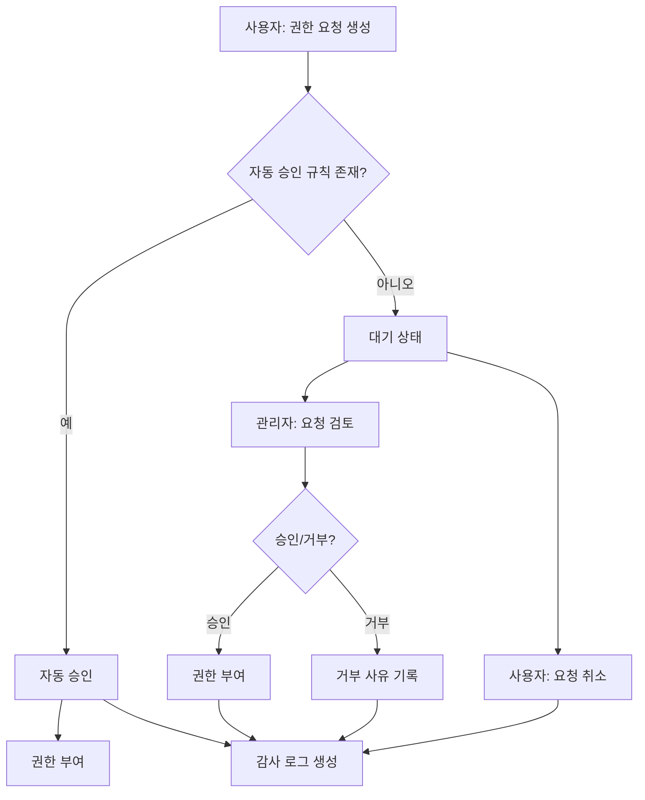

# 권한 승인 시스템 구현 완료 보고서

**작성일**: 2025-10-30  
**버전**: 1.0  
**구현 범위**: Week 1 - 권한 요청 및 승인 시스템

---

## 📋 구현 개요

기존 권한 관리 시스템에 **권한 요청-승인 워크플로우**를 추가하여, 사용자가 필요한 권한을 요청하고 관리자가 검토/승인할 수 있는 시스템을 구축했습니다.

### 주요 기능

1. ✅ **권한 요청 생성** - 사용자가 필요한 컨테이너 권한 요청
2. ✅ **자동 승인** - 규칙 기반 자동 승인 처리
3. ✅ **관리자 승인/거부** - 대기 중 요청 검토 및 처리
4. ✅ **일괄 처리** - 여러 요청 동시 승인/거부
5. ✅ **감사 로그** - 모든 권한 변경 이력 추적
6. ✅ **통계 대시보드** - 권한 요청 현황 모니터링

---

## 🏗️ 시스템 아키텍처

### 백엔드 (FastAPI + PostgreSQL)

```
backend/
├── alembic/versions/
│   └── 20251030_001_add_permission_request_tables.py  # DB 마이그레이션
├── app/
│   ├── models/auth/
│   │   └── permission_request_models.py               # SQLAlchemy 모델
│   ├── schemas/
│   │   └── permission_request.py                      # Pydantic 스키마
│   ├── services/auth/
│   │   └── permission_request_service.py              # 비즈니스 로직
│   └── api/v1/
│       └── permission_requests.py                      # REST API 엔드포인트
└── tests/
    ├── conftest.py                                     # 테스트 설정
    └── test_permission_requests.py                     # API 테스트
```

### 프론트엔드 (React + TypeScript)

```
frontend/src/
├── types/
│   └── permissionRequest.types.ts                     # TypeScript 타입 정의
├── services/
│   └── permissionRequestService.ts                    # API 클라이언트
├── components/manager/
│   ├── PermissionRequestForm.tsx                      # 권한 요청 폼
│   └── MyPermissionRequests.tsx                       # 내 요청 목록
└── pages/manager/
    ├── PermissionApprovalManagement.tsx               # 승인 관리 페이지
    └── UserPermissionManagement.tsx                   # 통합 권한 관리 (개선)
```

---

## 📊 데이터베이스 스키마

### 1. tb_permission_requests (권한 요청)
```sql
- request_id: UUID (PK)
- user_id: UUID (FK -> User)
- user_emp_no: VARCHAR(20)
- container_id: VARCHAR(100) (FK -> TbKnowledgeContainers)
- requested_role_id: VARCHAR(50)
- reason: TEXT
- status: ENUM (PENDING, APPROVED, REJECTED, CANCELLED, EXPIRED)
- requested_at: TIMESTAMP
- processed_at: TIMESTAMP
- processed_by: VARCHAR(20)
- rejection_reason: TEXT
- auto_approved: BOOLEAN
- expires_at: TIMESTAMP
- created_at: TIMESTAMP
- updated_at: TIMESTAMP
```

### 2. tb_permission_audit_log (감사 로그)
```sql
- log_id: UUID (PK)
- request_id: UUID (FK -> tb_permission_requests)
- action: VARCHAR(50)
- performed_by: VARCHAR(20)
- details: JSONB
- created_at: TIMESTAMP
```

### 3. tb_auto_approval_rules (자동 승인 규칙)
```sql
- rule_id: UUID (PK)
- rule_name: VARCHAR(200)
- role_id: VARCHAR(50)
- conditions: JSONB
- priority: INTEGER
- is_active: BOOLEAN
- created_at: TIMESTAMP
- updated_at: TIMESTAMP
```

---

## 🔌 API 엔드포인트

### 권한 요청 생성
```http
POST /api/v1/permission-requests
Content-Type: application/json

{
  "container_id": "CONT_001",
  "requested_role_id": "VIEWER",
  "reason": "프로젝트 진행을 위해 조회 권한이 필요합니다."
}
```

### 내 요청 목록 조회
```http
GET /api/v1/permission-requests/my-requests?status=PENDING&page=1&size=10
```

### 대기 중 요청 조회 (관리자)
```http
GET /api/v1/permission-requests/pending?container_id=CONT_001
```

### 요청 승인
```http
POST /api/v1/permission-requests/{request_id}/approve
Content-Type: application/json

{
  "approver_comment": "승인합니다."
}
```

### 요청 거부
```http
POST /api/v1/permission-requests/{request_id}/reject
Content-Type: application/json

{
  "rejection_reason": "권한 레벨이 부적절합니다."
}
```

### 일괄 승인
```http
POST /api/v1/permission-requests/batch-approve
Content-Type: application/json

{
  "request_ids": ["uuid1", "uuid2", "uuid3"],
  "approver_comment": "일괄 승인"
}
```

### 통계 조회
```http
GET /api/v1/permission-requests/statistics/summary
```

**응답 예시:**
```json
{
  "success": true,
  "statistics": {
    "total_requests": 45,
    "pending_requests": 12,
    "approved_requests": 28,
    "rejected_requests": 5,
    "auto_approved_requests": 15,
    "avg_processing_time_hours": 4.5,
    "requests_by_status": [...],
    "requests_by_container": [...]
  }
}
```

---

## 🎨 프론트엔드 UI 개선사항

### 1. UserPermissionManagement.tsx (통합 페이지)
- **탭 구조 도입**
  - 권한 현황: 기존 권한 관리 테이블
  - 내 권한 요청: 사용자의 요청 이력
  - 권한 요청: 새로운 권한 요청 폼

### 2. PermissionRequestForm (권한 요청 폼)
- 컨테이너 선택 드롭다운
- 권한 레벨 선택 (VIEWER, EDITOR, MANAGER, ADMIN)
- 요청 사유 입력 (최소 10자)
- 실시간 유효성 검증
- 자동 승인 안내 메시지

### 3. MyPermissionRequests (내 요청 목록)
- 상태별 필터링 (전체, 대기중, 승인, 거부)
- 요청 취소 기능
- 처리 정보 및 거부 사유 표시
- 만료일 표시

### 4. PermissionApprovalManagement (승인 관리 페이지)
- 대기 중 요청 대시보드
- 통계 카드 (총 요청, 대기중, 승인, 자동승인)
- 검색 및 필터링 (사용자, 컨테이너)
- 개별 승인/거부
- 일괄 승인/거부
- 거부 사유 입력 모달

---

## 🧪 테스트 코드

### 백엔드 테스트 (pytest)

**파일**: `backend/tests/test_permission_requests.py`

테스트 커버리지:
- ✅ 권한 요청 생성 성공
- ✅ 자동 승인 규칙 적용
- ✅ 중복 요청 방지
- ✅ 유효하지 않은 컨테이너 검증
- ✅ 승인/거부 처리
- ✅ 거부 사유 필수 검증
- ✅ 내 요청 목록 조회
- ✅ 대기 중 요청 조회 (관리자)
- ✅ 일괄 승인/거부
- ✅ 통계 조회
- ✅ 요청 취소
- ✅ 승인된 요청 취소 불가

**실행 방법:**
```bash
cd backend
pytest tests/test_permission_requests.py -v
```

---

## 🔄 권한 요청 워크플로우



---

## 🚀 배포 가이드

### 1. 데이터베이스 마이그레이션

```bash
cd backend
alembic upgrade head
```

### 2. 자동 승인 규칙 설정 (선택사항)

```sql
INSERT INTO tb_auto_approval_rules (
    rule_id, rule_name, role_id, conditions, priority, is_active
) VALUES (
    gen_random_uuid(),
    'VIEWER 권한 자동 승인',
    'VIEWER',
    '{"department": "개발팀"}',
    1,
    true
);
```

### 3. 백엔드 서버 재시작

```bash
cd backend
uvicorn app.main:app --reload
```

### 4. 프론트엔드 빌드

```bash
cd frontend
npm install
npm start
```

---

## 📖 사용 가이드

### 사용자 - 권한 요청하기

1. **권한 관리** 페이지 접속
2. **권한 요청** 탭 선택
3. 컨테이너와 권한 레벨 선택
4. 요청 사유 작성 (최소 10자)
5. **권한 요청** 버튼 클릭
6. 자동 승인되거나 관리자 검토 대기

### 사용자 - 내 요청 확인하기

1. **내 권한 요청** 탭 선택
2. 상태별 필터링 (대기중/승인/거부)
3. 대기 중 요청은 **취소** 가능

### 관리자 - 요청 승인하기

1. **권한 승인** 페이지 접속 (`/manager/permissions`)
2. 대기 중 요청 목록 확인
3. 개별 승인: ✓ 아이콘 클릭
4. 일괄 승인:
   - 체크박스로 요청 선택
   - **일괄 승인** 버튼 클릭

### 관리자 - 요청 거부하기

1. 거부할 요청의 ✕ 아이콘 클릭
2. 거부 사유 입력 (필수)
3. **거부** 버튼 클릭

---

## 🔍 주요 비즈니스 로직

### 자동 승인 규칙 매칭
```python
async def _check_auto_approval(self, request: TbPermissionRequests) -> bool:
    # 1. 활성화된 규칙 조회 (우선순위 순)
    # 2. 역할 ID 일치 확인
    # 3. JSONB 조건 매칭 (부서, 직급 등)
    # 4. 첫 번째 매칭 규칙 적용
```

### 권한 부여 로직
```python
async def _grant_permission(self, request: TbPermissionRequests):
    # 1. 기존 권한 확인
    # 2. 없으면 생성, 있으면 업데이트
    # 3. 만료일 설정 (요청일 + 30일)
    # 4. 감사 로그 생성
```

### 중복 요청 방지
```python
async def _check_duplicate_request(self, user_id: UUID, container_id: str):
    # 동일 사용자 + 컨테이너 + PENDING 상태 요청 존재 여부 확인
```

---

## 📈 성능 최적화

1. **인덱스 추가**
   - `(user_emp_no, status)` - 내 요청 조회 최적화
   - `(container_id, status)` - 컨테이너별 필터링 최적화
   - `(status, created_at)` - 대기 요청 정렬 최적화

2. **비동기 처리**
   - SQLAlchemy AsyncSession 사용
   - 병렬 데이터 로딩 (requests + statistics)

3. **페이지네이션**
   - 모든 목록 조회 API에 page/size 파라미터 지원

---

## 🛡️ 보안 고려사항

1. **권한 검증**
   - 요청 생성: 본인만 가능
   - 요청 취소: 본인만 가능
   - 승인/거부: 관리자만 가능 (TODO: 현재 미구현)

2. **입력 검증**
   - 컨테이너 존재 여부 확인
   - 역할 ID 유효성 검증
   - 거부 사유 필수 입력

3. **감사 로그**
   - 모든 권한 변경 이력 기록
   - 변경자 정보 저장
   - JSONB 상세 정보 저장

---

## 🐛 알려진 이슈 및 TODO

### 현재 제한사항

1. **관리자 권한 체크 미구현**
   ```python
   # TODO: 관리자 권한 확인 로직 추가
   # - 컨테이너 관리자인지 확인
   # - 시스템 관리자인지 확인
   ```

2. **이메일 알림 미구현**
   - 승인/거부 시 사용자에게 알림 필요
   - 요청 생성 시 관리자에게 알림 필요

3. **권한 만료 자동 처리 미구현**
   - 배치 작업으로 만료된 권한 자동 비활성화 필요

### 개선 계획 (Week 2-3)

- [ ] 관리자 권한 검증 추가
- [ ] 이메일/슬랙 알림 통합
- [ ] 권한 만료 자동 처리 배치
- [ ] 요청 승인 자동화 개선
- [ ] 대시보드 차트 추가
- [ ] 엑셀 내보내기 기능

---

## 📝 변경 이력

### v1.0 (2025-10-30)
- ✅ 권한 요청 CRUD API 구현
- ✅ 자동 승인 규칙 엔진 구현
- ✅ 일괄 처리 기능 추가
- ✅ 감사 로그 자동 생성
- ✅ 통계 대시보드 API
- ✅ React 프론트엔드 UI 구현
- ✅ 통합 테스트 코드 작성

---

## 🙏 참고 자료

- [FastAPI 공식 문서](https://fastapi.tiangolo.com/)
- [SQLAlchemy 2.0 비동기](https://docs.sqlalchemy.org/en/20/orm/extensions/asyncio.html)
- [React TypeScript 가이드](https://react-typescript-cheatsheet.netlify.app/)
- [Tailwind CSS](https://tailwindcss.com/)

---

**작성자**: GitHub Copilot  
**검토자**: -  
**승인자**: -  
**문서 버전**: 1.0
