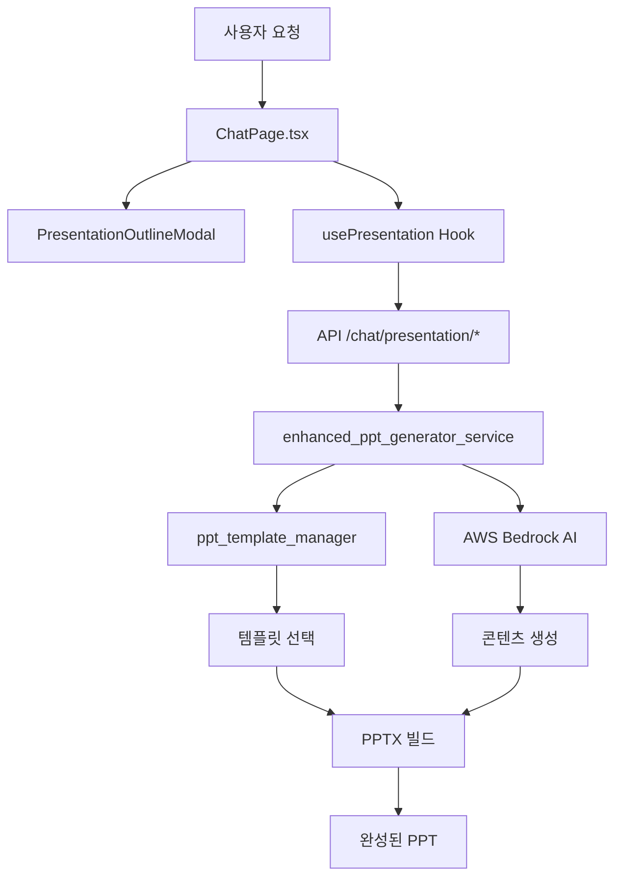

# 🎯 WKMS-AWS PPT 생성 파이프라인 완전 분석

## 📊 시스템 아키텍처



## 🏗️ 주요 컴포넌트

### 1. **Frontend (React + TypeScript)**
- `ChatPage.tsx`: 메인 채팅 인터페이스
- `PresentationOutlineModal`: 개요 편집 모달
- `usePresentation`: PPT 상태 관리 훅
- `MessageBubble`: PPT 생성 버튼 표시

### 2. **Backend API (FastAPI)**
- `/chat/presentation/templates` - 템플릿 목록
- `/chat/presentation/outline` - 개요 생성
- `/chat/presentation/build` - PPT 빌드

### 3. **Core Services**
- `enhanced_ppt_generator_service.py` (1602줄) - 메인 생성 로직
- `ppt_template_manager.py` (1311줄) - 템플릿 관리

## 📋 현재 템플릿 상황

### ✅ **등록된 템플릿 (7개)**
1. **기본 하드코딩 템플릿 (5개)**
   ```
   - business_034: 비즈니스 034 (29KB)
   - business_default: 비즈니스 기본 (29KB)  
   - minimal_gray: 미니멀 그레이 (29KB)
   - modern_green: 모던 그린 (29KB)
   - playful_violet: 비주얼 바이올렛 (29KB)
   ```

2. **사용자 업로드 템플릿 (2개)**
   ```
   - 제품소개서_샘플: 제품소개서 샘플 (3.4MB) ✨ 실제 템플릿
   - clean_제품소개서_샘플: Clean 제품소개서 샘플 (3.3MB) 🧹 자동 정리본
   ```

### ⚠️ **문제점**
1. **템플릿 중복**: 하드코딩 템플릿 5개가 모두 같은 기본 파일 사용
2. **혼동 요소**: 실제 의미있는 템플릿은 1개뿐인데 7개로 표시

## 🔄 PPT 생성 플로우

### 📝 **1단계: 개요 생성**
```python
# chat.py - create_presentation_outline()
outline = await ppt_service.generate_enhanced_outline(
    knowledge_text=search_result,
    user_request=request.user_request,
    template_id=request.template_id
)
```

### 🏗️ **2단계: PPT 빌드**  
```python
# chat.py - build_presentation_from_outline()
result = await ppt_service.build_enhanced_pptx(
    outline=request.outline,
    template_id=request.template_id
)
```

### 🧠 **3단계: AI 기반 콘텐츠 생성**
- **AWS Bedrock Claude 3 Haiku**: 텍스트 콘텐츠 생성
- **템플릿 매칭**: 사용자 선택 템플릿 적용
- **동적 분석**: 썸네일, 레이아웃 분석

### 📊 **4단계: 템플릿 처리**
- **콘텐츠 정리**: 불필요한 도형 제거
- **썸네일 생성**: 각 슬라이드 미리보기
- **스타일 적용**: 선택된 템플릿 스타일

## 🎯 성능 지표

### ✅ **정상 동작 확인**
- 📁 템플릿 스캔: 4개 PPTX 파일 발견
- 🔍 동적 분석: 썸네일 생성, 콘텐츠 정리 완료
- 📊 콘텐츠 최적화: 60개 → 1개 도형 (제품소개서 샘플)

### 📈 **파일 크기**
- 기본 템플릿: ~29KB (단순 구조)
- 실제 템플릿: 3.4MB (풍부한 콘텐츠)
- 정리본: 3.3MB (최적화 완료)

## 🛠️ 권장사항

### 1. **템플릿 정리**
```python
# 중복 제거하고 의미있는 템플릿만 유지
recommended_templates = [
    "제품소개서_샘플",  # 실제 사용자 템플릿
    "business_default", # 기본 비즈니스용
    "minimal_gray"      # 미니멀 스타일용
]
```

### 2. **사용자 경험 개선**
- 템플릿 프리뷰 강화
- 실제 콘텐츠 유무 표시
- 템플릿 카테고리 정리

### 3. **성능 최적화**  
- 템플릿 캐싱 개선
- 썸네일 생성 비동기 처리
- 대용량 템플릿 처리 최적화

## ✅ 결론

**PPT 생성 파이프라인은 정상 동작 중**이지만, 템플릿 관리 체계 정리가 필요합니다. 
핵심 기능(AI 기반 콘텐츠 생성, 템플릿 적용, PPTX 빌드)은 모두 작동하고 있으며, 
사용자가 업로드한 '제품소개서 샘플' 템플릿이 실질적인 메인 템플릿으로 활용되고 있습니다.
