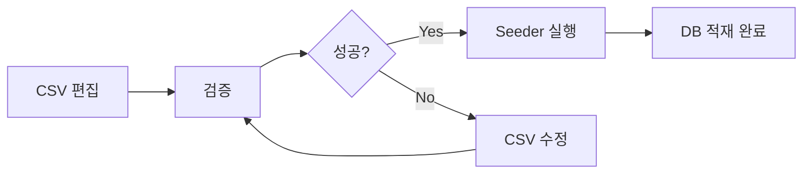

# WKMS 초기 데이터 관리 가이드

> 웅진 WKMS(Woongjin Knowledge Management System) 초기 데이터 설정 및 관리 문서

**최종 업데이트**: 2025-10-15  
**버전**: 2.0  
**작성자**: 시스템 관리팀

---

## 📋 목차

1. [개요](#개요)
2. [디렉토리 구조](#디렉토리-구조)
3. [CSV 데이터 파일](#csv-데이터-파일)
4. [초기 데이터 적재 프로세스](#초기-데이터-적재-프로세스)
5. [데이터 수정 가이드](#데이터-수정-가이드)
6. [검증 및 문제 해결](#검증-및-문제-해결)
7. [FAQ](#faq)

---

## 개요

### 목적

WKMS 시스템의 초기 데이터를 **CSV 파일 기반**으로 관리하여:
- ✅ 비개발자도 데이터 수정 가능
- ✅ 코드 변경 없이 데이터 구조 변경
- ✅ 버전 관리 및 이력 추적
- ✅ 다른 환경에 동일한 데이터 적용

### 설계 철학

```
┌─────────────────┐
│  CSV 파일       │  ← 단일 진실 소스 (Single Source of Truth)
│  (데이터 정의)  │     사용자가 직접 편집
└────────┬────────┘
         │
         ▼
┌─────────────────┐
│ 검증 스크립트   │  ← 데이터 정합성 검증
│ (validate)      │     문제 조기 발견
└────────┬────────┘
         │
         ▼
┌─────────────────┐
│ Seeder          │  ← DB 적재 로직
│ (단순 적재)     │     CSV → DB 변환
└────────┬────────┘
         │
         ▼
┌─────────────────┐
│ PostgreSQL DB   │
└─────────────────┘
```

**핵심 원칙:**
- **데이터 수정 = CSV 편집** (코드 수정 X)
- **검증 먼저, 적재 나중**
- **선언적 데이터 관리**

---

## 디렉토리 구조

```
backend/data/
├── README.md                          # 📘 이 문서
├── validate_initial_data.py           # 🔍 검증 스크립트
│
├── csv/                               # 📂 CSV 데이터 파일
│   ├── users.csv                      # 사용자 계정
│   ├── sap_hr_info.csv               # SAP HR 조직 정보
│   ├── knowledge_containers.csv      # 컨테이너 트리 구조
│   ├── user_permissions.csv          # 사용자별 컨테이너 권한
│   ├── user_roles.csv                # 역할 정의
│   ├── categories.csv                # 지식 카테고리
│   └── common_codes.csv              # 공통 코드
│
└── seeds/                             # 🌱 Seeder 스크립트
    ├── base_seeder.py                # 공통 적재 로직
    ├── system_seeder.py              # 시스템 데이터
    ├── hr_seeder.py                  # HR 정보
    ├── user_seeder.py                # 사용자
    ├── container_seeder.py           # 컨테이너
    ├── permission_seeder.py          # 권한
    └── run_all_seeders.py            # 전체 실행
```

---

## CSV 데이터 파일

### 1. users.csv

**목적**: 사용자 계정 정보 정의

**필수 컬럼**:
```csv
emp_no,username,email,password_plain,password_hash,is_active,is_admin,failed_login_attempts,created_date,last_modified_date
```

**예시**:
```csv
ADMIN001,admin,admin@woongjin.co.kr,admin123!,$2b$12$...,true,true,0,2025-09-30 13:00:00,2025-09-30 13:00:00
77107791,ms.staff,ms.staff@woongjin.co.kr,staff2025,$2b$12$...,true,false,0,2025-09-30 13:00:00,2025-09-30 13:00:00
```

**주의사항**:
- `password_hash`는 bcrypt로 암호화된 값
- `is_admin`은 시스템 관리자만 `true`
- `emp_no`는 SAP HR 정보와 일치해야 함

---

### 2. sap_hr_info.csv

**목적**: SAP HR 조직 정보

**필수 컬럼**:
```csv
emp_no,emp_nm,dept_cd,dept_nm,postn_cd,postn_nm,email,telno,mbtlno,entrps_de,rsgntn_de,emp_stats_cd,del_yn,created_by,created_date
```

**조직 코드 매핑**:
| 조직 코드 | 조직명 | 컨테이너 ID | 레벨 |
|----------|--------|-------------|------|
| CEO000 | CEO직속 | WJ_CEO | DIVISION |
| HR100 | 인사전략팀 | WJ_HR | DEPARTMENT |
| HR110 | 채용팀 | WJ_RECRUIT | TEAM |
| HR120 | 교육팀 | WJ_TRAINING | TEAM |
| PLN100 | 기획팀 | WJ_PLANNING | DEPARTMENT |
| CLD100 | 클라우드서비스팀 | WJ_CLOUD_SERVICE | DEPARTMENT |
| MSS100 | MS서비스팀 | WJ_MS_SERVICE | DEPARTMENT |
| INF100 | 인프라컨설팅팀 | WJ_INFRA_CONSULT | DEPARTMENT |
| BIZ100 | Biz운영1팀 | WJ_BIZ_OPS1 | DEPARTMENT |

---

### 3. knowledge_containers.csv

**목적**: 계층적 컨테이너 트리 구조 정의

**필수 컬럼**:
```csv
container_id,container_name,parent_container_id,container_type,sap_org_code,org_level,org_path,...
```

**컨테이너 타입**:
- `COMPANY`: 회사 레벨 (WJ_ROOT)
- `DIVISION`: 본부 레벨 (WJ_CEO, WJ_CLOUD, WJ_CTI)
- `DEPARTMENT`: 부서 레벨 (WJ_HR, WJ_PLANNING 등)
- `TEAM`: 팀 레벨 (WJ_RECRUIT, WJ_TRAINING)

**트리 구조**:
```
WJ_ROOT (COMPANY, level=1)
├── WJ_CEO (DIVISION, level=2)
│   ├── WJ_HR (DEPARTMENT, level=3)
│   │   ├── WJ_RECRUIT (TEAM, level=4)
│   │   └── WJ_TRAINING (TEAM, level=4)
│   └── WJ_PLANNING (DEPARTMENT, level=3)
├── WJ_CLOUD (DIVISION, level=2)
│   ├── WJ_CLOUD_SERVICE (DEPARTMENT, level=3)
│   └── WJ_MS_SERVICE (DEPARTMENT, level=3)
└── WJ_CTI (DIVISION, level=2)
    ├── WJ_INFRA_CONSULT (DEPARTMENT, level=3)
    └── WJ_BIZ_OPS1 (DEPARTMENT, level=3)
```

**중요 필드**:
- `org_level`: 계층 깊이 (1=COMPANY, 2=DIVISION, 3=DEPARTMENT, 4=TEAM)
- `org_path`: 전체 경로 (예: `/WJ_ROOT/WJ_CEO/WJ_HR`)
- `parent_container_id`: 부모 컨테이너 (ROOT는 빈 값)

---

### 4. user_permissions.csv

**목적**: 사용자별 컨테이너 접근 권한 정의

**필수 컬럼**:
```csv
user_emp_no,container_id,role_id,permission_type,permission_level,access_scope,granted_by,granted_date,is_active
```

**권한 타입**:
| 권한 | 설명 | 가능 작업 |
|------|------|-----------|
| `ADMIN` | 관리자 | 생성, 읽기, 수정, 삭제, 권한 관리 |
| `MANAGER` | 관리자 | 생성, 읽기, 수정, 삭제 |
| `EDITOR` | 편집자 | 생성, 읽기, 수정 |
| `VIEWER` | 조회자 | 읽기만 가능 |

**권한 할당 원칙**:
1. **ADMIN001**: 모든 컨테이너에 `ADMIN` 권한 (필수)
2. **팀장**: 소속 컨테이너에 `MANAGER` 권한
3. **팀원**: 소속 컨테이너에 `EDITOR` 권한
4. **상위 조직**: 하위 조직에 `VIEWER` 권한 (선택)

**예시**:
```csv
# ADMIN001: 모든 컨테이너에 ADMIN 권한
ADMIN001,WJ_ROOT,ADMIN_GLOBAL,ADMIN,ADMIN,GLOBAL,SYSTEM,2025-09-30 13:00:00,true
ADMIN001,WJ_HR,ADMIN_DEPARTMENT,ADMIN,ADMIN,DEPARTMENT,SYSTEM,2025-09-30 13:00:00,true

# 팀장: 소속 부서 MANAGER 권한

MSS001,WJ_MS_SERVICE,OWNER_DEPT,MANAGER,MANAGER,DEPARTMENT,CLD001,2025-09-30 13:00:00,true

# 팀원: 소속 부서 EDITOR 권한

77107791,WJ_MS_SERVICE,MEMBER_DEPT,EDITOR,EDITOR,DEPARTMENT,MSS001,2025-09-30 13:00:00,true
```

---

### 5. user_roles.csv

**목적**: 역할 기반 권한 정의 (RBAC)

**필수 컬럼**:
```csv
user_emp_no,role_name,role_level,scope_type,scope_value,role_description,permissions,valid_from,is_active
```

**역할 레벨**:
- `1`: ADMIN (시스템 관리자)
- `2`: MANAGER (부서/팀 관리자)
- `3`: EDITOR (편집자)
- `4`: VIEWER (조회자)

---

### 6. categories.csv

**목적**: 지식 카테고리 체계

**필수 컬럼**:
```csv
category_id,category_name,parent_category_id,category_level,description,is_active
```

---

### 7. common_codes.csv

**목적**: 시스템 공통 코드

**필수 컬럼**:
```csv
grp_cd,item_cd,item_nm,item_desc,sort_order,is_active
```

---

## 초기 데이터 적재 프로세스

### 전체 흐름



### 단계별 가이드

#### 1️⃣ 환경 설정

```bash
# 프로젝트 디렉토리로 이동
cd /home/wjadmin/Dev/InsightBridge/backend

# 가상환경 활성화
source ../.venv/bin/activate

# PostgreSQL 실행 확인
docker ps | grep wkms-postgres
```

#### 2️⃣ 데이터 검증

```bash
# 검증 스크립트 실행
python data/validate_initial_data.py
```

**검증 항목**:
- ✅ CSV 파일 존재 여부
- ✅ 필수 사용자 10명 존재
- ✅ 컨테이너 트리 구조 정합성
- ✅ 부모 컨테이너 참조 무결성
- ✅ 계층 레벨 일치성 (org_level ↔ org_path)
- ✅ ADMIN001 전체 권한 보유
- ✅ 사용자 조직-권한 매핑

**출력 예시**:
```
============================================================
🔍 WKMS 초기 데이터 검증 시작
============================================================

👥 사용자 데이터 검증 중...
   ✅ 필수 사용자 10명 모두 존재
   ✅ ADMIN001 관리자 권한 확인

🌲 컨테이너 트리 구조 검증 중...
   ✅ 필수 컨테이너 12개 모두 존재
   ✅ 부모 컨테이너 참조 무결성 통과
   ✅ 계층 구조(org_level, org_path) 일치성 통과

🔐 ADMIN001 권한 검증 중...
   ✅ ADMIN001이 모든 컨테이너(12개)에 ADMIN 권한 보유

🏢 사용자 조직-권한 매핑 검증 중...
   [매핑 테이블 출력]

============================================================
📊 검증 결과
============================================================

✅ 모든 검증 통과!
🚀 초기 데이터 적재 준비 완료
```

#### 3️⃣ 데이터 적재

```bash
# 자동 모드로 Seeder 실행 (기존 데이터 삭제 후 재적재)
WKMS_AUTO_SEED=true python data/seeds/run_all_seeders.py
```

**실행 순서**:
1. 시스템 기본 데이터 (공통 코드, 카테고리)
2. SAP HR 조직 정보
3. 사용자 계정
4. 지식 컨테이너
5. 사용자 권한

**출력 예시**:
```
🚀 WKMS 마스터 데이터 초기화 시작...
============================================================
📋 1단계: 시스템 기본 데이터 로딩...
   ✅ tb_cmns_cd_grp_item: 26개 삽입
   ✅ tb_knowledge_categories: 4개 삽입

🏢 2단계: SAP HR 조직 정보 로딩...
   ✅ tb_sap_hr_info: 10개 삽입

👥 3단계: 사용자 정보 로딩...
   ✅ tb_user: 10개 삽입

📁 4단계: 지식 컨테이너 구조 생성...
   ✅ tb_knowledge_containers: 12개 삽입

🔐 5단계: 사용자 권한 및 역할 설정...
   ✅ tb_user_permissions: 30개 삽입
   ✅ tb_user_roles: 10개 삽입

============================================================
🎉 WKMS 마스터 데이터 초기화 완료!
```

#### 4️⃣ 적재 확인

```bash
# PostgreSQL 접속
docker exec -it wkms-postgres psql -U wkms -d wkms

# 데이터 확인
SELECT COUNT(*) FROM tb_user;              -- 10
SELECT COUNT(*) FROM tb_knowledge_containers;  -- 12
SELECT COUNT(*) FROM tb_user_permissions;  -- 30
```

---

## 데이터 수정 가이드

### 시나리오 1: 새 부서 추가

**요구사항**: "데이터분석팀" (WJ_DATA_ANALYTICS) 추가

#### 1. CSV 파일 수정

**knowledge_containers.csv**:
```csv
WJ_DATA_ANALYTICS,데이터분석팀,WJ_CLOUD,DEPARTMENT,DA100,,3,"/WJ_ROOT/WJ_CLOUD/WJ_DATA_ANALYTICS","데이터 분석 및 BI","분석",RESTRICTED,VIEWER,true,SELECTIVE,DATA001,"{""DATA001""}",true,false,false,"{""DATA001""}",true,0,0,0,0,SYSTEM,2025-10-15 13:00:00
```

**sap_hr_info.csv**:
```csv
DATA001,김데이터,DA100,데이터분석팀,MGR009,팀장,data@woongjin.co.kr,02-1234-5687,,20210101,,ACTIVE,N,SYSTEM,2025-10-15 13:00:00
```

**users.csv**:
```csv
DATA001,data,data@woongjin.co.kr,data2025,$2b$12$...,true,false,0,2025-10-15 13:00:00,2025-10-15 13:00:00
```

**user_permissions.csv**:
```csv
ADMIN001,WJ_DATA_ANALYTICS,ADMIN_DEPARTMENT,ADMIN,ADMIN,DEPARTMENT,,SYSTEM_ADMIN,SYSTEM,2025-10-15 13:00:00,,true,,0
DATA001,WJ_DATA_ANALYTICS,OWNER_DEPT,MANAGER,MANAGER,DEPARTMENT,,DEPT_MANAGER,CLD001,2025-10-15 13:00:00,,true,,0
```

**user_roles.csv**:
```csv
DATA001,MANAGER,2,department,DA100,데이터분석팀 관리자,"{""read"": true, ""write"": true, ""delete"": true, ""manage_team"": true}",2025-10-15 13:00:00,,true,CLD001,2025-10-15 13:00:00,SYSTEM,2025-10-15 13:00:00
```

#### 2. 검증 및 적재

```bash
# 검증
python data/validate_initial_data.py

# 적재
WKMS_AUTO_SEED=true python data/seeds/run_all_seeders.py
```

---

### 시나리오 2: 사용자 권한 변경

**요구사항**: 77107791 사용자의 권한을 EDITOR → MANAGER로 승격

#### 1. CSV 수정

**user_permissions.csv**:
```csv
# 변경 전
77107791,WJ_MS_SERVICE,MEMBER_DEPT,EDITOR,EDITOR,DEPARTMENT,,TEAM_MEMBER,MSS001,2025-09-30 13:00:00,,true,,0

# 변경 후

77107791,WJ_MS_SERVICE,MANAGER_DEPT,MANAGER,MANAGER,DEPARTMENT,,TEAM_LEADER,MSS001,2025-10-15 13:00:00,,true,,0
```

**user_roles.csv**:
```csv
# 변경 전
77107791,EDITOR,3,department,MSS100,MS서비스팀 편집자,"{""read"": true, ""write"": true}",2025-09-30 13:00:00,,true,MSS001,2025-09-30 13:00:00,SYSTEM,2025-09-30 13:00:00

# 변경 후

77107791,MANAGER,2,department,MSS100,MS서비스팀 관리자,"{""read"": true, ""write"": true, ""delete"": true, ""manage_team"": true}",2025-10-15 13:00:00,,true,MSS001,2025-10-15 13:00:00,SYSTEM,2025-10-15 13:00:00
```

#### 2. 재적재

```bash
WKMS_AUTO_SEED=true python data/seeds/run_all_seeders.py
```

---

### 시나리오 3: 컨테이너 트리 재구성

**요구사항**: 교육팀을 인사전략팀에서 독립시켜 CEO 직속으로 변경

#### 1. CSV 수정

**knowledge_containers.csv**:
```csv
# 변경 전
WJ_TRAINING,교육팀,WJ_HR,TEAM,HR120,,4,"/WJ_ROOT/WJ_CEO/WJ_HR/WJ_TRAINING",...

# 변경 후

WJ_TRAINING,교육팀,WJ_CEO,DEPARTMENT,TRN100,,3,"/WJ_ROOT/WJ_CEO/WJ_TRAINING",...
```

**주의**: `org_level`, `org_path`, `container_type`도 함께 변경!

---

## 검증 및 문제 해결

### 자동 수정 기능

검증 스크립트는 일부 문제를 **자동으로 수정**합니다:

1. **ADMIN001 권한 누락**
   - 감지: ADMIN001이 모든 컨테이너에 권한이 없음
   - 조치: 자동으로 누락된 컨테이너에 ADMIN 권한 추가
   - 확인: user_permissions.csv 업데이트
2. **백업 생성**
   - 자동 수정 전: `user_permissions.csv.backup` 생성
   - 복구: `cp user_permissions.csv.backup user_permissions.csv`

### 일반적인 오류 및 해결

#### 오류 1: "필수 컨테이너 누락"

```
❌ 필수 컨테이너 누락: {'WJ_RECRUIT'}
```

**원인**: knowledge_containers.csv에 WJ_RECRUIT 행이 없음

**해결**:
```bash
# CSV 파일 확인
grep "WJ_RECRUIT" backend/data/csv/knowledge_containers.csv

# 없으면 추가

vim backend/data/csv/knowledge_containers.csv
```

---

#### 오류 2: "부모 컨테이너 참조 무결성 실패"

```
❌ 잘못된 parent_container_id: {'WJ_UNKNOWN'}
```

**원인**: parent_container_id에 존재하지 않는 컨테이너 ID 참조

**해결**:
```bash
# 잘못된 참조 찾기
grep "WJ_UNKNOWN" backend/data/csv/knowledge_containers.csv

# parent_container_id 수정

```

---

#### 오류 3: "org_level과 org_path 불일치"

```

❌ WJ_HR: org_level(3)과 org_path 깊이(2) 불일치
```

**원인**: org_path가 `/WJ_ROOT/WJ_HR`인데 org_level이 3

**해결**:
```csv
# 수정 전
WJ_HR,...,3,"/WJ_ROOT/WJ_HR",...

# 수정 후 (level = path 깊이)

WJ_HR,...,2,"/WJ_ROOT/WJ_HR",...
```

---

#### 오류 4: "사용자 소속 컨테이너 권한 없음"

```
❌ 77107791 (MS서비스팀): 소속 컨테이너 'WJ_MS_SERVICE'에 권한 없음
```

**원인**: user_permissions.csv에 해당 사용자의 소속 부서 권한 누락

**해결**:
```csv
# user_permissions.csv에 추가
77107791,WJ_MS_SERVICE,MEMBER_DEPT,EDITOR,EDITOR,DEPARTMENT,,TEAM_MEMBER,MSS001,2025-10-15 13:00:00,,true,,0
```

---

### 수동 검증 SQL

```sql
-- 1. 사용자 수
SELECT COUNT(*) FROM tb_user;  -- 예상: 10

-- 2. 컨테이너 수
SELECT COUNT(*) FROM tb_knowledge_containers;  -- 예상: 12

-- 3. 컨테이너 트리 확인
SELECT container_id, container_name, parent_container_id, org_level, org_path
FROM tb_knowledge_containers
ORDER BY org_level, org_path;

-- 4. ADMIN001 권한 확인
SELECT container_id, permission_type
FROM tb_user_permissions
WHERE user_emp_no = 'ADMIN001'
ORDER BY container_id;

-- 5. 사용자별 권한 수
SELECT user_emp_no, COUNT(*) as perm_count
FROM tb_user_permissions
GROUP BY user_emp_no
ORDER BY perm_count DESC;

-- 6. 권한 타입 분포
SELECT permission_type, COUNT(*) as count
FROM tb_user_permissions
GROUP BY permission_type;
```

---

## FAQ

### Q1: CSV 파일을 Excel에서 편집해도 되나요?

**A**: 가능하지만 주의사항이 있습니다.
- ✅ **가능**: Excel에서 편집 가능
- ⚠️ **주의**: UTF-8 인코딩 유지
- ⚠️ **주의**: 날짜 형식 자동 변환 주의
- 💡 **권장**: VS Code나 텍스트 에디터 사용

**Excel 저장 시**:
1. "다른 이름으로 저장"
2. 파일 형식: "CSV UTF-8 (쉼표로 분리)" 선택

---

### Q2: 기존 데이터를 유지하면서 추가만 하려면?

**A**: `clear_existing=False`로 실행

```python
# run_all_seeders.py 수정
success = await all_seeders.run_all(clear_existing=False)
```

또는 환경 변수:
```bash
WKMS_AUTO_SEED=false python data/seeds/run_all_seeders.py
# → 대화형 모드, "n" 입력하면 추가만
```

---

### Q3: 특정 테이블만 재적재하려면?

**A**: 개별 Seeder 실행

```bash
# 사용자만 재적재
python data/seeds/user_seeder.py

# 권한만 재적재
python data/seeds/permission_seeder.py
```

---

### Q4: 비밀번호 해시는 어떻게 생성하나요?

**A**: Python bcrypt 사용

```python
import bcrypt

password = "mypassword123"
hashed = bcrypt.hashpw(password.encode('utf-8'), bcrypt.gensalt())
print(hashed.decode('utf-8'))
# → $2b$12$...
```

또는 온라인 도구:
- https://bcrypt-generator.com/ (rounds=12 사용)

---

### Q5: 검증은 통과했는데 적재 시 오류가 나면?

**A**: 모델 스키마 확인

1. **모델 필드 확인**:

```python
# backend/app/models/user/user_models.py
class TbUser(Base):
    __tablename__ = "tb_user"
    # 필드 목록 확인
```

2. **CSV 컬럼 ↔ 모델 필드 매핑**:
   - CSV 컬럼명이 모델 필드명과 정확히 일치해야 함
   - 대소문자 구분
3. **데이터 타입 확인**:
   - `true/false` (소문자)
   - 날짜: `YYYY-MM-DD HH:MM:SS`
   - 숫자: 따옴표 없이

---

### Q6: 프로덕션 환경에 적재하려면?

**A**: 안전한 배포 절차

```bash
# 1. 백업
docker exec wkms-postgres pg_dump -U wkms wkms > backup_$(date +%Y%m%d).sql

# 2. 검증 (중요!)
python data/validate_initial_data.py

# 3. 스테이징에서 먼저 테스트
WKMS_AUTO_SEED=true python data/seeds/run_all_seeders.py

# 4. 프로덕션 적재 (신중하게)
# - 다운타임 확보
# - 적재 후 즉시 검증
# - 문제 시 백업 복구 준비
```

---

## 🔑 기본 로그인 정보

초기 데이터 적재 후 사용 가능한 계정:

### 관리자 계정

- **사번(emp_no)**: ADMIN001
- **비밀번호**: admin123!
- **권한**: 전체 시스템 관리자 (ADMIN)
- **이메일**: admin@woongjin.co.kr

### 일반 사용자 계정

- **사번(emp_no)**: 77107791
- **비밀번호**: staff2025
- **권한**: MS서비스팀 편집자 (EDITOR)
- **이메일**: ms.staff@woongjin.co.kr

### 기타 테스트 계정

| 사번     | 비밀번호         | 부서       | 역할  |
| ------ | ------------ | -------- | --- |
| HR001  | hr2025!      | 인사전략팀    | 매니저 |
| REC001 | recruit123   | 채용팀      | 매니저 |
| TRN001 | train2025    | 교육팀      | 매니저 |
| PLN001 | plan123!     | 기획팀      | 매니저 |
| CLD001 | cloud2025    | 클라우드서비스팀 | 매니저 |
| MSS001 | msservice123 | MS서비스팀   | 매니저 |
| INF001 | infra123!    | 인프라컨설팅팀  | 매니저 |
| BIZ001 | bizops2025   | Biz운영1팀  | 매니저 |

> 💡 **참고**: 로그인 시 **사번(emp_no)**과 비밀번호를 입력하세요.

> ⚠️ **보안 권고**: 프로덕션 환경에서는 초기 비밀번호를 즉시 변경하세요!

---

## 변경 이력

| 날짜         | 버전  | 변경 내용                       | 작성자     |
| ---------- | --- | --------------------------- | ------- |
| 2025-10-15 | 2.0 | 검증 스크립트 추가, CSV 기반 관리 체계 확립 | 시스템 관리팀 |
| 2025-09-30 | 1.0 | 초기 작성                       | 시스템 관리팀 |

---

## 참고 문서

- [별첨01_WKMS_권한관리_체계.md](../../01.docs/별첨01_WKMS_권한관리_체계.md)
- [별첨02_웅진WKMS_초기데이터_설정가이드.md](../../01.docs/별첨02_웅진WKMS_초기데이터_설정가이드.md)
- [Alembic 마이그레이션 가이드](../alembic/README)

---

## 문의

**시스템 관리팀**
- Email: admin@woongjin.co.kr
- 내선: 1234

---

> 📌 **중요**: 프로덕션 환경에서 데이터 변경 전에는 **반드시 백업**을 수행하세요!

````


